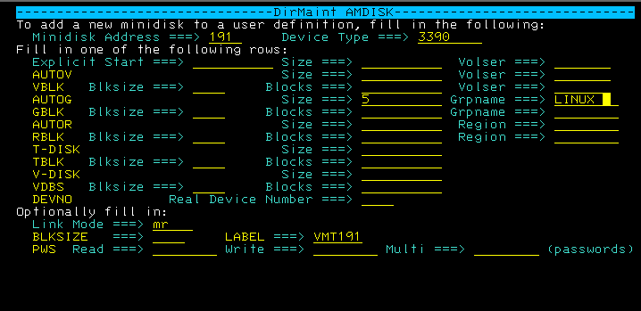
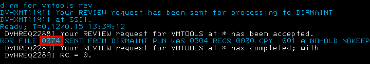
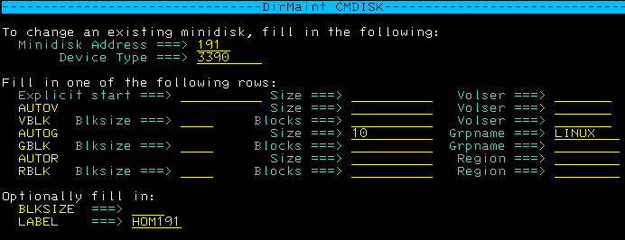
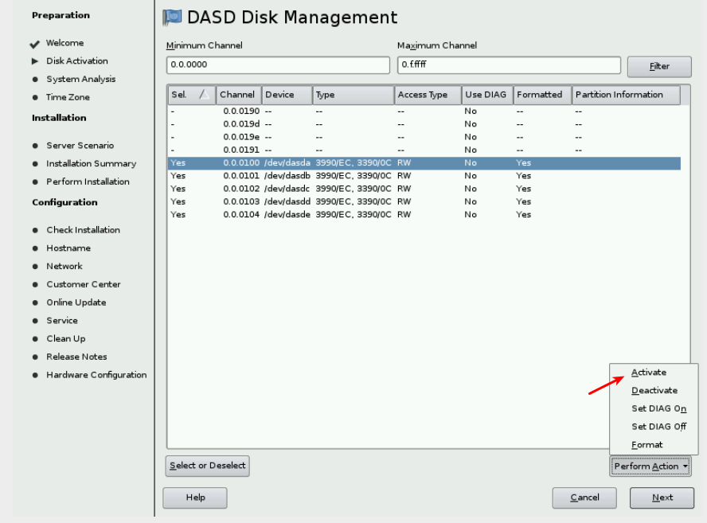
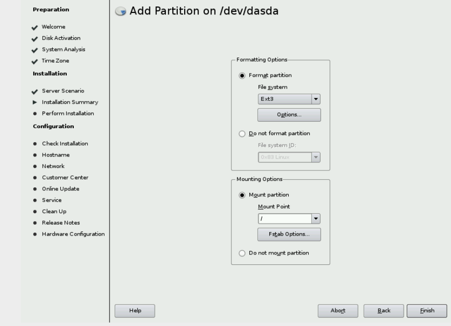
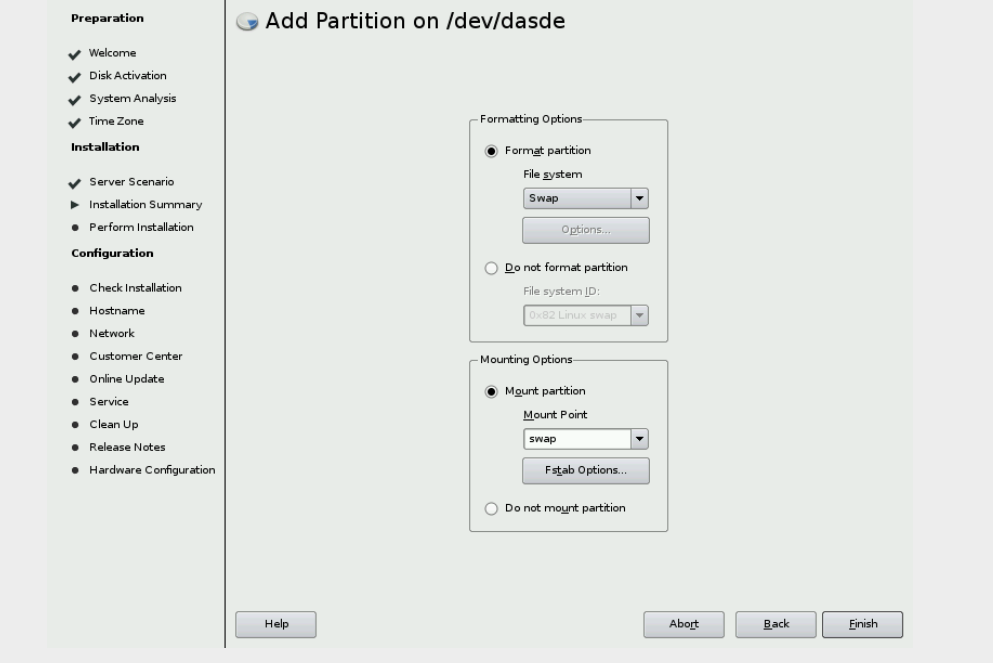
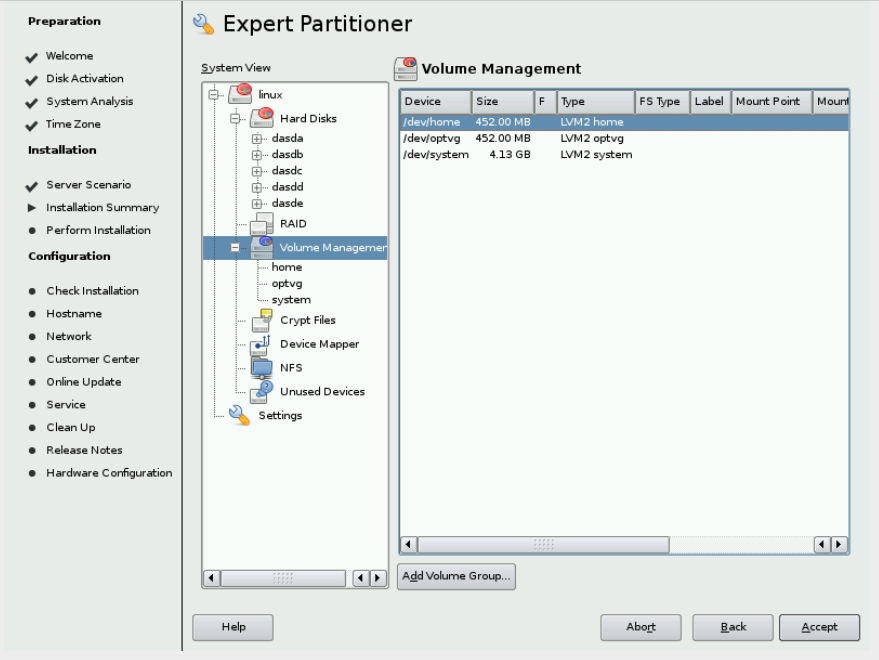
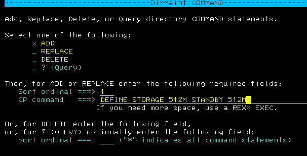

# The Control Program (CP)

## Introduction

z/VM has two main components:

-   The Control Program (CP) controls the Real Machine.

-   The Conversational Monitor System (CMS) controls Virtual Machines.

The CP is sometimes called the hypervisor. It is the layer between the
hardware and virtual machines. Each virtual machine appears to have its
own CPU, storage (memory), and devices. In reality, these items can be:

-   Real. For example, you can dedicate a real network interface to a
    virtual machine for its exclusive use.

-   Shared. For example, the CPU is shared through time sharing and real
    storage is shared as virtual storage.

-   Simulated. For example, a virtual switch is a simulated LAN
    networking switch. CP transparently maps virtual devices and
    resources to their real counterparts.

-   Emulated. For example, FBA emulated SCSI disks. The EDEVICE
    statements allow us to define emulated devices that represent real
    devices to CP. This means SCSI devices.

The following topics explain how CP manages computer resources for
virtual machines.

## Central processing units (CPUs)

::: easylist
& An IBM z13 server can have up to 141 processors. & An IBM zEnterprise
EC12 server can have up to 101 processors. & z13 can have up to 80
LPARs, an increase from 65 in zEC12 & A Logical Partition can now have
up to 141processors defined in z13 (101 for zEC12) & A z/VM LPAR can
have up to 64 logical processors if SMT is disabled or 32 logical
processors defined if SMT is enabled. & Virtual processors (or virtual
CPUs) in single virtual machine (architected): 64 && But NVirtual \>
NLogical is not usually practical & If capable of running in
multiprocessor mode, your virtual machine operating system dispatches
work on its virtual CPUs as if it were running on real hardware. CP
handles the dispatching of work on your virtual CPUs to real CPUs. &
**Guideline:** Never give a virtual machine more virtual CPUs than there
are real CPUs.
:::

Usually virtual machines share all CPUs, but a real CPU can be dedicated
to a virtual machine, which means that the CPU is reserved for that
virtual machine's exclusive use. This obviously has an impact on the
performance of other virtual machines in the system.

## Storage

Mainframe storage is analogous to memory in a personal computer. CP
commands refer to memory as storage, so do not confuse the term
"storage" with disk or tape storage.

Each virtual machine has its own virtual storage. CP manages the
residency of virtual machine's pages in real storage through paging.
Pages that have not been referenced can be moved out of real storage
into a paging device. When a virtual machine requires a page no longer
in real storage, a page fault occurs and CP brings the missing page back
into real storage.

CP has facilities that allow portions of real storage to be shared by
many virtual machines. Such portions are called shared segments. This
sharing economizes on real storage and requires less paging, thereby
improving performance. For example, the CMS nucleus is shared in real
storage by all virtual machines that loaded CMS by name; that is, every
CMS virtual machine maps a 1 MB segment of virtual storage to the same 1
MB of real storage.

## DASD and minidisks

DASD, the mainframe term for disk drives, stands for "direct access
storage device" and is analogous to a hard disk drive on a personal
computer. A single real DASD is called a volume or real volume. Each
volume has a label or volume serial number (volser) that identifies the
volume to z/VM.

It is important to understand the way that z/VM shares DASD. CP can
logically partition real DASD volumes into minidisks, which is analogous
to dividing a personal computer hard disk into multiple partitions. A
minidisk has its own label, which is distinct from the real DASD label.
Each virtual machine can have one or more minidisks and those minidisks
are under control of the guest operating system.

## Temporary minidisks

You can create a temporary minidisk from a special pool of real disks.
The disk lasts as long as the virtual machine is logged on. At logoff,
the temporary minidisk is deleted and the space returned to the
available temporary disk pool.

## Virtual Disks in storage

Virtual disks in storage are similar to temporary minidisks, except the
disks are mapped to storage rather than the cylinders of real disks.
Using virtual disks in storage avoids the need for disk I/O. CP manages
the virtual disk pages as part of its real memory management.

## Virtual readers, punches, and printers

These devices are not associated with real devices, but are implemented
through the spool file system.

In the early days of computing, input to the computer came from punched
cards loaded into a card reader. You used a key punch to record your
program on punched cards, then loaded the cards into a card reader,
which interpreted your cards and loaded your program into the computer.
Output from the program was written to a printer. z/VM preserves this
bit of computing history through virtual reader, punch, and printer
devices, also called unit record devices. Unit record devices provide a
handy way to send files from one virtual device to another, to other
virtual machines, or to real devices (such as real printers). For
instance, you can think of a file being sent from one virtual machine to
another as the virtual equivalent of taking a card stack from one
computer and loading the stack onto another computer's card reader.

Behind the manipulation of these files is a CP file system called the
spool file system. CP manages spool files on one or more DASD volumes
that act as temporary storage areas. A spool file is a collection of
data along with device control instructions for processing on a unit
record device. Spooling is the processing of files created by or
intended for virtual readers, punches, and printers. Through CP and CMS
commands, you can send spool files from one virtual device to another,
from your virtual machine to another, and to real devices.

By convention, each virtual machine has a virtual reader at virtual
device number **00C**, a virtual punch at virtual device number **00D**,
and a virtual printer at virtual device number **00E**. Your virtual
reader is like the in-box of an e-mail system, except more than just
e-mail can be placed there. Through your virtual punch, you can place a
copy of an entire operating system into the system spool, then use the
CP IPL command to load and run that operating system in your virtual
machine.

## The virtual machine console

The virtual machine console or virtual console is the primary interface
to the virtual machine. When you log on to a virtual machine from a
local terminal or a remote workstation, the virtual console is
associated with the terminal session. From the console, you can enter CP
commands, such as loading (IPL) an operating system. The virtual console
is the device an operating system views as its system or hardware
console.

As you do work on your console, the **lower right corner** of the screen
displays various status notices. The notices tell you what is happening
in the system at the present time. If you forget what these notices
mean, you can come back to this section for reference.

::: {#tab:consolestatus}
  **CP READ**        This notice means that the Control Program (CP) is waiting for you to enter a command.
  ------------------ -------------------------------------------------------------------------------------------------------------------------------------------------------------------------------------------------------------------------------------------------------------------------------------------------------------------------------------------------------------------------------------
  **VM READ**        This notice means that a virtual machine operating system, such as CMS, is waiting for you to enter a command.
  **RUNNING**        This notice means the virtual machine is working on something. For CMS, this means CMS is ready for you to enter a command.
  **MORE\...**       This notice means that there is more information than can fit on the current screen. After a pause (which depends on the terminal settings for your virtual machine), the next screen of information is displayed. To view the next screen right away, press the Clear key. To hold this information on the screen, press the Enter key, which changes **MORE\...** to **HOLDING**.
  **HOLDING**        This notice means the system is waiting for you to clear the screen before showing you more information. The notice appears when the screen displays **MORE\...** and you press the Enter key. The notice can also appear when another user sends you a message. To cancel the hold, press the Clear key.
  **NOT ACCEPTED**   This notice means that the system is working on something and is too busy to accept another command. Wait several seconds and issue your command again.

  : Console Status
:::

## The User Directory

The z/VM user directory (or user registry) describes the configuration
and operating characteristics of each virtual machine that can be
created by CP. A z/VM user directory exists in two forms: a source form
that consists of one or more CMS files, and an object form, compiled
from the source, on a CP-formatted disk.

Each virtual machine has a directory entry.


## Exercises

### Logon to MAINT

Log on to the MAINT virtual machine. The default password have changed
in the **z/VM 6.3**. In our environment the default password is
**WD5JU8QP** (or the name of the machine in some cases). Always check
the Installation Guide that comes with yours IBM Shopz order.

Alternatively, clear the logon screen, from CP mode, enter **===\> logon
maint WD5JU8QP**

```
USERID ===> maint 
PASSWORD ===> WD5JU8QP (complex password - installation default) 
```

**Press the ENTER key once to show some messages of the PROFILE EXEC for
this userid.**

**Press the ENTER key again to continue and to change the status from
"VM READ" to "RUNNING" status.**

The "PROFILE EXEC" will run to set up your environment. You are now in
CMS. It is similar to TSO in z/OS or a shell in Linux. You will learn
more about CMS in the next unit. Now, let's do some CP commands to get
familiarized with the system.

```
LOGON MAINT                                                                     
z/VM Version 6 Release 3.0, Service Level 1301 (64-bit),                        
built on IBM Virtualization Technology                                          
There is no logmsg data                                                         
FILES:   NO RDR,   NO PRT,   NO PUN                                             
LOGON AT 22:42:30 EDT SATURDAY 08/31/13                                         
z/VM V6.3.0    2013-08-31 21:23                                                 
                                                                                
DMSACP723I B (5E5) R/O                                                          
DMSACP723I D (51D) R/O                                                          
DMSACP723I E (551) R/O                                                          
                                                                                
******************************************************************              
                                                                                
THE MAINT630 USER ID **MUST** BE USED INSTEAD OF MAINT                          
WHEN INSTALLING SERVICE.                                                        
                                                                                
******************************************************************              
                                                                                
PRESS ENTER TO CONTINUE                                                         
                                                                                
Ready; T=0.01/0.01 22:43:44                                                     
                                                                                
                                                                                
                                                                                
                                                                                
                                                                                
                                                                                
                                                                                
                                                                                
                                                                                
                                                            RUNNING   ZVMWSXX   
```

## CP Commands

This section will describe some CP commands.

### HELP

You use CP commands to communicate with the control program. CP commands
control the devices attached to a virtual machine and their
characteristics.

1\. To see a list of the CP commands:

```
===> HELP
```

**Place cursor on "CP"**

**Press the ENTER key**

**What you see here is a subset of the CP commands available in z/VM.**

2\. To display help text for the DISCONNECT command:

**Press F8 if necessary to move the screen forward.**

**Place cursor on "DISConn"**

**Press the ENTER key**

The bottom of the screen lists the PF Keys for additional options that
are available for the selected command.

```
CP MENU                  Menu Help Information                   line 10 of 34 
                                                                                
 *CPQUERY  :DYNIO    CPRELease DUPlex    LINK      REFRESH   STore              
 *CPSET    :HELP     CPTRAP    ECho      LOADBUF   REPeat    SYNCmdrs           
 *CPUTIL   #CP       CPTYPE    ENable    LOADVFCB  REQuest   SYStem             
 *DEFINE   ACNT      CPU       EXTernal  LOCate    RESET     TAg                
 *DELETE   ACTivate  CPVLoad   FLASHBND  LOCATEVM  RESTART   TERMinal           
 *DETACH   ASSOCiate CPXLoad   FLASHCopy LOCK      RETAIN    TRace              
 *DISABLE  ASTERISK  CPXUnload FLASHEST  LOGoff    REWind    TRANsfer           
 *DISPLAY  AT        DEActive  FLASHRES  Logon     SAVESEG   TRSAVE             
 *DUMP     ATTach    DEDicate  FLASHTGT  Message   SAVESYS   TRSOurce           
 *ENABLE   ATTN      DEFine    FLASHWIT  MESSAGEA  SCREen    UNCOUPLE           
 *INDICATE AUTOLOg   DEFSEG    Flush     MESSAGEU  SEND      UNDEDicate         
 *LOCATE   BAckspace DEFSYS    FOR       MODify    SET       UNDIAL             
 *MODIFY   Begin     DELete    FORCE     MONitor   SHUTDOWN  UNLOCK             
 *MONITOR  CHange    DESTAGE   FORWard   MSGNOH    SIGnal    UTILITY            
 *PURGE    Close     DETach    FRee      NOTReady  SILENTly  VARY               
 *RDEVICE  COMMands  Dial      GIVE      ORDer     SLeep     VDelete            
 *SPXTAPE  COMMIT    DISAble   GIVRDEV   PER       SMsg      VInput             
 *STORE    CONCOPY   DISASSOCi GIVVDEV   POUNDCP   SNAPDUMP  VMDump             
 *TERMINAL COUPLE    DISCARD   HALT      PURge     SPAce     VMDUMPTL           
 *TRACE    CP        (*| \textcolor{red}{DISConn} |*)  HOld      Query     SPool     VMRELOcate         
 *TRSOURCE CPACcess  DISPlay   HYPerswap READY     SPXtape   Warning            
 *VMDUMPTL CPCAche   DRain     INDicate  RECordin  STArt     XAUTOLOg           
 *XLINK    CPHX      DUmp      Ipl       REDEFine  STOP      XLINK              
 :DUMPS    CPLISTfile                                                           
* * * End of File * * *                                                         
 PF1= Help     2= Top      3= Quit     4= Return     5= Clocate   6= ?          
 PF7= Backward 8= Forward  9= PFkeys  10=           11=          12= Cursor     
                                                                                
====>                                                                           
                                                            Macro-read 2 Files  
```

```
CP DISCONN                All Help Information                   line 1 of 140 
(c) Copyright IBM Corporation 1990, 2013                                        
                                                                                
 DISCONNECT                                                                     
                                                                                
 >>--DISConnect--.------.---------------------------------------------------->< 
                 '-HOld-'                                                       
                                                                                
 Authorization                                                                  
                                                                                
 Privilege Class: Any                                                           
                                                                                
 Purpose                                                                        
                                                                                
 Use DISCONNECT to disconnect your display from the host system without         
 stopping operations in your virtual machine.                                   
                                                                                
 Operands                                                                       
                                                                                
 HOld                                                                           
     causes the non-SNA TTY display terminal telecommunication connection to    
     remain in effect after your session is disconnected. If you specify the    
     HOLD option from a logical device, you disconnect from the logical device  
     without losing the connection between the logical device and the system.   
                                                                                
 Usage Notes                                                                    
                                                                                
 PF1=          2= Top      3= Quit     4= Return     5= Clocate   6= ?          
 PF7= Backward 8= Forward  9= PFkeys  10=           11=          12= Cursor     
                                                                                
====>                                                                           
                                                            Macro-read 3 Files  
```

3\. When you are done browsing, exit the help utility.

**Press the F3 key (Quit) repeatedly until you return to "RUNNING"
state**

You may have to do this repeatedly depending on how deep you have gone
into the HELP function.

4\. Another way to go directly to the menu of CP commands is with the
following help command:

```
===> HELP CP MENU
```

5\. Exit the help menu and return to the READY prompt:

**Press the F3 key repeatedly until you return to "RUNNING" state**

### QUERY

Let's learn a little about your virtual machine environment with the
QUERY command.

1\. To display a list of commands your virtual machine (MAINT, in this
case) is authorized to issue:

```
===> query commands
```

```
Ready; T=0.01/0.01 12:06:06                                                     
query  commands                                                                      
ACNT        ACTIVATE    ADJUNCT     ADSTOP      ASSOCIATE   AT                  
ATTACH      ATTN        AUTOLOG     BACKSPACE   BEGIN       CHANGE              
CLOSE       COMMANDS    COMMIT      CONCOPY     COUPLE      CPACCESS            
CPCACHE     CPHX        CPLISTFILE  CPRELEASE   CPFORMAT    CPTRAP              
CPTYPE      CPU         CPVLOAD     CPXLOAD     CPXUNLOAD   DEACTIVE            
DEACTIVATE  DEDICATE    DEFINE      DEFSEG      DEFSYS      DELETE              
DESTAGE     DETACH      DIAL        DISABLE     DISASSOCIATEDISCARD             
DISCONNECT  DISPLAY     DRAIN       DUMP        DUPLEX      ECHO                
ENABLE      EXTERNAL    FLASHCOPY   FLUSH       FOR         FORCE               
FORWARD     FREE        GIVE        HALT        HOLD        HYPERSWAP           
INDICATE    IPL         LINK        LOADBUF     LOADVFCB    LOCATE              
LOCATEVM    LOCK        LOGON       LOGOFF      MESSAGE     MODIFY              
MONITOR     MSGNOH      NOTREADY    ORDER       PURGE       QUERY               
READY       RECORDING   REDEFINE    REFRESH     REPEAT      REQUEST             
RESET       RESTART     RETAIN      REWIND      SAVESEG     SAVESYS             
SCREEN      SEND        SET         SHUTDOWN    SIGNAL      SILENTLY            
SLEEP       SMSG        SNAPDUMP    SPACE       SPOOL       SPXTAPE             
START       STOP        STORE       SYNCMDRS    SYSTEM      TAG                 
                                                                                
                                                            MORE...   ZVMWSXX   
```

```
TERMINAL    TRACE       TRANSFER    TRSAVE      TRSOURCE    UNCOUPLE            
UNDEDICATE  UNDIAL      UNLOCK      VARY        VDELETE     VINPUT              
VMDUMP      VMRELOCATE  WARNING     XAUTOLOG    XLINK       XSPOOL              
DIAG00      DIAG04      DIAG08      DIAG0C      DIAG10      DIAG14              
DIAG18      DIAG20      DIAG24      DIAG28      DIAG34      DIAG3C              
DIAG40      DIAG44      DIAG48      DIAG4C      DIAG54      DIAG58              
DIAG5C      DIAG60      DIAG64      DIAG68      DIAG70      DIAG74              
DIAG7C      DIAG84      DIAG88      DIAG8C      DIAG90      DIAG94              
DIAG98      DIAG9C      DIAGA0      DIAGA4      DIAGA8      DIAGB0              
DIAGB4      DIAGB8      DIAGBC      DIAGC8      DIAGCC      DIAGD0              
DIAGD4      DIAGD8      DIAGDC      DIAGE0      DIAGE4      DIAGEC              
DIAGF0      DIAGF8      DIAG204     DIAG210     DIAG214     DIAG218             
DIAG220     DIAG224     DIAG238     DIAG23C     DIAG240     DIAG244             
DIAG248     DIAG250     DIAG254     DIAG258     DIAG25C     DIAG260             
DIAG264     DIAG268     DIAG26C     DIAG270     DIAG274     DIAG278             
DIAG27C     DIAG280     DIAG288     DIAG290     DIAG29C     DIAG2A0             
DIAG2A4     DIAG2A8     DIAG2AC     DIAG2C0     DIAG2C4     DIAG2CC             
DIAG2E0     DIAG2FC     DIAG308                                                 
Ready; T=0.01/0.01 12:06:09                                                     
                                                                                
                                                                                
                                                                                
                                                                                
                                                            RUNNING   ZVMWSXX   
```

This list is long because the MAINT virtual machine has the highest
level of privilege class (A, B, C, D, E, F, G) which enables it to issue
all the commands. Usually a general virtual machine should have only
general class (G) privilege which only allows it to issue commands to
control its own resources.

2\. Display a list of all real processors, and indicate the way in which
each processor is being used.

```
===> query processors
```

The output indicates that your z/VM has real processors. Processor
address 00 is the processor and processor address 01 is the .

```
query processors                     
PROCESSOR 00 MASTER CP     
PROCESSOR 01 ALTERNATE CP  
PROCESSOR 02 ALTERNATE CP  
PROCESSOR 03 ALTERNATE CP  
PROCESSOR 04 ALTERNATE CP  
Ready; T=0.01/0.01 00:50:16
```

3\. Display the size of real storage.

```
===> query storage
```

The output indicates that your z/VM system has of real storage.

```
QUERY STORAGE
STORAGE = 2G CONFIGURED = 2G INC = 1M STANDBY = 0  RESERVED = 0
Ready; T=0.01/0.01 00:50:34                                    
```

4\. Display the size of storage accessible to your virtual machine
(MAINT) ===\> query virtual storage The MAINT virtual machine has access
to MB of virtual storage.

```
Q V STOR                    
STORAGE = 256M              
Ready; T=0.01/0.01 00:50:49 
QUERY VIRTUAL STORAGE       
STORAGE = 256M              
Ready; T=0.01/0.01 00:50:56
```

5\. Display the status of real direct access storage devices (DASDs).

```
===> q dasd all
```

A list of devices known to this virtual machine is displayed. Check the
table below for descriptions of each device and what are are used for.

::: {#tab:dasdsenv}
  0200                                           Boot volume or "res" pack, sometimes called the SYSRES, or system's residence volume. The volume that you just "IPL" (IPL 0200 CLEAR).
  ---------------------------------------------- -------------------------------------------------------------------------------------------------------------------------------------------------------------------------------------------------------------------------------------------------------------
  0201, 0205, 0206                               Other CP owned volumes. For now consider CP owned volumes as system volumes, containing things like page space (swap for those of you who prefer distributed terminology), spool space, temporary file space, etc\... You will learn more about this later.
  2222, 24CC, 2CF0                               CMS disks used to support your team ID on the first level z/VM (ZVMDEMO).
  0300, 0304                                     DASD for z/VM use
  0301, 0302, 0303                               Use to build linux virtual machines.
  0191                                           Shared DASD with some important files used during this bootcamp.
  0190, 0191, 019D, 019E, 0400, 0401, and 0402   Additional disks from MAINT 1st level

  : DASDs for your environment
:::

```
Q DASD ALL                                                                   
DASD 0200 CP OWNED  M01RES   21                                              
DASD 0201 CP OWNED  VMCOM1   2                                               
DASD 0202 CP SYSTEM VMCOM2   1                                               
DASD 0203 CP SYSTEM 630RL1   11                                              
DASD 0204 CP SYSTEM 630RL2   2                                               
DASD 0205 CP OWNED  M01S01   1                                               
DASD 0206 CP OWNED  M01P01   0                                               
DASD 0207 CP SYSTEM M01W01   1                                               
DASD 0208 CP SYSTEM M01W02   1                                               
DASD 0209 CP SYSTEM M01W03   1                                               
DASD 0190 MNT190  , DASD 0191 MNT191  , DASD 019D MNT19D  , DASD 019E MNT19E 
DASD 0300 M01S01  , DASD 0301 M02S01  , DASD 0401 MNT401  , DASD 0402 MNT402 
DASD 04CC MNT4CC  , DASD 2222 MNT4CC  , DASD 24CC MNT4CC  , DASD 2CF0 PMTCF0 
An offline DASD was not found.                                               
Ready; T=0.01/0.01 00:51:10                                                                                                                                  
                                                                                
                                                                                
                                                                                
                                                                                
                                                                                
                                                            RUNNING   ZVMWSXX   
```

6\. Display all the free Open System Adapter (OSA) devices.

```
===> q osa free
```

The output returns all free OSA devices. A free OSA device is one that
is not currently in use by a user or the system.

```
q osa free                                                                
OSA  0800 FREE    , OSA  0801 FREE    , OSA  0802 FREE    , OSA  0803 FREE    
OSA  0804 FREE    , OSA  0805 FREE    , OSA  0806 FREE    , OSA  0807 FREE    
OSA  0808 FREE    , OSA  0809 FREE    , OSA  080A FREE    , OSA  080B FREE                                        
Ready; T=0.01/0.01 23:03:30                                                                                                                               
                                                                                
                                                            RUNNING   ZVMWSXX
```

7\. Display the number of cylinders or pages that are allocated, in use,
and available for DASD volumes attached to the system which are owned by
'CP' (Control Program) . These are typically system related DASDs.

```
===> q alloc
```

```
Q ALLOC                                                                         
DASD 0200 M01RES 3390 CKD-ECKD (UNITS IN CYLINDERS)                             
     TDISK TOTAL=00000000000 INUSE=00000000000 AVAIL=00000000000                
     PAGE  TOTAL=00000000000 INUSE=00000000000 AVAIL=00000000000                
     SPOOL TOTAL=00000000000 INUSE=00000000000 AVAIL=00000000000                
     DRCT  TOTAL=00000000020 INUSE=00000000001 AVAIL=00000000019, ACTIVE        
DASD 0201 VMCOM1 3390 CKD-ECKD (UNITS IN CYLINDERS)                             
     TDISK TOTAL=00000000000 INUSE=00000000000 AVAIL=00000000000                
     PAGE  TOTAL=00000000000 INUSE=00000000000 AVAIL=00000000000                
     SPOOL TOTAL=00000000000 INUSE=00000000000 AVAIL=00000000000                
     DRCT  TOTAL=00000000000 INUSE=00000000000 AVAIL=00000000000                
DASD 0205 M01S01 3390 CKD-ECKD (UNITS IN CYLINDERS)                             
     TDISK TOTAL=00000000000 INUSE=00000000000 AVAIL=00000000000                
     PAGE  TOTAL=00000000000 INUSE=00000000000 AVAIL=00000000000                
     SPOOL TOTAL=00000003337 INUSE=00000000162 AVAIL=00000003175                
     DRCT  TOTAL=00000000000 INUSE=00000000000 AVAIL=00000000000                
DASD 0206 M01P01 3390 CKD-ECKD (UNITS IN CYLINDERS)                             
     TDISK TOTAL=00000000000 INUSE=00000000000 AVAIL=00000000000                
     PAGE  TOTAL=00000003337 INUSE=00000000001 AVAIL=00000003336                
     SPOOL TOTAL=00000000000 INUSE=00000000000 AVAIL=00000000000                
     DRCT  TOTAL=00000000000 INUSE=00000000000 AVAIL=00000000000                
IPL NUCLEUS ACTIVE ON VOLUME M01RES                                             
Ready; T=0.01/0.01 00:55:04                                                     
                                                                                
                                                                                
                                                            RUNNING   ZVMWSXX                                                                           
```

In a later exercise, you will learn how to format a DASD volume.
Basically, a volume must be allocated and used in the following ways:

::: {#tab:typecpformat}
  **TDISK**   Tdisk is short for temporary disk. z/VM gives you the ability to define temporary work or utility disks.
  ----------- -----------------------------------------------------------------------------------------------------------------------------------------------------------------------
  **PAGE**    Page space on the mainframe is similar to swapping in the distributed environment. Windows has swap files. Linux has swap devices or swap files. z/VM has page space.
  **SPOOL**   Spool space is where print, reader, and punch files are held.
  **PERM**    Permanent user's space.

  : Type of CP formats
:::

### VARY

With a mainframe you have the ability to turn devices on and make them
available for use, or you can turn them off, and remove them from the
available pool of resources. This is called varying devices online and
varying devices off-line.

In a previous exercise, you used the 'Q DASD ALL' command to display the
status of real DASDs. Since devices 2222, 24CC and 2CF0 are not needed
by your second level virtual machine, let's vary them offline.

```
===> vary offline 2222 24CC 2CF0
```

Display the status of these devices to verify that they are offline

```
===> q 2222 24CC 2CF0
===> vary online 2222 24CC 2CF0
```

### ATTACH

In a previous exercise, you used the 'Q OSA FREE' command to display all
the available Open Systems Adapter addresses. You can 'attach' a free
device to a virtual machine and make it available for use. One way to
attach a real device is to use the 'ATTACH' command.

You will be using OSA devices 800-802 in this workshop later to provide
networking for the Linux guest you will build. Let's attach these
devices to the MAINT virtual machine now.

```
===> attach 800-802 maint 
```

Display the status of these devices:

```
===> query osa free
===> q 800-802 
```

Notice that they are no longer free (Q OSA FREE)! They show as attached
to MAINT. The command to return these devices to the free resource pool
for other virtual machines to use is 'DETACH'.

### INDICATE

CP also has commands to help you monitor what's happening with your
system; IND or INDICATE, is one such command. Let's try a few:

```
===> ind load 
```

```
ind load                                                                        
AVGPROC-000% 05                                                                 
MDC READS-000000/SEC WRITES-000000/SEC HIT RATIO-000%                           
PAGING-0/SEC                                                                    
Q0-00000(00000)                           DORMANT-00001                         
Q1-00000(00000)           E1-00000(00000)                                       
Q2-00000(00000) EXPAN-001 E2-00000(00000)                                       
Q3-00000(00000) EXPAN-001 E3-00000(00000)                                       
                                                                                
PROC 0000-000% CP   HZ     PROC 0001-000% CP   HZ                               
PROC 0002-000% CP   HZ     PROC 0003-000% CP   HZ                               
PROC 0004-000% CP   HZ                                                          
                                                                                
LIMITED-00000                                                                   
Ready; T=0.01/0.01 23:06:38                                                     
                                                                                
                                                                                
                                                                                
                                                                                
                                                                                
                                                                                
                                                            RUNNING   ZVMWSXX  
```

This simple command tells you many things. You might notice right away
your system is sleeping!

::: easylist
& Average utilization is 000 & No I/O activities & No paging (remember
that in z/VM 6.3 IBM changed the paging algorithm, maybe sometimes you
will see some page activity in a non-stressed system) & Etc.
:::

Another useful command is 'IND USER'. You can use this command to find
out how a specific virtual machine is doing. If the I/O count fields are
progressing you know the machine is working on something. Hopefully it's
something productive. You might want to try some IND USER commands when
your Linux guest is running later on. (See output above)

```
===> ind user maint
===> ind user operator
===> and so on... (QUERY NAMES - show the users on z/VM)
```

Try others\....

```
===> ind paging
===> ind i/o
```

```
ind user                                                       
USERID=MAINT    MACH=ESA STOR=256M VIRT=V XSTORE=NONE          
IPLSYS=DEV 0190 DEVNUM=00036                                   
PAGES: RES=1622  WS=1601  LOCKEDREAL=0  RESVD=0                
       INSTAN=1622                                             
NPREF=0  PREF=0  READS=1  WRITES=13                            
CPU 00: CTIME=00:38 VTIME=000:00 TTIME=000:00 IO=000603        
        RDR=000000 PRT=000432 PCH=000000 TYPE=CP   CPUAFFIN=ON 
Ready; T=0.01/0.01 12:21:33                                    
```

```
ind paging                   
No users in page wait        
Ready; T=0.01/0.01 13:46:33  
```

```
ind i/o                     
No users in I/O wait        
Ready; T=0.01/0.01 13:47:04
```

### CPFMTXA

When you add a new disk to a PC you may format, partition, and build
filesystems. When you add disk to a z/VM system, you must format it and
tell z/VM how you would like the disk to be used, for instance: Page,
Spool, Perm, etc.

CPFMTXA is a utility for formatting and allocating page, spool,
temporary disk, and directory space on DASD volumes. These special
volumes are listed in the 'CP_OWNED_VOLUMES' list of the 'SYSTEM CONFIG'
file. z/VM uses volumes in this list whenever it needs to allocate page,
spool, temporary and directory space. In addition, CPFMTXA can be used
to format, label, and allocate DASD volumes for user minidisk space.
This kind of allocation is called PERM space.

Now let's practice using the CPFMTXA utility.

#### Formating a device for PAGE

1\. First, display a list of available DASDs:

```
===> q dasd free 
```

```
q dasd free                                                                 
DASD 0190 MNT190  , DASD 0191 DSD191  , DASD 0192 CMS191  , DASD 019D MNT19D
DASD 019E MNT19E  , DASD 0300 M01P02  , DASD 0301 M01P01  , DASD 0302 M01W01
DASD 0303 M01W02  , DASD 0401 MNT401  , DASD 0402 MNT402  , DASD 04CC MNT4CC
DASD 2222 MNT4CC  , DASD 24CC MNT4CC  , DASD 2CF0 FREE
Ready; T=0.01/0.01 15:49:09                                                 
```

The QUERY command should report that disk('s) is free. Attach the volume
to MAINT. Example: If the volume is at real address 300, type this
command and press the Enter key:

```
===> attach 300 *
```

```
attach 300 *                                 
DASD 0300 ATTACHED TO MAINT 0300 WITH DEVCTL 
Ready; T=0.01/0.01 15:48:00                  
```

The asterisk means attach the device to me, the user ID issuing the
attach command

```
===> q 300
```

Device 300 should show as attached to MAINT.

```
q 300                                         
DASD 0300 ATTACHED TO MAINT    0300 R/W ZV63PG
Ready; T=0.01/0.01 15:49:45                   
```

To gain access to the CPFMTXA utility, verify that you have access the
551 minidisk. From the command line, type the following command and
press the Enter key:

```
===> q accessed 
```

Or

```
===> q disk
```

```
q accessed                                 
Mode  Stat     Files  Vdev  Label/Directory
A      R/W         5  191   MNT191         
B      R/O       134  5E5   MNT5E5         
C      R/W         3  2CC   MNT2CC         
D      R/O       293  51D   MNT51D         
E      R/O         8  551   PMT551         
S      R/O       696  190   MNT190         
Y/S    R/O      1123  19E   MNT19E         
Z/Z    R/O       404  19D   MNT19D         
Ready; T=0.01/0.01 15:51:28                
```

In this example we have the 551 minidisk accessed with the letter E. If
you don't have this minidisk accessed, type the following command and
press enter:

```
===> access 551 e 
```

```
acc 551 e                                  
DMSACP723I E (551) R/O                     
Ready; T=0.01/0.01 15:54:33                
q accessed                                 
Mode  Stat     Files  Vdev  Label/Directory
A      R/W         5  191   MNT191         
B      R/O       134  5E5   MNT5E5         
C      R/W         3  2CC   MNT2CC         
D      R/O       293  51D   MNT51D         
E      R/O         8  551   PMT551         
S      R/O       696  190   MNT190         
Y/S    R/O      1123  19E   MNT19E         
Z/Z    R/O       404  19D   MNT19D         
Ready; T=0.01/0.01 15:54:40                
```

Format device 0300 with the CPFMTXA utility. Enter:

```
===> cpfmtxa 
```

The CPFMTXA interactive utility will ask you want to format, allocate or
label. CPFMTXA is a multifunction utility. In this case you want to
begin by formatting. Enter:

```
===> format
```

CPFMTXA next asks us which device you would like formatted. You are
going to format device 0300, the device you just attached to MAINT.
Enter:

```
===> 0300
```

CPFMTXA next asks what range of cylinders you would like formatted. This
is a nice feature. Sometimes you don't want to format the whole volume,
just selected cylinder ranges on a volume. In this case you want to
format the whole volume so enter:

```
===> 0 end
```

Next you are asked for a new volume label (M01P02 means paging volume).
Enter:

```
===> M01P02
```

We are next warned that CPFMTXA is about to erase all data on the
volume; are you sure you want to continue?

```
CPFMTXA:                                                     
FORMAT WILL ERASE CYLINDERS 000000000-000003337 ON DISK 0300 
DO YOU WANT TO CONTINUE? (YES | NO)                          
```

Enter:

```
===> yes
```

CPFMTXA now invokes ICKDSF to begin formatting the volume. This would be
a good time to get a cup of coffee! When the formatting is done, CPFMTXA
presents the following:

```
cpfmtxa                                                                         
ENTER FORMAT, ALLOCATE, LABEL, OWNER OR QUIT:                                   
format                                                                          
ENTER THE VDEV TO BE PROCESSED OR QUIT:                                         
0300                                                                            
ENTER THE CYLINDER RANGE TO BE FORMATTED ON DISK 0300 OR QUIT:                  
0 end                                                                           
ENTER THE VOLUME LABEL FOR DISK 0300:                                           
M01P02                                                                          
CPFMTXA:                                                                        
FORMAT WILL ERASE CYLINDERS 000000000-000003337 ON DISK 0300                    
DO YOU WANT TO CONTINUE? (YES | NO)                                             
yes                                                                             
HCPCCF6209I INVOKING ICKDSF.                                                    
ICK030E DEFINE INPUT  DEVICE: FN FT FM, "CONSOLE", OR "READER"                  
CONSOLE                                                                         
ICK031E DEFINE OUTPUT DEVICE: FN FT FM, "CONSOLE", OR "PRINTER"                 
CONSOLE                                                                         
ICKDSF - CMS/XA/ESA DEVICE SUPPORT FACILITIES 17.0                TIME: 02:34:33
        08/25/13     PAGE   1                                                   
                                                                                
ENTER INPUT COMMAND:                                                            
  CPVOL FMT MODE(ESA) UNIT(0300) VOLID(M01P02) NOVFY NFILL -                    
ENTER INPUT COMMAND:                                                            
 RANGE(0,3337)                                                                  
ICK00700I DEVICE INFORMATION FOR 0300 IS CURRENTLY AS FOLLOWS:                  
          PHYSICAL DEVICE = 3390                                                
          STORAGE CONTROLLER = 3990                                             
          STORAGE CONTROL DESCRIPTOR = E9                                       
          DEVICE DESCRIPTOR = 0C                                                
          ADDITIONAL DEVICE INFORMATION = 4A001F3C                              
          TRKS/CYL = 15, # PRIMARY CYLS = 3338                                  
ICK04000I DEVICE IS IN SIMPLEX STATE                                            
ICK00703I DEVICE IS OPERATED AS A MINIDISK                                      
ICK00091I 0300 NED=002107.900.IBM.82.0000000V9341                               
ICK091I   0300 NED=002107.900.IBM.82.0000000V9341                               
ICK03020I CPVOL WILL PROCESS 0300 FOR VM/ESA MODE                               
ICK03090I VOLUME SERIAL = M01P02                                                
ICK03022I FORMATTING THE DEVICE WITHOUT FILLER RECORDS                          
ICK03011I CYLINDER RANGE TO BE FORMATTED IS 0 - 3337                            
ICK003D REPLY U TO ALTER VOLUME 0300 CONTENTS, ELSE T                           
                                                                                
                                                            MORE...   ZVMWSXX
```

```
UICK03000I CPVOL REPORT FOR 0300 FOLLOWS:                                        
                                                                                
          FORMATTING OF CYLINDER 0 STARTED AT: 02:56:23                         
          FORMATTING OF CYLINDER 100 ENDED AT: 02:56:23                         
          FORMATTING OF CYLINDER 200 ENDED AT: 02:56:24                         
          FORMATTING OF CYLINDER 300 ENDED AT: 02:56:25                         
          FORMATTING OF CYLINDER 400 ENDED AT: 02:56:26                         
          FORMATTING OF CYLINDER 500 ENDED AT: 02:56:37                         
          FORMATTING OF CYLINDER 600 ENDED AT: 02:56:38                         
          FORMATTING OF CYLINDER 700 ENDED AT: 02:56:39                         
          FORMATTING OF CYLINDER 800 ENDED AT: 02:56:39                         
          FORMATTING OF CYLINDER 900 ENDED AT: 02:56:40                         
          FORMATTING OF CYLINDER 1000 ENDED AT: 02:56:41                        
          FORMATTING OF CYLINDER 1100 ENDED AT: 02:56:42                        
[...]                 
          FORMATTING OF CYLINDER 2800 ENDED AT: 02:56:54                     
FORMATTING OF CYLINDER 2900 ENDED AT: 02:56:55                     
FORMATTING OF CYLINDER 3000 ENDED AT: 02:56:56                     
FORMATTING OF CYLINDER 3100 ENDED AT: 02:56:56                     
FORMATTING OF CYLINDER 3200 ENDED AT: 02:56:57                     
FORMATTING OF CYLINDER 3300 ENDED AT: 02:56:58                     
FORMATTING OF CYLINDER 3337 ENDED AT: 02:56:58                     
                                                                   
VOLUME SERIAL NUMBER IS NOW = M01P02                               

          CYLINDER ALLOCATION CURRENTLY IS AS FOLLOWS:
          TYPE     START      END        TOTAL
          ----     -----      ---        -----
          PERM     0          3337       3338
 
ICK00001I FUNCTION COMPLETED, HIGHEST CONDITION CODE WAS 0
          14:28:59    04/28/16
 
ENTER INPUT COMMAND:
 END
 
ICK00002I ICKDSF PROCESSING COMPLETE. MAXIMUM CONDITION CODE WAS 0
ENTER ALLOCATION DATA
TYPE CYLINDERS
.................                                                                   
                                                                   
                                                  VM READ   ZVMWSXX 
```

CPFMTXA is reporting the current allocation map of the new volume
**M01P02**. As you notice it is waiting for an input from you (VM READ
statement at the botton), In response to the "ENTER ALLOCATION DATA"
prompt, type the following commands:

```
===> PAGE 0 END <Enter>
===> END <Enter>
```

Note that by default CPFMTXA allocated all cylinders as PERM space. PERM
space is where virtual machine minidisks are allocated, but we changed
this behavior in response to the \"ENTER ALLOCATION DATA\".

```
ICK03000I CPVOL REPORT FOR 0300 FOLLOWS:
 
          CYLINDER ALLOCATION CURRENTLY IS AS FOLLOWS:
          TYPE     START      END        TOTAL
          ----     -----      ---        -----
          (*@ \textcolor{red}{PAGE} |*)     0          3337       3338
 
ICK00001I FUNCTION COMPLETED, HIGHEST CONDITION CODE WAS 0
          14:33:26    04/28/16
 
ENTER INPUT COMMAND:
 END
 
ICK00002I ICKDSF PROCESSING COMPLETE. MAXIMUM CONDITION CODE WAS 0
Ready; T=0.06/0.14 14:33:26                                                  
                                                                                
                                                                                
                                                                                
 
                                                                                
                                                                                
                                                                                
                                                                                
                                                            RUNNING   ZVMWSXX   
```

For PAGE, SPOOL or TDISK we need to set an owner to the volume, specify
ssiname.sysname.

::: bclogo
Rules for volumes ownership For user volumes that are **shared** (PERM
volumes) throughout the SSI cluster, specify NOSYS for the sysname
(OWNER ssiname.NOSYS). For user volumes that are **not shared** (PAGE,
SPOOL, TDISK volumes) throughout the SSI cluster, specify the sysname
(OWNER ssiname.sysname).
:::

Set the ownership for the volume:

```
===> cpfmtxa 0300 label owner ssiname.sysname
```

For our example, type the following and press enter

```
===> cpfmtxa 0300 M01P02 owner nossi.ZVMWSXX
```

You are now done with device 300. Detach it from MAINT. Enter:

```
===> detach 300
```

```
detach 300                  
DASD 0300 DETACHED          
Ready; T=0.01/0.01 16:42:59
```

#### Exercise {#sec:formatdisks}

Using what you have learned in the previous lab:

::: easylist
& Format device **304** as SPOOL. Please note that for CPFMTXA the type
name is SPOL (just 1 "O") not SPOOL. Name it as **M01S02**. Do not
forget to setup the ownership. & Format device 301, 302 and 303, label
it as, e.g. LNX301, LNX302, and LNX303 and allocate the entire device
with PERM space.
:::

::: bclogo
Hints Attach the device to MAINT

Format it

Detach the device
:::

On the next section you will learn how to add it to the system and make
the change permanent.

### Adding PAGE to the SYSTEM

Before you begin

You need to be logged on as **MAINT**.

Check the paging volumes on your z/VM System. Type the following command
and press the Enter key:

```
===> query alloc page
```

```
query alloc page                                            
                EXTENT     EXTENT  TOTAL  PAGES   HIGH    % 
VOLID  RDEV      START        END  PAGES IN USE   PAGE USED 
------ ---- ---------- ---------- ------ ------ ------ ---- 
M01P01 0206          1       3337 600660     25     34   1% 
                                  ------ ------        ---- 
SUMMARY                           600660     25          1% 
USABLE                            600660     25          1% 
Ready; T=0.01/0.01 15:59:14                                 
```

Set the ownership for the volume (if you have not performed). Type the
following commands and press enter:

```
===> attach 0300 *
===> cpfmtxa 0300 m01p02 owner nossi.zvmwsxx
===> detach 300 *
```

```
att 300 *                                                                       
DASD 0300 ATTACHED TO MAINT 0300 WITH DEVCTL                                    
Ready; T=0.01/0.01 17:13:58                                                     

cpfmtxa 0300 m01p02 owner nossi.zvmwsxx                                         
HCPCCF6209I INVOKING ICKDSF.                                                    
ICK030E DEFINE INPUT  DEVICE: FN FT FM, "CONSOLE", OR "READER"                  
CONSOLE                                                                         
ICK031E DEFINE OUTPUT DEVICE: FN FT FM, "CONSOLE", OR "PRINTER"                 
CONSOLE                                                                         
ICKDSF - CMS/XA/ESA DEVICE SUPPORT FACILITIES 17.0                TIME: 17:14:14
        09/05/13     PAGE   1                                                   
                                                                                
ENTER INPUT COMMAND:                                                            
 CPVOL OWNER UNIT(0300) VFY(M01P02) NOSSI SYSNAME(ZVMWSxx)                      
ICK00700I DEVICE INFORMATION FOR 0300 IS CURRENTLY AS FOLLOWS:                  
          PHYSICAL DEVICE = 3390                                                
          STORAGE CONTROLLER = 3990                                             
          STORAGE CONTROL DESCRIPTOR = E9                                       
          DEVICE DESCRIPTOR = 0C                                                
          ADDITIONAL DEVICE INFORMATION = 4A001F3C                              
          TRKS/CYL = 15, # PRIMARY CYLS = 3338                                  
ICK04000I DEVICE IS IN SIMPLEX STATE                                            
ICK00703I DEVICE IS OPERATED AS A MINIDISK                                      
ICK00091I 0300 NED=002107.900.IBM.82.0000000V9341                               
ICK091I   0300 NED=002107.900.IBM.82.0000000V9341                               
ICK03020I CPVOL WILL PROCESS 0300 FOR VM/ESA MODE                               
ICK03090I VOLUME SERIAL = M01P02                                                
ICK03092I VOLUME VM SSI OWNER = (NO OWNER ASSIGNED)                             
ICK03093I VOLUME SYSTEM OWNER = ZVMWSXX                                         
ICK003D REPLY U TO ALTER VOLUME 0300 CONTENTS, ELSE T                           
                                                                                
                                                            MORE...   ZVMWSXX   
```

```
U                                                                               
ICK03000I CPVOL REPORT FOR 0300 FOLLOWS:                                        
          VOLUME VM SSI OWNER = (NO OWNER ASSIGNED)                             
          VOLUME SYSTEM OWNER = ZVMWSXX                                         
                                                                                
ICK00001I FUNCTION COMPLETED, HIGHEST CONDITION CODE WAS 0                      
          17:14:14    09/05/13                                                  
                                                                                
ENTER INPUT COMMAND:                                                            
 END                                                                            
                                                                                
ICK00002I ICKDSF PROCESSING COMPLETE. MAXIMUM CONDITION CODE WAS 0              
Ready; T=0.01/0.01 17:15:16                                                     
detach 300 *                
DASD 0300 DETACHED BY MAINT 
Ready; T=0.01/0.01 17:16:28                                                                                 
                                                                                
 
                                                                                
                                                                                
                                                                                
                                                            RUNNING   ZVMWSXX 
```

Type the following command to get the next available slot number. Press
Pause/Break to clear the screen until you see the slot 255 (the default
page slot on the installation). In our system you will see the slot 254
available.

```
===> query cpowned
```

```
 239  ------  ----  -----  Reserved                -------- --------            
 240  ------  ----  -----  Reserved                -------- --------            
 241  ------  ----  -----  Reserved                -------- --------            
 242  ------  ----  -----  Reserved                -------- --------            
 243  ------  ----  -----  Reserved                -------- --------            
 244  ------  ----  -----  Reserved                -------- --------            
 245  ------  ----  -----  Reserved                -------- --------            
 246  ------  ----  -----  Reserved                -------- --------            
 247  ------  ----  -----  Reserved                -------- --------            
 248  ------  ----  -----  Reserved                -------- --------            
 249  ------  ----  -----  Reserved                -------- --------            
 250  ------  ----  -----  Reserved                -------- --------            
 251  ------  ----  -----  Reserved                -------- --------            
 252  ------  ----  -----  Reserved                -------- --------            
 253  ------  ----  -----  Reserved                -------- --------            
 254  ------  ----  -----  Reserved                -------- --------            
 255  M01P01  0206  Own    Online and attached     -------- ZVMWSXX             
Ready; T=0.01/0.01 17:20:18                                                     
                                                                                
                                                                                
                                                                                
                                                                                
                                                                                
                                                                                
                                                                                
                                                            RUNNING   ZVMWSXX   
```

Enter the following command to define dynamically the new page volume on
the slot 254

```
===> define cpowned slot 254 m01p02
```

```
define cpowned slot 254 m01p02
Ready; T=0.01/0.01 17:25:28 
```

Type the following command and press enter. Now you have attached a new
page volume to your z/VM system.

```
===> attach 300 system m01p02
```

```
attach 0300 system m01p02          
DASD 0300 ATTACHED TO SYSTEM M01P02
Ready; T=0.01/0.01 17:26:36    
```

Type the following commands to make sure the new page volume is working
on your z/VM system. The new page volume should now show up.

```
===> query alloc page
```

```
q alloc page                                                
                EXTENT     EXTENT  TOTAL  PAGES   HIGH    % 
VOLID  RDEV      START        END  PAGES IN USE   PAGE USED 
------ ---- ---------- ---------- ------ ------ ------ ---- 
M01P02 0300          0       2500 450180      0      0   0% 
M01P01 0206          1       3337 600660     25     34   1% 
                                  ------ ------        ---- 
SUMMARY                            1026K     25          1% 
USABLE                             1026K     25          1% 
Ready; T=0.01/0.01 17:29:42                                 
                                                            
```

```
===> query cpowned
```

```
239  ------  ----  -----  Reserved                -------- --------            
 240  ------  ----  -----  Reserved                -------- --------            
 241  ------  ----  -----  Reserved                -------- --------            
 242  ------  ----  -----  Reserved                -------- --------            
 243  ------  ----  -----  Reserved                -------- --------            
 244  ------  ----  -----  Reserved                -------- --------            
 245  ------  ----  -----  Reserved                -------- --------            
 246  ------  ----  -----  Reserved                -------- --------            
 247  ------  ----  -----  Reserved                -------- --------            
 248  ------  ----  -----  Reserved                -------- --------            
 249  ------  ----  -----  Reserved                -------- --------            
 250  ------  ----  -----  Reserved                -------- --------            
 251  ------  ----  -----  Reserved                -------- --------            
 252  ------  ----  -----  Reserved                -------- --------            
 253  ------  ----  -----  Reserved                -------- --------            
 254  M01P02  0300  Own    Online and attached     -------- ZVMWSXX             
 255  M01P01  0206  Own    Online and attached     -------- ZVMWSXX             
Ready; T=0.01/0.01 17:30:14                                                     
                                                                                
                                                                                
                                                                                
                                                            RUNNING   ZVMWSXX   
```

We will learn how to add this page volume to the SYSTEM CONFIG file on
the Unit, or you will have unpleasant results at the next IPL of z/VM.
(Chapter [4](#ch:systemconfig){reference-type="ref"
reference="ch:systemconfig"} - we will explain better the SYSTEM
CONFIG).

# CMS

## Introduction

Just as you can interact with Linux or UNIX through a bash or Korn
shell (popular Unix shell), you can interact with z/VM through CMS. Like
a shell, you can use CMS to edit files, run EXECs (script-like
executable files) or programs, modify the virtual machine environment,
or modify z/VM itself. CMS is to z/VM as a shell is to Linux or UNIX.

## HELP

z/VM provides online help through the CMS Help system. The HELP command
is like the man command in Linux. You can find full descriptions of z/VM
commands by using the HELP command.

## Minidisks and CMS access mode

CMS, like other operating systems running in a virtual machine, can
access minidisks to store and retrieve files. For CMS, each minidisk has
an access mode represented by an alphabetic letter that determines how
CMS searches for files. In Linux, path variables defining directories
determine the search order for files. CMS searches for files among
minidisks based on the alphabetical order of the access mode. First, CMS
looks on the A minidisk, then the B minidisk, and so forth. The 191
minidisk holds a special place in CMS. A 191 minidisk to a CMS user is
like the home file directory for a Linux user. CMS always tries to
access a user's 191 minidisk as access mode A. The CMS 191 minidisk is
often called the "A-disk".

## CMS Files

CMS files have a file name, file type, and file mode. File names and
file types can be up to 8 characters long. The file mode corresponds to
the access mode of the minidisk. Examples:

```
PROFILE  EXEC    A1
MYDOC    LISTING A1
DNFPFS   LISTPS  B1
```

By convention, some file types have special meanings. For example, EXEC
is the file type for a file that contains executable statements, LISTING
is the file type for text files, and LISTPS is the file type for
PostScript files. To view and manipulate files, use the FILELIST command
(Or LISTFILE command). FILELIST is similar to the dir command in Linux.

## PROFILE EXEC

The PROFILE EXEC is a special executable file analogous to the .profile
(or .bash_profile) in Linux and UNIX. Every time a CMS user logs on, CMS
runs the PROFILE EXEC residing on the 191 minidisk, file mode A. You can
use the PROFILE EXEC to set up your virtual machine environment; for
instance, access disks, set up special PF keys, or even load another
operating system in your virtual machine.

There can be times when you do not want the PROFILE EXEC to execute when
you log on. For example, assume your PROFILE EXEC automatically loads
Linux. If you have just shut down Linux and want to start CMS, but
prevent Linux from being loaded again, you can prevent CMS from
executing the PROFILE EXEC by issuing **access (noprof**. When you IPL
(load) CMS, you see an identifier line displayed and CMS pauses with VM
READ in the lower right corner of the display.

Example (logging with NOPROF parameter)

```
z/VM ONLINE                                                                    
                                                                                
                                                                                
                                                                                
                                 / VV          VVV MM       MM                  
                                /  VV        VVV  MMM     MMM                   
                    ZZZZZZ     /   VV      VVV   MMMM   MMMM                    
                       ZZ     /    VV    VVV    MM MM MM MM                     
                      ZZ     /     VV  VVV     MM  MMM  MM                      
                     ZZ     /      VVVVV      MM   M   MM                       
                    ZZ     /       VVV       MM       MM                        
                   ZZZZZZ /        V        MM       MM                         
                                                                                
                     built on IBM Virtualization Technology                     
                                                                                
                                                                                
                                                                                
 Fill in your USERID and PASSWORD and press ENTER                               
 (Your password will not appear when you type it)                               
 USERID   ===>  LINUX1                                                          
 PASSWORD ===>                                                                  
                                                                                
 COMMAND  ===>  ACCESS (NOPROF                                                  
                                                            RUNNING   ZVMWSXX   
```

## The CMS file editor XEDIT

CMS provides a file editor called XEDIT, which is a not only a
full-screen editor, but a powerful programming tool. XEDIT has functions
similar to vi in Linux.

## Exercises

### HELP

Logon as MAINT. Press the enter key until you see the RUNNING state on
the lower right hand corner of the screen.

To see a list of the CMS commands:

```
===> help 
```

Place cursor on "CMS" and press the ENTER key

What you see here is a subset of the CMS commands available in z/VM.

Display helps text for the QUERY command. You may have to scroll down
(F8) to find it.

Place cursor on "Query" and press the ENTER key

The bottom of the screen lists the PF Keys for additional options that
are available for the selected command. To see related information for
this command:

Press the F11 key

When you are done browsing, exit the help utility.

Press the F3 key repeatedly until you return to "RUNNING" state

Another way to go directly to the menu of CMS commands is with the
following help command:

```
===> help cms menu 
```

Exit the help facility and return to the READY prompt: Press the F3 key
repeatedly until you return to "RUNNING" state

### QUERY

The CMS QUERY command is used to display information about your virtual
machine. You can get information about:

::: easylist
& The operation of your virtual machine. & The status of your files and
file pool directories. & Information about how your virtual machine is
set up.
:::

Use the QUERY ACCESSED command to display the status of your accessed
disks. Note that the 191 disk is accessed as "A".

```
===> q accessed
```

```
q userid                                    
MAINT    AT ZVMWSXX                         
Ready; T=0.01/0.01 18:42:50                 

q accessed                                  
Mode  Stat     Files  Vdev  Label/Directory 
A      R/W         3  191   MNT191          
B      R/O       134  5E5   MNT5E5          
C      R/W         4  2CC   MNT2CC          
D      R/O       293  51D   MNT51D          
E      R/O         8  551   PMT551          
S      R/O       696  190   MNT190          
Y/S    R/O      1123  19E   MNT19E          
Ready; T=0.01/0.01 18:42:54                 
```

Use the QUERY IMPCP command to find out the implied CP function setting
for your virtual machine.

```
===> q impcp
```

*For the MAINT virtual machine, the IMPCP function is set to*

You will learn more about this function in a moment.

```
set impcp off              
Ready; T=0.01/0.01 14:52:34
q impcp                    
IMPCP    = OFF             
Ready; T=0.01/0.01 14:52:37

set impcp on               
Ready; T=0.01/0.01 14:52:42
q impcp                    
IMPCP    = ON              
Ready; T=0.01/0.01 14:52:44
```

### ACCESS

The ACCESS command is used to:

::: easylist
& Identify a minidisk to CMS. & Make a list of the files on the
specified minidisk or directory available to your virtual machine. &
Establish a file mode letter for the files on a minidisk or in a
directory.
:::

Use the ACCESS command to access the 191 minidisk as "Z".

```
===> access 191 z
```

What happened to the A-disk?

What implications does this change have?

Re-access the 191 minidisk as "A". What is the command? ===\>

```
q disk                                                                          
LABEL  VDEV M  STAT   CYL TYPE BLKSZ   FILES  BLKS USED-(%) BLKS LEFT  BLK TOTAL
MNT191 191  A   R/W   175 3390 4096       27        172-01      31328      31500
MNT5E6 5E6  B   R/W     9 3390 4096      134       1304-80        316       1620
MNT2CC 2CC  C   R/W    10 3390 4096        3        104-06       1696       1800
MNT51D 51D  D   R/W    26 3390 4096      293       1796-38       2884       4680
PMT551 551  E   R/W    40 3390 4096       10        119-02       7081       7200
MNT190 190  S   R/O   207 3390 4096      696      18085-49      19175      37260
MNT19E 19E  Y/S R/O   500 3390 4096     1123      30403-34      59597      90000
Ready; T=0.01/0.01 14:53:37                                                     

access 191 z                                                                    
DMSACP726I 191 A released                                                       
Ready; T=0.01/0.01 14:53:46                                                     
                                                                                
                                                                                
                                                                                
                                                                                
                                                                                
                                                                                
                                                                                
                                                                                
                                                                                
                                                                                
                                                            RUNNING   ZVMWSXX   
```

### COPYFILE

The COPYFILE command is used to copy and modify files on CMS minidisks.
You can:

::: easylist
& Combine two or more files into a single file. & Copy multiple input
files into multiple output files. & Change file characteristics (such as
file mode number and record format) and/or modify file contents.
:::

Logon as MAINT Copy the file PROFILE EXEC A to a new file called PROFILE
EXECSAVE A.

```
===> copy profile exec a = execsave =
```

What do the "=" signs mean?

### CP

There are several ways to issue CP commands in CMS depending on the
setting of the implied CP (IMPCP) option:

::: easylist
& If IMPCP is set to ON, CMS will try to interpret an "unknown" command
as a CP command. & If IMPCP is set to OFF, you must precede any CP
commands with "CP"
:::

Or you can precede any CP command with "#CP" to directly send the
command to the control program.

Find your current IMPCP option setting:

```
===> q impcp
```

It should say 'ON'. This is the default. It means if CMS does not
recognize a command, it will send to CP for processing. Try a CP command
(while you are in CMS):

```
===> q dasd
```

Sure enough, the command works and you see a list of DASDs currently
attached to your virtual machine. Next set the IMPCP option to off:

```
===> set impcp off
```

Try the same CP command:

```
===> q dasd
```

This time, the command failed. With the IMPCP function turned off, CMS
did not redirect the unknown command to CP for processing.

You are currently running in the CMS environment. To enter CP mode,
type:

```
===> CP
```

The console status in the lower right hand corner of the screen now
indicates "CP READ".

Try the same CP command:

```
===> q dasd
```

To return to CMS, type:

```
===> begin (or 'b' for short) 
```

The status in the lower right hand corner of the console returns to
"RUNNING".

8\. Another way to issue CP command is to prefix it with '#CP'. Try
this:

```
===> #cp q dasd 
```

9\. Reset the IMPCP option back to ON:

```
===> set impcp on
```

### FILELIST

The FILELIST command is used to display a list of information about CMS
files residing on accessed disks. In the FILELIST environment,
information is displayed under the control of XEDIT. You can use XEDIT
subcommands to manipulate the list itself. You can also issue CMS
commands against the files directly from the displayed list.

1\. Logoff as MAINT

2\. Logon as MAINT630

3\. Display a list of files on your A-disk.

===\> filel \* \* a

The files are sorted by date and time, newest to oldest.

```
MAINT630 FILELIST A0  V 169  Trunc=169 Size=27 Line=1 Col=1 Alt=9              
Cmd   Filename Filetype Fm Format Lrecl    Records     Blocks   Date     Time   
*     $VMFP2P  $MSGLOG  A1 V         80        381          6  8/31/13 21:25:26 
      MAINT630 NETLOG   A0 V        104         11          1  8/31/13 21:25:26 
      PUT2PROD $CONS    A1 V        132        361         12  8/31/13 21:25:26 
      SETUP    $LINKS   A1 V         26         67          1  8/31/13 21:25:26 
      $VMFBLD  $MSGLOG  A1 V         80        432          6  8/31/13 21:25:21 
      $VMFMRD  $MSGLOG  A1 V         80        303          5  8/31/13 21:24:57 
      $VMFSRV  $MSGLOG  A1 V         83        821         11  8/31/13 21:24:24 
      SERVICE  $CONS    A1 V        132        790         26  8/31/13 21:24:24 
      $VMFAPP  $MSGLOG  A1 V         80        208          3  8/31/13 21:23:51 
      $VMFINS  $MSGLOG  A1 V         80        198          3  8/31/13 21:23:51 
      6VMPTK30 PSUPLAN  A1 V         72         33          1  8/31/13 21:23:49 
      6VMCPR30 PSUPLAN  A1 V         72         33          1  8/31/13 21:23:26 
      ZCMSLOAD $NUCEXEC A1 F         80       1675         33  8/31/13 21:23:22 
      CMSLOAD  $NUCEXEC A1 F         80       1675         33  8/31/13 21:23:18 
      6VMCMS30 PSUPLAN  A1 V         72         35          1  8/31/13 21:23:07 
      6VMLEN20 PSUPLAN  A1 V         72         33          1  8/31/13 21:22:55 
      6VMSES30 PSUPLAN  A1 V         72         33          1  8/31/13 21:22:47 
      VMFINS   PRODLIST A1 V        101         10          1  8/31/13 21:22:45 
      INS      6301     A1 V         39         14          1  6/28/13 15:01:51 
      6VMCPR30 $INS6301 A1 V          8         10          1  6/28/13 15:01:51 
      6VMPTK30 $INS6301 A1 V          8          7          1  6/28/13 15:01:51 
      6VMCMS30 $INS6301 A1 V          7          8          1  6/28/13 15:01:50 
      6VMSES30 $INS6301 A1 V          7          9          1  6/28/13 15:01:49 
      6VMLEN20 $INS6301 A1 V          7          7          1  6/28/13 15:01:48 
      PROFILE  EXEC     A1 V         71         37          1  4/25/13  8:00:57 
1= Help       2= Refresh  3= Quit   4= Sort(type)  5= Sort(date)  6= Sort(size) 
7= Backward   8= Forward  9= FL /n 10=            11= XEDIT/LIST 12= Cursor     
                                                                                
====>                                                                           
                                                            X E D I T  1 File   
```

Copy the PROFILE EXEC file to PROFILE EXECBKP. Press the TAB key to
advance the cursor to the CMD column of the PROFILE EXEC file

Type "COPY / = EXECBKP =" and press the ENTER key

The command can be read as "copy the current file (/) to a file with the
same file name of PROFILE (=), a file type of EXECBKP and the same file
mode of A (=)".

Update the FILELIST display and you should see the new copy of the
profile.

```
===> Press the F2 key 
```

Exit FILELIST.

```
===> Press the F3 key
```

### XEDIT

#### Configure the XEDIT PROFILE

The XEDIT command looks for the file XEDIT PROFILE configuration file
when it is invoked. Not all CMS virtual machines have a copy of this
file, so XEDIT sessions look and behave differently. The MAINT 191 (A)
disk has a PROFILE XEDIT so when you are editing files on MAINT, the
values in this profile are usually in effect.

To configure the XEDIT profile on the SSI cluster, perform the following
steps:

::: easylist
& Log on to **MAINT** if you are not already. & One default setting that
can be dangerous, especially if you use F12 to retrieve commands, is
that PF12 is set to the **FILE** subcommand. Sometimes you might not
want to save your changes with the stroke of one key. It is recommended
that you set PF12 to the ? subcommand, which has the effect of a
retrieve key:

```
==> copy profile xedit a profile xediorig a (oldd
==> x profile xedit
```

**Before:**

SET PF12 FILE

**After:**

SET PF12 ?

& Save your changes with the FILE subcommand. & Make the modified file
available to other virtual machines by copying it to the MAINT 19E disk
with file mode suffix 2: && Release the current 19E disk:

```
==> rel 19e
```

&& Link to the MAINT 19E disk read/write:

```
==> link * 19e 19e mr
DASD 019E LINKED R/W; R/O BY 10 USERS
```

&& Access the disk as file mode F:

```
==> acc 19e f
```

&& Copy it to the MAINT 19E disk (F) with file mode suffix 2 (because
the MAINT 19E disk is commonly accessed with a file mode suffix of 2,
files will not be seen by other virtual machines unless they have this
file mode suffix):

```
==> copy profile xedit a = = f2
```

&& Save the CMS named saved segment with the following commands:

```
==> acc 193 g
==> sampnss cms
HCPNSD440I The Named Saved System (NSS) CMS was successfully defined in fileid 0002.
==> ipl 190 parm savesys cms
HCPNSS440I Named Saved System (NSS) CMS was successfully saved in fileid 0002.
```
:::

The same XEDIT PROFILE should now be accessible to all virtual machines
in the z/VM system.

#### Creating an EXEC

Let's create a simple REXX EXEC file with an edit session by using the
XEDIT command.

1\. Logoff MAINT630 2. Logon as MAINT 3. Start an XEDIT session and
create a new file HELLO EXEC A.

```
===> xedit hello exec
```

4\. Enter Input mode and press Enter:

```
===> i
```

5\. Input the following text. Refer to the XEDIT quick reference guide
if you need help.

```
/* A sample REXX exec */
say 'Welcome to the z/VM and Linux on z Workshop'
say 'Hello World'
```

6\. Return to Edit mode:

Press the Enter key twice

7\. File your changes and exit the file.

```
===> file
```

8\. An REXX EXEC is similar to a Unix/Linux script. Let's run the exec
and see what happens:

```
===> hello
```

9\. Now update the HELLO EXEC file:

```
===> x hello exec 
```

10\. Insert a new line:

Type an 'i' on the line number 3

Enter the text 'q time'

```
00000 * * * Top of File * * *                             
00001 /* A sample REXX exec */                            
00002 say 'Welcome to the z/VM and Linux on z - Workshop'
00003 'query time'                                        
00004 * * * End of File * * *    
```

11\. Execute the file again. You have successfully created an executable
file to execute commands and output messages!

```
===> hello
```

Next, modify the PROFILE EXEC file so that you will gain access to a
shared utility disk which contains useful scripts for the workshop.

1\. Edit the "PROFILE EXEC" file.

```
===> x profile exec 
```

2\. Add the following statements (in upper case) after the following
line 'ACCESS 551 E':

```
'CP ATTACH 0192 *'
'ACCESS 0192 Z'
```

10\. File your changes and exit the file.

```
===> file
===> profile
```

11\. Execute the profile to pick up the changes. You should see a
message tell you that the device 192 is attached.

```
Ready; T=0.01/0.01 14:25:42                                                     
profile                                                                         
DMSACC724I 5E5 replaces B (5E5)                                                 
DMSACP723I B (5E5) R/O                                                          
DMSACC724I 2CC replaces C (2CC)                                                 
DMSACC724I 51D replaces D (51D)                                                 
DMSACP723I D (51D) R/O                                                          
DMSACC724I 551 replaces E (551)                                                 
DMSACP723I E (551) R/O                                                          
DASD 0192 ATTACHED TO MAINT 0192 WITH DEVCTL                                    
                                                                                
******************************************************************              
                                                                                
THE MAINT630 USER ID **MUST** BE USED INSTEAD OF MAINT                          
WHEN INSTALLING SERVICE.                                                        
                                                                                
******************************************************************              
                                                                                
PRESS ENTER TO CONTINUE                                                         
                                                                                
                                                          VM READ   ZVMWSXX   
```

# System Configuration {#ch:systemconfig}

As a system programmer, you should become familiar with the SYSTEM
CONFIG file.

The SYSTEM CONFIG file contains the primary system definitions used when
CP is booted (IPLed). All of the information needed to configure CP
statically comes from this file. In an SSI cluster, all members use the
same SYSTEM CONFIG file; however, you can specify that certain
configuration statements apply only to specific members by qualifying
the statements with a system identifier. This topic has examples of this
specifying method.

The SYSTEM CONFIG file resides on a special CMS-formatted minidisk (CF0)
belonging to the PMAINT user ID. Minidisks containing such objects are
called parm disks because when allocated those disks are given a special
record category type called "PARM". There can be more than one parm disk
allocated in a z/VM system for backup and recovery.

Related information: "Using Configuration Files" in z/VM: CP Planning
and Administration, SC24-6178-09.

## Exercises

### System parameter disks

The SYSTEM CONFIG file is located on a system's parameter disk. Before
you begin updating the SYSTEM CONFIG file, you must access the parm disk
(In this case, the PMAINT's CF0).

MAINT's CF1, and CF3 minidisks are traditionally used as the system's
parameter disks. Use the QUERY CPDISK command to query what system
parameter disks are in use with your system:

::: easylist
& Logon as MAINT & Enter the following command and press Enter
:::

```
===> q cpdisk
```

```
q userid                                                             
MAINT    AT ZVMWSXX                                                  
q cpdisk                                                             
Label  Userid   Vdev Mode Stat Vol-ID Rdev Type   StartLoc     EndLoc
MNTCF1 MAINT    0CF1  A   R/O  AB1RES 6205 CKD          39        158
MNTCF3 MAINT    0CF3  C   R/O  AB1RES 6205 CKD         160        279
```

### Steps for accessing the parm disk and creating a backup for SYSTEM CONFIG

Perform these steps to access the CF0 parm disk:

::: easylist
& Logon as MAINT & Access the parm disk (PMAINT's CF0). Type these
commands and press the Enter key after each command:

```
===> link pmaint cf0 cf0 mr

===> access cf0 x
```

```
q userid                                                                        
MAINT    AT ZVMWSXX                                                             
Ready; T=0.01/0.01 08:30:09                                                     

link pmaint cf0 cf0 mr                                                          
Ready; T=0.01/0.01 08:30:23                                                     

access cf0 x                                                                    
Ready; T=0.01/0.01 08:30:37                                                     

q disk                                                                          
LABEL  VDEV M  STAT   CYL TYPE BLKSZ   FILES  BLKS USED-(%) BLKS LEFT  BLK TOTAL
MNT191 191  A   R/W   175 3390 4096        4         11-01      31489      31500
MNT5E5 5E5  B   R/O    18 3390 4096      134       1537-47       1703       3240
MNT2CC 2CC  C   R/O    10 3390 4096        3        104-06       1696       1800
MNT51D 51D  D   R/O    26 3390 4096      293       1796-38       2884       4680
PMT551 551  E   R/O    40 3390 4096        8        119-02       7081       7200
MNT190 190  S   R/O   207 3390 4096      696      18085-49      19175      37260
MNT19E 19E  Y/S R/O   500 3390 4096     1123      30403-34      59597      90000
(*|\textcolor{red}{PMTCF0 CF0}|*)  X   R/W   120 3390 4096        2         15-01      21585      21600
Ready; T=0.01/0.01 08:30:39                                                     
                                                                                
                                                                                
                                                                                
                                                                                
                                                                                
                                                            RUNNING   ZVMWSXX   
```

& As a preferred practice, create a backup of SYSTEM CONFIG:

```
===> copy system config x system configbk x 
```

```
copy system config x system configbk x  
Ready; T=0.01/0.01 08:32:53             

listfile * * x                          
LOGO     CONFIG   X1                    
SYSTEM   CONFIG   X1                    
SYSTEM   CONFIGBK X1                    
Ready; T=0.01/0.01 08:32:59      
```
:::

You know you are done when you have access to the CF0 disk and have
created a backup of SYSTEM CONFIG on the parm disk.

### Edit the SYSTEM CONFIG file

After you linked in "Multiple Write Mode", you can edit the SYSTEM
CONFIG file with XEDIT editor.

Before you begin updating the SYSTEM CONFIG file, we will create a small
REXX that will automate the access to SYSTEM CONFIG disk. From MAINT use
XEDIT to create a new file called GETCF0 EXEC A:

```
===> xedit getcf0 exec a
```

Add the follow content:

```
/* REXX will link PMAINT CF0 */

'LINK PMAINT CF0 CF0 MR'
'ACCESS CF0 X'
```

Execute a script "GETCF0" which will access the parm disk as the "X"
disk.

### Steps for updating the CP-owned volume list

The CP-owned volume list is the place where you specify the labels of
paging, spooling, and temporary disk volumes that CP should
automatically attach to the system during IPL. These volumes contain the
system data for your z/VM system. All other volumes on the system are
considered user volumes.

**Before you begin:** You need to format and allocate your paging,
spooling, temporary disk or Perm Volumes. You need to access to the parm
disk.

Perform these steps to update the CP-owned volume list:

::: easylist
& Logon as MAINT & Edit the SYSTEM CONFIG file. Type any of these two
commands to get access and edit the file, and press the Enter key:

```
===> xedit system config x
```

Or

```
===> filel * * x (go to the CMD column of the file, type x and press enter)
```

You will see a file like the following:

```
SYSTEM   CONFIG   X1  F 80  Trunc=80 Size=376 Line=0 Col=1 Alt=0               
                                                                                
00000 * * * Top of File * * *                                                   
00001 /**********************************************************************/  
00002 /*             SYSTEM CONFIG FILE                                     */  
00003 /**********************************************************************/  
00004 /*                                                                    */  
00005 /*  Refer to CP Planning and Administration for SYSTEM CONFIG rules   */  
00006 /*                                                                    */  
00007 /*  Warning - Always run CPSYNTAX after updating the SYSTEM CONFIG    */  
00008 /*                                                                    */  
00009 /**********************************************************************/  
00010                                                                           
00011                                                                           
00012 /**********************************************************************/  
00013 /*                   System_Identifier Information                    */  
00014 /**********************************************************************/  
00015                                                                           
00016   /* System_Identifier LPAR ZVMWSXX  ZVMWSXX */                           
00017   /* System_Identifier LPAR @@LU-2 @@MEMSLOT2 */
00018   /* System_Identifier LPAR @@LU-3 @@MEMSLOT3 */                          
00019   /* System_Identifier LPAR @@LU-4 @@MEMSLOT4 */                          
00020                                                                           
00021       System_Identifier * * ZVMWSXX                                       
00022                                                                           
00023                                                                           
00024 /**********************************************************************/  
00025 /*         SSI Statement required for VMSSI feature                   */  
00026 /**********************************************************************/  
00027                                                                           
00028   SSI CLUSTER1  PDR_VOLUME VMCOM1,                                        
00029         SLOT 1 ZVMWSXX                                                    
00030 /*      SLOT 2 @@MEMSLOT2,  */                                            
00031 /*      SLOT 3 @@MEMSLOT3,  */                                            
00032 /*      SLOT 4 @@MEMSLOT4   */                                            
00033                                                                           
00034                                                                           
00035 /**********************************************************************/  
00036 /*                Checkpoint and Warmstart Information                */  
00037 /**********************************************************************/  
00038                                                                           
00039   ZVMWSXX:     System_Residence,                                          
====>                                                                           
```

& Find the string "DUMP & SPOOL VOLUMES". At the XEDIT command line,
type this command and press the Enter key:

```
===> /dump/ & /spool/ & /volume/
```

& Add additional Spool volumes to slots in **ascending** order (slots
11, 12, and so forth).

Duplicate the following line:

::: bclogo
Duplicating a line on XEDIT To duplicate a line in XEDIT place a double
quote (\") in the line number and press enter, example:

00080
/\*\*\*\*\*\*\*\*\*\*\*\*\*\*\*\*\*\*\*\*\*\*\*\*\*\*\*\*\*\*\*\*\*\*\*\*\*\*\*\*\*\*\*\*\*\*\*\*\*\*\*\*\*\*\*\*\*\*\*\*\*\*\*\*\*\*\*\*\*\*/

00081

[\"]{style="color: red"}0082 CP_Owned Slot 10 M01S01

00083

00084
/\*\*\*\*\*\*\*\*\*\*\*\*\*\*\*\*\*\*\*\*\*\*\*\*\*\*\*\*\*\*\*\*\*\*\*\*\*\*\*\*\*\*\*\*\*\*\*\*\*\*\*\*\*\*\*\*\*\*\*\*\*\*\*\*\*\*\*\*\*\*/
:::

```
00082     CP_Owned   Slot  10  M01S01
```

Add the Spool volume previously formatted (M01S02) **below the M01S01
line**.

You should now see something like the following:

```
00072 /*                                           DUMP & SPOOL VOLUMES     */
00073 /* Dump and spool volumes begin with slot 10 and are assigned in      */
00074 /* ascending order, without regard to the system that owns them.      */
00075 /* In an SSI cluster all member systems MUST have access to ALL spool */
00076 /* volumes and they MUST be assigned the same slot number on each     */
00077 /* system. When moving to an SSI cluster volume ownership, which      */
00078 /* determines which member owns and can allocate the spool space,     */
00079 /* will be established by CPFMTXA.                                    */
00080 /**********************************************************************/
00081
00082     CP_Owned   Slot  10  M01S01
00083     CP_Owned   (*|\textcolor{red}{Slot  11}|*)  (*|\textcolor{red}{M01S02}|*)
```

& To add the PAGE volume, find the string "PAGE & TDISK VOLUMES" (Tip:
you may be able to see this section just below the SPOOL section). At
the XEDIT command line, type this command and press the Enter key:

```
===> /page/ & /tdisk/ & /volume/
```

& Add additional Page volumes to slots in **descending** order (slots
254, 253, and so forth).

Duplicate the following line:

```
00095     CP_Owned   Slot 255  M01P01
```

Add the Page volume previously formatted (M01P02) **above the M01P01
line**.

You should now see something like the following:

```
SYSTEM   CONFIG   Z1  F 80  Trunc=80 Size=280 Line=85 Col=1 Alt=2              
                                                                                
00085 /*                                           PAGE & TDISK VOLUMES     */  
00086 /* In a SSI cluster Paging and T-disk volumes are not shared.         */  
00087 /* To avoid interference with spool volumes and to automatically      */  
00088 /* have all unused slots defined as "Reserved", begin with slot 255   */  
00089 /* and assign them in descending order.  It is NOT required that each */  
00090 /* system use the same slot numbers for paging and T-disk volumes.    */  
00091 /* When moving to an SSI cluster volume ownership will be established */  
00092 /* by CPFMTXA OWNER.                                                  */  
00093 /**********************************************************************/  
00094                                                                           
00095     CP_Owned   (*|\textcolor{red}{Slot 254}|*)   (*| \textcolor{red}{M01P02} |*)                                           
00096     CP_Owned   Slot 255  M01P01                                           
00097                                                                           
00098 /**********************************************************************/  
00099 /*                          User_Volume_List                          */  
00100 /**********************************************************************/  
00101 /* These volumes contain the minidisks for your guests, as well as    */  
00102 /* the product disks for z/VM. Volumes that are not intended to hold  */  
00103 /* "local" minidisks, i.e., minidisks that would be unique to a       */  
00104 /* single system, should be kept on separate volumes.                 */  
00105                                                                           
00106 /**********************************************************************/  
00107 /* Shared User Volumes                                                */  
00108 /**********************************************************************/  
00109                User_Volume_List  VMCOM2 630RL1 630RL2                     
00110                                                                           
00111 /**********************************************************************/  
00112 /* User volumes for local minidisks                                   */  
00113 /**********************************************************************/  
====>                         
```

& Save the file. At the XEDIT command line, type this command and press
the Enter key:

```
===> save
```
:::

### Steps for updating the user volume list

Just as there is a list of DASD volumes that CP should automatically
attach to the system during IPL for access to CP system areas, there is
a list of DASD volumes that CP should automatically attach to the system
for user minidisk definitions.

Because all minidisks are managed by CP, all volumes that house
minidisks must be attached to the z/VM system. CP must control the
volumes so it can reorient channel programs initiated by a guest
operating system. The guest perceives its disks as starting at cylinder
0, but the true location of the guest's minidisk starts at an offset of
real cylinder 0.

Unless you qualify user volume statements with a system name, the user
volumes are attached to all members in the SSI cluster.

If no user volumes are attached to the system at IPL time, the real
devices housing minidisks need to be attached **manually**. Otherwise,
virtual machines will have no disks. To avoid manual attachment, you can
tell CP to look for DASD volume labels and attach those devices at IPL
time.

The **USER_VOLUME_LIST** statement directs CP to attach specific user
DASD volumes at z/VM load (IPL) time. The **USER_VOLUME_INCLUDE**
statement allows you to create a general volume identifier and to
include all volumes that match the general identifier.

Example: If all your Linux user volumes have a volume identifier
starting with LNX, you can add this statement:

```
02109          User_Volume_Include LNX*
```

If a volume is normally attached to the system using a
USER_VOLUME_INCLUDE statement, CP does not notify the operator if the
volume is not mounted. If a user volume is necessary for normal system
operation, specify it with a USER_VOLUME_LIST statement so that the
operator is notified during system initialization if the volume is not
mounted.

**Before you begin:** You need to format and allocate the user volumes
you need. You need to access to the parm disk.

::: easylist
& If not already doing so, you must edit the SYSTEM CONFIG file. Type
this command and press the Enter key:

```
===> xedit system config x
```

Perform these steps to update the user volume list:

& Find the string "User_Volume_List" in the section titled "User volumes
for local minidisks." At the XEDIT command line, type this command and
press the Enter key:

```
===> /user_volume_list
```

& For shared user volumes, update the User_Volume_List statements in the
"Shared User Volumes" section.

& Include the LNX301, LNX302 and LNX303 volumes on this list (We will
use a wildcard LNX\*)

& In the prefix area for the last USER_VOLUME_LIST statement, type "i2"
and press the Enter key. For instance:

```
00099 /*                          User_Volume_List                          */
00100 /**********************************************************************/
00101 /* These volumes contain the minidisks for your guests, as well as    */
00102 /* the product disks for z/VM. Volumes that are not intended to hold  */
00103 /* "local" minidisks, i.e., minidisks that would be unique to a       */
00104 /* single system, should be kept on separate volumes.                 */
00105                                                                         
00106 /**********************************************************************/
00107 /* Shared User Volumes                                                */
00108 /**********************************************************************/
(*|\textcolor{red}{i2}|*)109                User_Volume_List  VMCOM2 630RL1 630RL2                   
00110                                                                         
00111 /**********************************************************************/
00112 /* User volumes for local minidisks                                   */
00113 /**********************************************************************/
```

& Add a User_Volume_Include statement. If you followed the instructions
from the last chapter you probably have volumes named LNX301, LNX302 and
LNX303, so it makes sense to use LNX\* wildcard for our volumes.
Example:

```
00099 /*                          User_Volume_List                          */
00100 /**********************************************************************/
00101 /* These volumes contain the minidisks for your guests, as well as    */
00102 /* the product disks for z/VM. Volumes that are not intended to hold  */
00103 /* "local" minidisks, i.e., minidisks that would be unique to a       */
00104 /* single system, should be kept on separate volumes.                 */
00105                                                                         
00106 /**********************************************************************/
00107 /* Shared User Volumes                                                */
00108 /**********************************************************************/
00109                User_Volume_List  VMCOM2 630RL1 630RL2                   
00110                (*|\textcolor{red}{User\_Volume\_Include  LNX*}|*)                                                                        
00111                                                                       
00112 /**********************************************************************/
00113 /* User volumes for local minidisks                                   */
00114 /**********************************************************************/
```

& When you finish the User_Volume_List statements, press the Enter key.
& Save the file. At the XEDIT command line, type this command and press
the Enter key:

```
===> save
```

Question: Is there another way to add those LNX\* disks to the User
Volume List?

R:
:::

### Steps for updating the FEATURES statement

The FEATURES statement in SYSTEM CONFIG allows you to modify attributes
associated with the running system at IPL time. In this procedure, you
will modify some of the features.

::: easylist
& The **Auto_Warm_IPL** feature causes CP to bypass prompting for start
options, provided the previous system shutdown was successful. The
feature allows for a fully automated startup of z/VM.

& The **Clear_TDisk** feature causes CP to erase temporary disks fully
(that is, overwrite the entire temporary disk with zeros) after those
disks are detached. The feature prevents another user who might define
an identically sized temporary disk from accessing data written by the
previous user.

& The **Retrieve** defines the default and maximum number of retrieve
buffers allowed per user on your system. Retrieve buffers create a
command history, from which users can retrieve commands previously
issued. Command retrieval is usually assigned to a program function key
such as PF12 (F12). The assignment is through the CP SET command, SET
PF12 RETRIEVE. By pressing PF12, a command is retrieved and written back
into the command area on the terminal screen. You probably do not need
to change these settings.

& The **Passwords_on_Cmds** feature allows users to use passwords when
using the CP AUTOLOG, LINK, or LOGON commands.

& The **Disconnect_timeout** feature controls whether and when a virtual
machine is logged off after it has been forced to disconnect. You will
turn this feature off, so that any virtual machine that has been forced
to disconnect will not be logged off.

& The **ShutdownTime** and **Signal ShutdownTime** features enable a
virtual machine to register with CP to receive a shutdown signal when
z/VM is shutting down. CP waits to shut itself down until the time
interval (in seconds) is exceeded, or all of the virtual machines
enabled for the signal shutdown have reported a successful shutdown.
Some Linux distributions support this function, which allows Linux to
shut down cleanly before z/VM shuts down. []{#sec:signalshutdown
label="sec:signalshutdown"}

**Note:** Unless you qualify the features with a system name, these
features will be the same for all members in your SSI cluster.
:::

Procedure: Find the line containing the text "Features Statement", it is
a section. At the XEDIT command line, type this command and press the
Enter key:

```
===> /Features Statement
```

You will see something like this:

```
00146 /*                         Features Statement                         */
00147 /**********************************************************************/
00148
00149  Features ,
00150    Disable ,                       /* Disable the following features */
00151      Set_Privclass ,               /* Disallow SET PRIVCLASS command */
00152      Auto_Warm_IPL ,               /* Prompt at IPL always           */
00153      Clear_TDisk   ,               /* Don't clear TDisks at IPL time */
00154    Retrieve ,                      /* Retrieve options               */
00155      Default  20 ,                 /* Default.... default is 20      */
00156      Maximum  255 ,                /* Maximum.... default is 255     */
00157    MaxUsers noLimit ,              /* No limit on number of users    */
00158    Passwords_on_Cmds ,             /* What commands allow passwords? */
00159      Autolog  yes ,                /* ... AUTOLOG does               */
00160      Link     yes ,                /* ... LINK does                  */
00161      Logon    yes ,                /* ... and LOGON does, too        */
00162    Vdisk Userlim 144000 blocks     /* Maximum vdisk allowed per user */
```

and we will modify to something like this:

```
00148 /*                         Features Statement                         */
00149 /**********************************************************************/
00150
00151  Features ,
00152    Enable,                         /* Enable the following features  */
00153      Set_Privclass ,               /* Allow SET PRIVCLASS command    */
00154      Auto_Warm_IPL ,               /* Do not prompt at IPL           */
00155      Clear_TDisk   ,               /* Clear TDisks at IPL time       */
00156    Retrieve ,                      /* Retrieve options               */
00157      Default  99 ,                 /* Default.... default is 20      */
00158      Maximum  255 ,                /* Maximum.... default is 255     */
00159    MaxUsers noLimit ,              /* No limit on number of users    */
00160    Passwords_on_Cmds ,             /* What commands allow passwords? */
00161      Autolog  yes ,                /* ... AUTOLOG does               */
00162      Link     yes ,                /* ... LINK does                  */
00163      Logon    yes ,                /* ... and LOGON does, too        */
00164    Vdisk ,                         /* Maximum vdisk allowed per user */
00165      Syslim infinite ,
00166      Userlim infinite ,
00167    Disconnect_timeout off
00168    Set ,
00169      ShutdownTime 30 ,
00170      Signal ShutdownTime 500
00171

```

On the next section we will setup the devices to start up online.

### Set up control access to devices at startup

Sometimes your z/VM system might have access to devices that you do not
want to be varied online during IPL. For instance, the devices might
duplicate labels of devices used by your production system, or might be
in use by other LPARs or systems. You can specify ranges of devices that
z/VM should not vary online during IPL.

Find the section titled "Status of Devices". At the XEDIT command line,
type this command and press the Enter key:

```
===> /status of devices
```

On the line with the string "Devices", type i in the prefix area and
press the Enter key:

```
SYSTEM   CONFIG   Z1  F 80  Trunc=80 Size=286 Line=190 Col=1 Alt=2           
                                                                              
00190 /*                        Status of Devices                           */
00191 /**********************************************************************/
00192                                                                         
(*| \textcolor{red}{i} |*)0193  Devices ,                                                              
00194    Online_at_IPL   0000-FFFF,                                           
00195    Sensed          0000-FFFF                                            
00196                                                                         
00197 /**********************************************************************/
00198 /*                     Console Definitions                            */
00199 /**********************************************************************/
00200      
```

Type the following line, then press the Enter key:

```
===> Offline_at_IPL 0000-FFFF,
```

Type over the device range on the ONLINE_AT_IPL statement with a device
range specific for your system.

```
===> Online_at_IPL 0009,   /* Console device */
```

Add a new ONLINE_AT_IPL statement for each device range. Use the i
prefix command to add lines.

```
===> Online_at_IPL 0200-0700,  /* PERM,PAGE,SPOOL */
===> Online_at_IPL 0800-0808,  /* OSAs */
```

The result:

```
SYSTEM   CONFIG   Z1  F 80  Trunc=80 Size=289 Line=187 Col=1 Alt=0           
                                                                              
00187 /**********************************************************************/
00188 /*                        Status of Devices                           */
00189 /**********************************************************************/
00190                                                                         
00191  Devices ,                                                              
00192    Offline_at_IPL   0000-FFFF,                                          
00193    Online_at_IPL    0009,       /* Console */                
00196    Online_at_IPL    0200-0700,  /* PERM,PAGE,SPOOL */
00198    Online_at_IPL    0800-0808,  /* OSAs */
00200    Sensed           0000-FFFF                                           
00201                                                                                            
```

### Set addresses for consoles

During the first IPL of your z/VM system, you needed to specify a load
parameter so you could communicate with the Stand-Alone Program Loader
(SAPL). The reason is the new z/VM system did not know which device
addresses to use to display messages and prompts. The installation
system includes default device addresses for use as the system operator
console and emergency messages console, but these addresses rarely
correspond to your production hardware configuration. So you will not
need to use the SAPL each time you IPL z/VM, you need to supply the
address of your IPL console and your emergency messages console on the
Operator_Consoles statement. During IPL, CP tries each device on the
Operator_Consoles statement (from left to right) until it finds an
active device. If no devices on the list are active, CP loads a disabled
wait state and terminates. The emergency message console is used as an
additional console during failures. Define the emergency console with
the Emergency_Message_Console statement.

Find the section titled "Console Definitions".

```
===> /console 
```

Set **0009** as the first device on the **Operator_Consoles** and the
**Emergency_Message_Consoles** statement. This will tell z/VM to open
operator communications with device **0009** which is the device address
of the virtual console. This will alleviate the need for passing load
parameters at the next boot.

```
00200 /**********************************************************************/
00201 /*                     Console Definitions                            */
00202 /**********************************************************************/
00203                                                                         
00204  Operator_Consoles     (*|\textcolor{red}{0009}|*) 0020 0021 0022 0023 0E20 0E21 1020 ,        
00205                        System_3270 System_Console                       
00206  Emergency_Message_Consoles   (*|\textcolor{red}{0009}|*) 0020 0021 0022 0023 0E20 0E21 1020 , 
00207                               System_Console                            
00208                                                                         
```

Save all the changes you have made so far and exit the SYSTEM CONFIG
file.

```
===> file
```

### Steps for checking the syntax of the SYSTEM CONFIG file

Since the SYSTEM CONFIG file contains very important data, extreme care
must be taken to ensure its contents are correct. The system may not
start correctly if this file contains errors. Fixing the errors can be
cumbersome. z/VM provides a utility, CPSYNTAX, in the 193 minidisk to
check the syntax of the SYSTEM CONFIG file.

**Procedure**

::: easylist
& Logon as MAINT & To gain access to the CPSYNTAX command, access the
193 disk as F. From the command line, type the following command and
press the Enter key:

```
===> access 193 f
```

& Run the CPSYNTAX command. From the command line, type this command and
press the Enter key:

```
===> cpsyntax system config x
```

& Check for a zero return code. If you do not get a zero return code,
modify the SYSTEM CONFIG file and rerun the CPSYNTAX utility. Example of
a non-zero return code:

```
acc 193 f                                                                       
Ready; T=0.01/0.01 17:14:17                                                     

listfile cpsyntax * *                                                           
CPSYNTAX EXEC     F2                                                            
Ready; T=0.01/0.01 17:14:28                                                     

cpsyntax system config x                                                        
HCPSYK6700E FILE SYSTEM CONFIG X, RECORD 164:                                   
HCPSYK6701E INVALID SYSTEM CONFIGURATION FILE STATEMENT - DISCONNECT_TIMEOUT    
                                                                                
Ready(00008); T=0.37/0.38 17:14:46                                              
                                                                                
                                                                                
                                                                                
                                                            RUNNING   ZVMWSXX  
```

& Lets create a FREECF0 EXEC on your MAINT "A-disk", it will release the
cf0 disk for us on future updates:

```
===> x freecf0 exec
```

```
00000 * * * Top of File * * *
00001 /* REXX */             
00002 'RELEASE X'            
00003 'CP DETACH CF0'        
00004 * * * End of File * * *
```

& Execute the script "FREECF0" to release and detach the parm disk CF0.

```
===> freecf0
```
:::

### Restart z/VM and verify changes

In this exercise, you will learn to use some new CP/CMS commands to
verify the changes you have made to the system.

::: easylist
& Shutdown and IPL your z/VM

```
===> shutdown reipl
```

When the system shuts down and re-IPLs, you will see a number of IPL
messages. z/VM restores the system to the same state as it was prior to
shutdown (for instance, with OPERATOR disconnected).

Press the Pause key if the console status is "MORE\..."

To get a z/VM logo, press the Enter key.

Log on as MAINT (password WD5JU8QP)

Press the Enter Key to go from "VM READ" to "RUNNING" State.

& Check paging and spooling space

Use the QUERY ALLOC to display the number of cylinders or pages that are
allocated, in use, and available for DASD volumes attached to the
system.

Display the allocation information for paging space.

```
===> query alloc page
```

The output should show that the system now have two paging volumes.

```
q alloc page                                                
                EXTENT     EXTENT  TOTAL  PAGES   HIGH    % 
VOLID  RDEV      START        END  PAGES IN USE   PAGE USED 
------ ---- ---------- ---------- ------ ------ ------ ---- 
M01P02 0300          0       2500 450180     40     51   1% 
M01P01 0206          1       3337 600660      0      0   0% 
                                  ------ ------        ---- 
SUMMARY                            1026K     24          1% 
USABLE                             1026K     24          1% 
Ready; T=0.01/0.01 11:14:41                                                              
```

Display the allocation information for spooling space.

```
===> query alloc spool
```

If you added another disk for spool, the output should show that the
system now have two spool volumes.

```
query alloc spool                                          
                EXTENT     EXTENT  TOTAL  PAGES   HIGH    %
VOLID  RDEV      START        END  PAGES IN USE   PAGE USED
------ ---- ---------- ---------- ------ ------ ------ ----
M01S01 0205          1       3337 600660   9020  39600   1%
M01P02 0304          1       3337 600660      0      0   0%
                                  ------ ------        ----
SUMMARY                            1026K   9020          1%
USABLE                             1026K   9020          1%
Ready; T=0.01/0.01 11:15:20   
```

& Check the system identifier Use the IDENTIFY command to display
information about your user ID and node

```
===> id
```

```
identify                                                           
MAINT    AT ZVMWSXX  VIA *        09/13/13 11:18:27 EDT      FRIDAY
Ready; T=0.01/0.01 11:18:27  
```

Your system identifier should be ZVMWSxx. The system identifier is also
displayed at the lower right hand corner of your console.

& Check the user volume list

Use the QUERY DASD command to display a list of the DASDs that are
attached to the system.

```
q dasd                         
DASD 0200 CP OWNED  M01RES   89
DASD 0201 CP OWNED  VMCOM1   13
DASD 0202 CP SYSTEM VMCOM2   2 
DASD 0203 CP SYSTEM 630RL1   12
DASD 0204 CP SYSTEM 630RL2   6 
DASD 0205 CP OWNED  M01S01   1 
DASD 0206 CP OWNED  M01P01   0 
DASD 0207 CP SYSTEM M01W01   10
DASD 0208 CP SYSTEM M01W02   1 
DASD 0209 CP SYSTEM M01W03   1 
DASD (*|\textcolor{red}{0300}|*) CP OWNED  (*|\textcolor{red}{M01P02}|*)   0 
DASD (*|\textcolor{red}{0301}|*) CP SYSTEM (*|\textcolor{red}{LNX301}|*)   0
DASD (*|\textcolor{red}{0302}|*) CP SYSTEM (*|\textcolor{red}{LNX302}|*)   0
DASD (*|\textcolor{red}{0303}|*) CP SYSTEM (*|\textcolor{red}{LNX303}|*)   0
DASD (*|\textcolor{red}{0304}|*) CP OWNED  (*|\textcolor{red}{M01S02}|*)   0 
Ready; T=0.01/0.01 11:19:21    
```

& Check features Use the QUERY RETRIEVE command to display the setting
of the retrieve key buffer limits.

```
===> q ret
```

```
q ret                                                     
99 buffers available.  Maximum of 255 buffers may be selected.
Ready; T=0.01/0.01 12:27:53      
```

A maximum of 99 commands can now be stored and retrieved from the
retrieve key buffer. The retrieve keys (PF11 and PF12) are defined in
the PROFILE EXEC file.

& Check offline devices

Once again, use the QUERY DASD command to display any offline devices.

```
===> query dasd offline
```

```
query dasd offline             
An offline DASD was not found. 
Ready; T=0.01/0.01 12:29:29
```
:::

This is our actual environment after the changes:

{#fig:workshoppagespool}

# Network Concepts

The physical network in System z consists of devices known as Open
Systems Adapters (OSAs). Several varieties are available, such as the
OSA-Express4S and OSA-Express5S. These are capable of handling up to 640
TCP/IP stacks simultaneously, including HiperSockets for inter-LPAR
communication. An IBM System zEC12 provides up to 96 OSA-Express5S ports
for external network communications. The Open Systems Adapter supports
both copper and fiber Ethernet connections at speeds of up to 10 Gb.

As might be expected, the z/VM feature to access the Internet Protocol
network is TCP/IP for z/VM. OSA-Express devices can be virtualized
through a virtual switch (VSWITCH) device to many Linux guests. It is
available using special z/VM machines known as VSWITCH controllers. Each
Linux guest connects using a virtual device controlled by the qeth
module to a virtual switch system in a z/VM LPAR.

An important benefit of the VSWITCH system is that it can be set up with
redundant OSA devices that provide a failover network system on z/VM

HiperSockets provide high-speed interconnectivity among guests running
on a System z. This technology does not require any special physical
device configurations or cabling. The guests simply communicate with one
anot her internally via the in-memory capabilities of the PR/SM
hypervisor. HiperSockets, however, are not intended to be used for
sophisticated networking and should not be used for external traffic.

Both OSA-Express and HiperSockets use the Queue Direct I/O (QDIO)
mechanism to transfer data. This mechanism improves the response time
using system memory queues to manage the data queue and transfer between
z/VM and the network device

## Network Facilities

On the Mainframe, quite a number of different network devices are
available for use. Many of these come from a historical background, and
should not be used for new implementations. They commonly stay, however,
to continue the support of previous installations on newer hardware.
Linux on System z can operate using all common network interfaces but
for new installations, there are recommended methods for operation
depending on the use case.

The following are some technologies that you will find in the System z
wo rld that are not used or even seen on x86 systems. This section
clarifies some new facilities that you are going to find when you are
migrating from x86 to System z. We provide some brief information that
you can use to start your network planning. In each subsection, you can
find a reference for more detailed information.

### The Open Systems Adapter (OSA)

The Open Systems Adapter (OSA) is a hardware network controller. It is
installed in a Mainframe I/O cage and provides connectivity to clients
on local area networks (LANs) or wide area networks (WANs). It ca n be
directly attached on Linux but will typically be attached to virtual
switches (read more in the "Virtual switch" section below). You can find
more technical information about OSA cards on IBM zEnterprise EC12
Technical Guide, SG24-8049.

### OSA with Link Agregation

You can aggregate multiple physical OSA cards in to a single logical
link, which is called a link aggregation group (LAG). This configuration
increases the bandwidth and provides nondisruptive failover. How to co
nfigure it is well described on Advanced Networking Concepts Applied
Using Linux on IBM System z, SG24-7995.

### HiperSockets

HiperSockets is a microcode implementation that emulates a Logical Link
Control Layer of an OSA interface. HiperSockets provides near zero
latency at memory speed communications between servers running in
different LPARs. When connecting a Linux guest to an IBM z/OS system on
the Mainframe, the HiperSockets network in Layer 3 mode is the method to
use. HiperSockets must be configured in the I/O configuration of the
Mainframe. HiperSockets do not provide external connections. If an
external connection is required, either a HiperSockets bridge must be
implemented by using a VSWITCH, or a Linux guest must be set up as a
router.

HiperSockets provide a very fast connection between LPARs. They provide
an easy way to connect many Linux servers to a z/OS system in the same
Mainframe. This direct connection without involving real hardware is an
important factor to simplify setups with many Linux systems that must be
connected to z/OS. Some benefits are explained in Set up Linux on IBM
System z for Production, SG24-8137.

### Virtual Switch

A virtual switch (VSWITCH) is a software program that enables one
virtual host to communicate with another virtual host within a computer
system. Virtual switches typically emulate functions of a physical
Ethernet switch. In Linux on System z, a VSWITCH provides direct
attachment of z/VM guests to the local physical network segment. The
VSWITCH allows IP network architects and network administrators to treat
z/VM guests as a server in the network.

The switched network inside a z/VM Operating System commonly is
implemented with a VSWITCH. When running the VSWITCH as Layer 2, it
behaves similar to a real switch just between virtual machines.

The actual speed of a connection with a VSWITCH depends on a number of
different variables. The type of traffic is as important as the real
underlying hardware and the maximum transmission unit (MTU), which is
the maximum size (in bytes) of one packet of data that can be
transferred in a network. Common to all of those solutions is that the
VSWITCH is faster than a real switch connected to the Mainframe would
be.

VSWITCHes do not need a connection to an OSA card to operate. They can
also provide purely virtual networks. This also simplifies the setup of
private interconnects between guest systems. When creating private
interconnects in an SSI with LGR enabled, the use of dedicated VLANs
with external interface is recommended. This is necessary to accomplish
the private connection between guests that run on different nodes in the
SSI.

Implementing VLANs also helps if different guests run in different
security zones of a network. It is easy to configure network interfaces
to Linux guests that provide only selected VLANs to the guest. These can
be configured either as tagged VLANs or as single untagged VLAN on an
interface.

The VSWITCH infrastructure provides two basic configuration options. One
configures user-based access, the other configures port-based access.
From the possibilities, both are equivalent, just the configurations
differs.

You can read more about VSWITCH benefits on Set up Linux on IBM System z
for Production, SG24-8137, and technical information about Advanced
Networking Concepts Applied Using Linux on IBM System z, SG24-7995.

# Basic TCP/IP Configuration

## TCPIP Service Machines

This section describes the virtual machines that are necessary to
provide basic and optional TCP/IP services. The virtual machines listed
here comprise a set of "default" TCP/IP virtual machines that are
defined as part of the z/VM system when it is installed.

While various TCP/IP virtual machines have specific definition
requirements, all TCP/IP servers must maintain links to the following
minidisks, to allow for correct operation:

::: {#tab:tcpip}
  **Minidisk**   **Description**
  -------------- -------------------------------------------
  TCPMAINT 592   Client-code disk
  TCPMAINT 591   Server-code disk
  TCPMAINT 198   Configuration file, or customization disk

  : TCPIP Service Machines
:::

## Required Virtual Machines

The following virtual machines are required to provide basic TCP/IP
services:

::: {#tab:tcpip2}
  **Machine**   **Function**
  ------------- -----------------------------------------------------------------------------------------------------------------------------------
  6VMTCP30      Maintains the TCP/IP system. Installation and service resources are owned by this user ID.
  TCPIP         Provides TCP/IP communication services. The Telnet server is implemented as a "internal client" within the TCPIP virtual machine.
  TCPMAINT      Owns TCP/IP production resources --- the 198, 591, and 592 disks.

  : Required Virtual Machines
:::

## Optional Virtual Machines

There are many optional virtual machines that you can setup to perform
TCP/IP server functions. Some of these servers include FTPSERVE, IMAP,
PORTMAP, NAMESRV, SSLSERV, SMTP, etc.

## Configuration files

This section lists the various TCP/IP configuration files which are
necessary to provide basic TCP/IP services for most environments.

The first file, IBM DTCPARMS, contains server configuration definitions.
The next three files, PROFILE TCPIP, HOSTS LOCAL, and ETC HOSTS, are
configuration files for the TCPIP server virtual machine. The next two
files, TCPIP DATA and ETC SERVICES, need to be accessible to all TCP/IP
servers, applications, and users; these files contain information that
is (or may be) referenced by all users. ETC GATEWAYS contains routing
information for distant networks and hosts.

### The DTCPARMS files

Configuration of each server is controlled by a set of files with a file
type of DTCPARMS. These files may contain two types of information:

::: easylist
& Server class names that define the application protocols available for
all server virtual machines. & Individual server user IDs and their
associated server class, as well as the operational characteristics of
the server (security, devices, parameters, etc.).
:::

The TCP/IP server initialization program searches for server definitions
in a hierarchical fashion. The following table lists the DTCPARMS files
in the order that they are searched, along with a description of each
file.

::: {#tab:tcpip3}
  **File**          **Purpose**
  ----------------- -----------------------------------------------------------------------------------------------------------------------------------------------------------------------------------------------------------------------------------------------------------------------------------------------------------------------------------------------------------------------------------------------------
  userid DTCPARMS   Can be used for servers that do not require configuration by the TCP/IP administrator, such as a test server. Such a file might commonly reside on a server disk or directory accessed at file mode A.
  nodeid DTCPARMS   Useful for shared-DASD configurations. The node ID used is the node ID returned by the CMS IDENTIFY command. This file should be maintained on the TCPMAINT 198 disk.
  SYSTEM DTCPARMS   Most customized server configurations should be maintained in this file. This file should be maintained on the TCPMAINT 198 disk.
  IBM DTCPARMS      Server classes provided by IBM, as well as the default server configurations, are supplied by this file. This file resides on the TCPMAINT 591 disk and should never be modified, because it can be replaced when service is applied, or when a new release is installed. All modifications required for your installation should be placed in SYSTEM DTCPARMS (or, nodeID DTCPARMS, as warranted).

  : The DTCPARMS files
:::

### The TCPIP DATA File

The TCPIP DATA file defines system parameters used by TCP/IP client
applications. It is used to specify configuration information for single
or multiple host systems. It also allows you to specify:

::: easylist
& Host name of the VM host & User ID of the TCPIP virtual machine &
Domain origin of the host & Output trace & Name server specifications
:::

A sample TCP/IP DATA file is shipped as TCPIP SDATA on the TCPMAINT 592
disk.

### The ETC HOSTS Files

The local host files contain information needed for local host name
resolution. Any domain name or IP address specified in this file is
accessible for use on your network. Local host files are used to create
the site table, which enables name resolution and reverse name
resolution without using a domain name server.

TCP/IP for z/VM offers two local host files for domain name resolution
and reverse name resolution. The old HOSTS LOCAL file (which supports
IPv4 only), and the preferred ETC HOSTS file (which supports both IPv4
and IPv6).

The ETC HOSTS file does not require additional processing to create the
site tables used for name resolution. The site tables are created
dynamically by the resolver when the ETC HOSTS file is used. Use of the
HOSTS LOCAL file requires that you run the MAKESITE command to create
the site tables. Whenever changes are made to the HOSTS LOCAL file, you
must run the MAKESITE command to recreate the site tables.

A sample file, ETCHOSTS SAMPLE, is supplied with the TCP/IP distribution
tapes on the.

### The TCPIP server profile file

When the TCPIP virtual machine is started, TCP/IP operation and
configuration parameters are read from an initial configuration file.
TCP/IP searches for an initial configuration file in the following order
and uses the first file present in that order:

::: easylist
& userid TCPIP, where userid is the user ID of the of the TCP/IP server
& node_name TCPIP, where node_name is the system node name returned by
the CMS IDENTIFY command & PROFILE TCPIP
:::

This file is used to customize your system, specify system operation,
Telnet, and network parameters. If no file is found, TCP/IP uses server
default values.

A sample initial configuration file is provided as PROFILE STCPIP on the
TCPMAINT 591 disk.

## Exercises

### IPWIZARD

You can initially configure TCP/IP via the IPWIZARD command which is
generally used just once. After IPWIZARD creates the initial
configuration files, they are typically maintained manually.

::: easylist
& Log on as MAINT. & The IPWIZARD command is on the MAINT 193 disk.
Issue the ACCESS command so you will pick up IPWIZARD from that
minidisk.

```
==> acc 193 g
```

& Invoke the IPWIZARD.

```
==> ipwizard
```

& At the '\*\*\* z/VM TCP/IP Configuration Wizard \*\*\*' panel. Fill in
the following data:

```
    *** z/VM TCP/IP Configuration Wizard ***                 
                                                                             
The items that follow describe your z/VM host                                
                                                                             
User ID of VM TCP/IP Stack Virtual Machine:   TCPIP___                       
                                                                             
Host Name:     (*| \textcolor{red}{ZVMWSxx} |*) (your group name) ___________                                          
Domain Name:   (*| \textcolor{red}{mycompany.com} |*)_________                      
                                                                             
Gateway IP Address:  (*|\textcolor{red}{YOUR\_GW\_ADDR}|*)_______________________                 
                                                                             
DNS Addresses:                                                               
1) (*|\textcolor{red}{YOUR\_DNS}|*)_______                                                           
2) _______________                                                           
3) _______________                          
       PF1 = HELP   PF3 = QUIT   PF8 = Continue   ENTER = Refresh    
```

& Continue with next step.

**Press the F8 key**

& At the '\*\*\* General Interface Configuration Panel \*\*\*' panel.
Fill in the following data:

```
                  *** General Interface Configuration Panel ***             
                                                                            
Interface Name:  ETH0____________     Device Number:  0800                  
                                                                            
IP Address:      (*|\textcolor{red}{YOUR\_IP\_ADDR}|*) (your team IP number)_                                            
Subnet Mask:     (*|\textcolor{red}{YOUR\_MASK}|*)__                                            
                                                                            
Path MTU Discovery (Optional):  _ Enabled      _ Disabled                   
                                                                            
Interface Type (Select one): (*|\textcolor{red}{Ask the layer to the instructor and put an 'X' there}|*)
                                                                            
   _    QDIO (layer 3)      _    QDIO (layer 2)      _    LCS               
   _    HiperSockets        _    CTC                                        
                                                                            
                                                                            
                                                                            
PF1 = HELP  PF3 = QUIT  PF7 = Backward  PF8 = Continue  ENTER = Refresh   
```

& Continue with next step.

**Press the PF8 key**

& At the '\*\*\* QDIO Interface Configuration Panel \*\*\*' panel. Fill
in the following data:

```
                   *** QDIO Interface Configuration Panel ***                
                                                                             
VLAN ID (optional):  ____                                                    
                                                                             
                                                                             
Router Type (Select one):                                                    
                                                                             
   _    Primary             _    Secondary           X    None               
                                                                             
                                                                             
Maximum Transmission Unit (MTU) size:  1500_                                 
                                                                             
                                                                             
Port Number (optional):  __                                                  
                                                                             
                                                                             
 PF1 = HELP  PF3 = QUIT  PF5 = Process  PF7 = Backward  ENTER = Refresh      
```

& Start the network configuration.

**Press the PF5 key to Process**

& The TCP/IP stack (TCPIP) must be restarted as part of this procedure.
Would you like to restart TCPIP and continue?

**Enter '1' for Yes**

& The TCP/IP configuration is complete when you see these messages:

```
Successfully PINGed Interface (172.24.200.222)                    
Successfully PINGed Gateway (172.24.200.1)                        
Successfully PINGed DNS (172.24.200.241)                          
DTCIPW2519I Configuration complete; connectivity has been verified
DTCIPW2520I File PROFILE TCPIP created on TCPIP 198               
DTCIPW2520I File TCPIP DATA created on TCPIP 592                  
DTCIPW2520I File SYSTEM DTCPARMS created on TCPIP 198             
(*|\textcolor{red}{IUGIPW8392I IPWIZARD EXEC ENDED SUCCESSFULLY                      }|*)
DMSVML2061I TCPIP 592 released                                    
Ready; T=0.15/0.23 23:50:42      
```

& At this point, your z/VM system should be on the network. Go to a DOS
prompt (or Linux session) and try to ping your z/VM system.

```
# ping <your ip>
```
:::

### Viewing TCP/IP configuration files

Let's learn what the IPWIZARD did for you.

::: easylist
& Logon to the TCPMAINT virtual machine

**Logoff of MAINT**

**Logon to TCPMAINT**

```
LOGON TCPMAINT                                          
z/VM Version 6 Release 3.0, Service Level 1301 (64-bit),
built on IBM Virtualization Technology                  
There is no logmsg data                                 
FILES: 0009 RDR,   NO PRT,   NO PUN                     
LOGON AT 10:19:32 EDT MONDAY 09/23/13                   
z/VM V6.3.0    2013-09-13 00:01                         
                                                        
Profile..: Spooling console to self (TCPMAINT)...       
Profile..: Setting PF Keys...                           
PF12 RETRIEVE BACKWARD                                  
PF24 RETRIEVE BACKWARD                                  
Profile..: Setting minidisk environment workspace...    
DMSACC724I 191 replaces A (191)                         
                                                        
Profile..: Setup complete                               
Ready; T=0.01/0.01 10:19:32        
```

& List the CMS disks that are accessed via the QUERY DISK command. Note
that the TCPMAINT 198 disk is accessed as your disk:

```
===> q disk
```

```
q disk                                                                          
LABEL  VDEV M  STAT   CYL TYPE BLKSZ   FILES  BLKS USED-(%) BLKS LEFT  BLK TOTAL
TCM191 191  A   R/W     7 3390 4096        2         11-01       1249       1260
TCM198 198  D   R/W     9 3390 4096        4         11-01       1609       1620
TCM591 591  E   R/W   122 3390 4096      166       7139-33      14821      21960
TCM592 592  F   R/W   140 3390 4096      858      10312-41      14888      25200
MNT190 190  S   R/O   207 3390 4096      696      18085-49      19175      37260
MNT19E 19E  Y/S R/O   500 3390 4096     1123      30403-34      59597      90000
MNT191 120  Z   R/O   175 3390 4096        7         24-01      31476      31500
Ready; T=0.01/0.01 10:24:34                                                     
```

& This is an important disk for TCP/IP configuration files. List all the
files on this disk. What is the command?

===\>

```
TCPMAINT FILELIST A0  V 169  Trunc=169 Size=2 Line=1 Col=1 Alt=0               
Cmd   Filename Filetype Fm Format Lrecl    Records     Blocks   Date     Time   
      PROFILE  TCPIP    D1 V         73         55          1  9/19/14 14:39:11 
      SYSTEM   DTCPARMS D1 V         71          7          1  9/19/14 14:38:58 
                                                                                
                                                                                
                                                                                
                                                                                
                                                                                
                                                                                
                                                                                
    
                                                                            
                                                                                
1= Help       2= Refresh  3= Quit   4= Sort(type)  5= Sort(date)  6= Sort(size) 
7= Backward   8= Forward  9= FL /n 10=            11= XEDIT/LIST 12= Cursor     
                                                                                
====>                                                                           
                                                            X E D I T  1 File   
```
:::

#### PROFILE TCPIP

::: easylist
& Look at the file PROFILE TCPIP. You can type an **X**, which is a
synonym for **X**EDIT right in the FILELIST command next to the file you
want to edit. & Search for the string DEVICE. You should see many of the
values that you typed into the IPWIZARD. Following is an example file
for **ZVMWSXX**:

```
===> /device
```

```
PROFILE  TCPIP    D1  V 80  Trunc=80 Size=55 Line=37 Col=1 Alt=0               
                                                                                
00037 DEVICE DEV@0800  OSD 0800   NONROUTER                                     
00038 LINK ETH0 QDIOETHERNET DEV@0800   MTU 1800 IP                             
00039 ; (End DEVICE and LINK statements)                                        
00040 ; ----------------------------------------------------------------------  
00041 ; ----------------------------------------------------------------------  
00042 HOME                                                                      
00043 172.24.200.222 255.255.255.0 ETH0                                         
00044 ; (End HOME Address information)                                          
00045 ; ----------------------------------------------------------------------  
00046 GATEWAY                                                                   
00047 ; Network       Subnet          First           Link             MTU      
00048 ; Address       Mask            Hop             Name             Size     
00049 ; ------------- --------------- --------------- ---------------- -----    
00050 DEFAULTNET                      172.24.200.1    ETH0             1800     
00051 ; (End GATEWAY Static Routing information)                                
00052 ; ----------------------------------------------------------------------  
00053 START DEV@0800                                                            
00054 ; (End START statements)                                                  
00055 ; ----------------------------------------------------------------------  
00056 * * * End of File * * *                                                   
                                                                                
                                                                                
 
                                                                                
                                                                                
                                                                                
====>                                                                           
```

& Exit this file, enter:

```
 ===> qq
```
:::

#### SYSTEM DTCPARMS

::: easylist
& Now look at the file SYSTEM DTCPARMS. & You should see the following:

```
SYSTEM   DTCPARMS D1  V 80  Trunc=80 Size=7 Line=0 Col=1 Alt=0                 
                                                                                
00000 * * * Top of File * * *                                                   
00001 .**********************************************************************   
00002 .* SYSTEM DTCPARMS created by DTCIPWIZ EXEC on 19 Sep 2013                
00003 .* Configuration program run by MAINT at 23:50:15                         
00004 .**********************************************************************   
00005 :nick.TCPIP    :type.server                                               
00006                :class.stack                                               
00007                :attach.0800-0802                                          
00008 * * * End of File * * *                                                   
                                                                                
                                                                                
 
                                                                                
====>                                                                           
```

This file is how the OSA devices 800, 801 and 802 are attached to the
TCPIP service machine.

& Exit this file:

**Press the F3 key (or type qq)**

& If you are still in FILELIST mode, exit and return to RUNNING mode.

**Press the F3 key**
:::

### Renaming the PROFILE TCPIP file

One change that is recommended is to rename your main configuration
file, PROFILE TCPIP. It is possible that applying service to z/VM can
overwrite the PROFILE TCPIP file.

::: easylist
& Use the RENAME command to change the file:

```
===> rename profile tcpip d zvmwsxx = d
```

& Now you should test this change. You can do this by forcing the TCPIP
user ID off the system (logging it off) and then logging on
interactively and watching it come back up. This is analogous to a Linux
"service network restart" command. Be careful when you do this. If you
are using the network to get to your system, you will immediately lose
the connection.

```
===> force tcpip
```

& Now logon to TCPIP and start the TCP/IP stack.

```
===> logoff TCPMAINT
===> logon TCPIP
```

Press **Enter** to run the PROFILE EXEC

Press **Enter** again to start the TCP/IP stack. Note that your renamed
profile is used:

```
LOGON TCPIP                                                                     
z/VM Version 6 Release 3.0, Service Level 1301 (64-bit),                        
built on IBM Virtualization Technology                                          
There is no logmsg data                                                         
FILES:   NO RDR, 0001 PRT,   NO PUN                                             
LOGON AT 12:25:00 EDT MONDAY 09/23/13                                           
z/VM V6.3.0    2013-09-13 00:01                                                 
                                                                                
DMSACP723I D (198) R/O                                                          
DMSACP723I E (591) R/O                                                          
DMSACP723I F (592) R/O                                                          
Ready; T=0.01/0.01 12:25:03                                                     
DTCRUN1022I Console log will be sent to default owner ID: TCPMAINT              
DTCRUN1046I Using 'server' definition (TCPIP) from file: SYSTEM DTCPARMS D1     
DTCRUN1046I Using 'class' definition (STACK) from file: IBM DTCPARMS E1         
DTCRUN1096I STORAGE = 128M                                                      
DTCRUN1038I Server is not configured to support secure connections              
DTCRUN1021R To cancel TCP/IP Stack startup, type any non-blank character and    
            press ENTER. To continue startup, just press ENTER.                 
                                                                                
DTCRUN1011I Server started at 12:25:07 on 23 Sep 2013 (Monday)                  
DTCRUN1011I Running server command: TCPIP                                       
DTCRUN1011I No parameters in use                                                
DTCRUN1048I SLVL service information for: TCPIP MODULE E2                       
DTCRUN1048I CMHOSTN  ZVM620    CMPRCOM  ZVM630    CMTCPPR  ZVM630               
DTCRUN1048I CMUNTOK  ZVM620    FPIPDOW  ZVM630    FPI6DOW  ZVM630               
DTCRUN1048I FPNOTIF  ZVM630    FPPARSE  ZVM630    FPQDIO   ZVM630               
DTCRUN1048I FPQUEUE  PK30609   FPROUND  ZVM620    FPSCHED  ZVM630               
DTCRUN1048I FPTCPDOW ZVM630    FPTCPREQ ZVM620    FPTCPUP  ZVM620               
DTCRUN1048I FPTIMER  ZVM620    FPTOCLAW PQ95126   FPTOCTC  PQ70168              
                                                                                
                                                            MORE...   ZVMWSXX   
```

```
DTCRUN1048I TCMIB    ZVM630    TCMON    ZVM630    TCMPRIO  ZVM620               
DTCRUN1048I TCNED    ZVM630    TCNOTIF  ZVM630    TCOFFLOP PQ21340              
DTCRUN1048I TCPARSE  ZVM630    TCPDOWN  ZVM620    TCPERUP  PQ49456              
DTCRUN1048I TCPEXITS ZVM620    TCPIP    ZVM620    TCPIPIN  ZVM630               
DTCRUN1048I TCPKT    ZVM620    TCPREQU  ZVM630    TCPRINT  ZVM630               
DTCRUN1048I TCPSSL   PM77039   TCPUP    ZVM630    TCQDIO   ZVM630               
DTCRUN1048I TCQUEUE  ZVM620    TCROUND  ZVM620    TCSOCKRE PM72267              
DTCRUN1048I TCSYSIO  PQ51738   TCTOATM  ZVM620    TCTOCLAW PQ95126              
DTCRUN1048I TCTOCTC  ZVM620    TCTOHPPI PQ51891   TCTOIUC  ZVM630               
DTCRUN1048I TCTOOSD  ZVM630    TCTOPC3  PQ66267   TCTREEP  ZVM620               
DTCRUN1048I TCUDPRE  ZVM620    TCUDPUP  ZVM630    TCUTIL   PM71046              
DTCRUN1048I TCVMSUB  ZVM620    TNLDSFP  ZVM630    TNSTMAS  ZVM630               
DTCRUN1048I TNTOCP   ZVM620    TNTOTCP  ZVM620    T6PREQU  ZVM630               
DTCRUN1048I T6PSSL   ZVM630    T6SOCKRE ZVM630                                  
DTCTCP001I z/VM TCP/IP Level 630                                                
                              ***** 09/23/13 *****                              
12:23:09 DTCIPI008I    Initializing... TCPIP MODULE E2 dated 05/22/13 at 14:18  
12:23:09 DTCIPI052I TCP/IP Module Load Address:  00C00000                       
12:23:09 DTCIPI009I Devices will use diagnose 98 real channel program support   
12:23:09 DTCIPI012I TCP/IP running under z/VM system                            
12:23:09 DTCIPI005I Trying to open TCPIP TCPIP *                                
12:23:09 DTCIPI005I Trying to open ZVMWSXX TCPIP *                              
12:23:09 DTCIPI006I Using profile file ZVMWSXX TCPIP D1 dated 09/19/13 at 23:50 
12:23:09 DTCFPM004I FPSM is available with 0 pages allocated                    
12:23:09 DTCFPM005I FPSM may allocate an additional 24570 pages out of 27301    
                              ***** 09/23/13 *****                              
12:23:09 DTCPRS354I AutoRestart is the default for device DEV@0800              
12:23:09 DTCOSD080I OSD initializing:                                           
12:23:09 DTCPRI385I  Device DEV@0800:                                           
12:23:09 DTCPRI386I     Type: OSD, Status: Not started                          
                                                                                
                                                            MORE...   ZVMWSXX   
```

```
10:32:22 DTCQDI001I QDIO device DEV@0800 device number 0800:                    
10:32:22 DTCQDI007I   Enabled for QDIO data transfers                           
10:32:22 DTCOSD238I ToOsd: IPv4 multicast support enabled for DEV@0800          
10:32:22 DTCOSD319I ProcessSetArpCache: Supported for device DEV@0800           
10:32:22 DTCOSD341I Obtained MAC address 02003000001E for device DEV@0800       
10:32:22 DTCOSD246I OSD device DEV@0800: Assigned IPv4 address 172.24.200.95    
10:32:22 DTCOSD234I ToOsd: TCPIP host is not set as a router for port UNASSIGNED
 for IPv4                                                                       
                                                   
                                                                                
                                                            RUNNING   ZVMWS01   
```

& Now should you LOGOFF of TCPIP or DISCONNECT?

===\>

The former will kill the stack while the latter will allow it to run. A
VM service machine is analogous to a Linux daemon. Use the #CP DISC
command. The #CP *punches through* to the CP level.
:::

### Verify the TCPIP setup

If all went well, your z/VM should now be on the network. Let's try a
few things to verify the configuration is correct.

::: easylist
& Start a TN3270 session and connect directly to you z/VM system. You
now have the ability to log on to more than one virtual machine at a
time. & Log on as TCPMAINT. & Use the NETSTAT command to display
information about your network. Display the device information. You
should see information about the QDIO1 device.

```
===> netstat dev
```

Display the gateway information. You should see information about the
gateway.

```
===> netstat gate
```

& Ping the gateway (first hop).

```
===> ping GATEWAYIP
```

& Tracing routes through a network is sometimes necessary to help debug
connectivity issues. Try the TRACERTE command and trace the route to
another IP:

```
===> tracerte ANOTHERIP
```

& Log off the TCPMAINT virtual machine.

```
===> logoff 
```
:::

### Create a ETC HOSTS file

The local host files contain information needed for local host name
resolution. Any domain name or IP address specified in this file is
accessible for use on your network. Local host files are used to create
the site table, which enables name resolution and reverse name
resolution without using a domain name server.

A sample file, ETCHOSTS SAMPLE, is supplied with the z/VM system
deliverable on the TCPMAINT 592 disk. You can use this file as a guide
for creating a customized ETC HOSTS file, that should reside on this
same minidisk (TCPMAINT 592). Because each site is unique, the
statements within the ETC HOSTS file must be customized for your
installation.

::: easylist
& Log on as TCPMAINT.

& Identify disk 592 file mode

```
===> q disk
```

& Copy the sample file from disk 592 to ETC HOSTS

```
===> copy ETCHOSTS SAMPLE f ETC HOSTS =
```

& Edit the file and add the IP from another student

```
00046 # -----------------------------------------------------------------------
00047 # Local Host Loopback Address (IPv4 format)
00048 # -----------------------------------------------------------------------
00049
00050 127.0.0.1     localhost loopback
00051 (*|\textcolor{red}{172.24.200.222  zvmwsxx}|*)
00052
00053 # -----------------------------------------------------------------------
00054 # Special IPv6 Addresses
00055 # -----------------------------------------------------------------------
```

& Test it pinging the z/VM using its name:

```
===> ping zvmwsxxx
```

```
ping zvmwsxx
Ping Level 630: Pinging host ZVMWSXX (172.24.200.222).
                Enter #CP EXT to interrupt.
PING: Ping #1 response took 0.003 seconds. Successes so far 1.
Ready; T=0.08/0.17 19:41:26
```
:::

### Configure AUTOLOG1's PROFILE EXEC {#sec:autologtcpip}

When z/VM IPLs, normally the AUTOLOG1 virtual machine is logged on
(unless the NOAUTOLOG parameter is specified at IPL). Its PROFILE EXEC
is run when CMS IPLs. Using this file, perform the following tasks:

::: easylist
& Limit minidisk cache in main storage and turn it off in expanded
storage with the SET MDC command. & Start virtual machines that should
be started using the XAUTOLOG command
:::

::: easylist
& Log on to AUTOLOG1.

& Before pressing Enter at the VM READ prompt, type **acc (noprof** so
that the PROFILE EXEC is not run:

```
LOGON AUTOLOG1
z/VM Version 6 Release 3.0, Service Level 1201 (64-bit),
built on IBM Virtualization Technology
There is no logmsg data
FILES: NO RDR, NO PRT, NO PUN
LOGON AT 13:32:04 EDT TUESDAY 09/03/13
z/VM V6.3.0
2013-06-24 16:58
==> acc (noprof
```

& Make a copy of the original PROFILE EXEC

```
==> copy profile exec a = execorig =
```

Edit the PROFILE EXEC and add the following three lines below the
Customer processing comment:

```
==> x profile exec
====> /customer
```

```
...
/* Customer processing can be added here
*/
/*********************************************************************/
"CP XAUTOLOG TCPIP"   /* Autolog TCPIP */
"CP SET MDC STOR 0M 256M" /* Limit minidisk cache in CSTOR */
...
====> file
```

& The TCPIP VM should start automatically during the IPL.
:::

This is our actual environment after the changes:

{#fig:workshoptcpip}

# Virtual Switch

### Setting up a virtual switch (VSWITCH) with failover

In this exercise, we will setup the Virtual Switch to use two
controllers and two separate sets of OSA devices. If the primary
controller fails, the backup controller will take over. Likewise, if the
primary OSA fails, traffic will be switched to use the backup OSA
devices.

The high-level steps in the process are in the sections that follow:

::: easylist
& Define a VSWITCH & Shutdown and re-IPL z/VM
:::

Define the Virtual Switch in the SYSTEM CONFIG file to ensure the
Virtual Switch is defined on IPL. Use the MODIFY VSWITCH statement to
authorize a z/VM user to attach to the Virtual Switch.

::: easylist
& Log on as MAINT. & Display a list of available OSA devices. You should
see devices 803-805 and 806-808 free.

```
===> q osa free
```

Now you can execute the GETCF0 script to get write access to the primary
parm disk.

```
===> getcf0
```

& Edit the SYSTEM CONFIG file.

```
===> x system config x 
```

& Add the following statements to the end of the file to:

(Change the X in macprefix to your student number)

```
/* define vswitch named VSW1 and set MAC address prefix to 02-00-0X */
DEFINE VSWITCH VSW1 RDEV 803 806 
VMLAN MACPREFIX 0200(*|\textcolor{red}{XX}|*)
```

& Save the changes end exit the file.

```
===> file
```

& Check the syntax by using the CPSYNTAX command.

```
===> access 193 f
===> cpsyntax system config 
```

& Execute the script to release write access to the primary parm disk.

```
===> freecf0 
```
:::

### Test VSWITCH configuration

Restart the z/VM system and verify the changes you have made in the
networking section.

::: easylist
& Shutdown and re-ipl your z/VM system.

```
===> shutdown reipl 
```

& Log on as MAINT.

& Display the VSWITCH:

```
===> q vswitch 
```

Is the VSWITCH VSW1 defined?

& To see the status of the VSWITCH controllers, issue the command:

```
===> q controller
```

Which controller is your primary?
:::

If any of the above commands indicated you have problems in your setup,
review your work and try again. You will test the failover capability of
the VSWITCH in a later exercise.

This is our actual environment after the changes:

{#fig:workshopvswitch}

# Directory Maintanace {#cap:DIRMAINT}

Before create our first virtual machine (VM), we are going to learn
about DIRMAINT.

## DIRMAINT

IBM Directory Maintenance z/VM (DirMaint) is a Conversational Monitor
System (CMS) application that helps you manage your VM directory.
Directory management is simplified by DirMaint's command interface and
automated facilities. DirMaint's directory statement-like commands are
used to add, delete or alter the directory. DirMaint's error checking
ensures that only valid changes are made to the directory, and that only
authorized personnel are able to make the requested changes. Any
transaction requiring the allocation or deallocation of minidisk extents
can be handled automatically. All user-initiated transactions are
password controlled, and are recorded for auditing purposes.

Features:

::: easylist
& Automated control of the z/VM user directory through a command
interface & Auditing and controls for access to the directory & Error
checking & Automated facilities for minidisk allocation, deallocation,
and copying. & The ability to work in conjunction with external security
managers, such as RACF.
:::

There are individual Dirmaint commands for each directory statement.

The general format of a DirMaint command is:

```
DIRMaint [ prefix ] command [ cmd_options ]
```

Where:

*DIRMaint* is the name of the DirMaint EXEC.

*prefix* is an optional command prefix keyword and any operands required
for that keyword.

*command* is the DirMaint command.

*cmd_options* are any options to be passed to command.

Example:

```
DIRM for linux1 REView
```

The DirMaint command provides the interface between the command issuer
and the DirMaint service machine. The issuer types the DirMaint command
followed by a command operand. The DirMaint command routes the command
to the DirMaint service machine where the service machine does
validation checking, and either processes the request or rejects it with
an appropriate message. The request sent to the service machine may
include prefix keywords.

The DirMaint command may be abbreviated to **DIRM**.

## Extent control

The EXTENT CONTROL file defines any volume that is being used for
minidisk allocation and provides a template, or layout, of how the space
should be used. In addition, it also contains system and device default
values used during allocation operations.

This file can be updated dynamically with the DIRM DASD command.

To check how the EXTENT CONTROL file looks like you can use:

```
===> DIRM SEND EXTENT CONTROL
```

Receive the file and check the content:

```
===> X EXTENT CONTROL
```

You will see something like this file:

```
* ********************************************************************
:REGIONS.
  *RegionId  VolSer    RegStart      RegEnd  Dev-Type  Comments
:END.
:GROUPS.
  *GroupName RegionList
:END.
:SSI_VOLUMES.
  *VolumeFamily     Member   VolSer
:END.
:DEFAULT_GROUPS.
  *GroupName Member
:END.
:EXCLUDE.
  * entry_name Address
  MAINT-*      0122
  MAINT-*      0123
  MAINT-*      0124
  MAINT-*      0125
  MAINT-*      0126
  MAINT630     0131
  MAINT630     0132
  PMAINT       0141
  PMAINT       0142
  SYSDMP-*     0123
:END.
:AUTOBLOCK.
  * IBM supplied defaults are contained in the AUTOBLK DATADVH file.
  * The following are customer overrides and supplements.
  *
  *DASDType BlockSize Blocks/Unit Alloc_Unit Architecture
:END.
:DEFAULTS.
  * IBM supplied defaults are contained in the DEFAULTS DATADVH file.
  * The following are customer overrides and supplements.
  *
  *DASDType Max-Size
:END.
```

Each section has a special function:

::: easylist
& REGIONS: Defines an area or region on your DASD volume for use during
DirMaint automatic allocation. & GROUPS: Defines a grouping of regions
for use during DirMaint automatic allocation. & EXCLUDE: Defines users
or user/device combinations that should be considered as excluded by the
DirMaint DASD subsystem. & AUTOBLOCK: Defines blocking factors and
device architectures for various device types. These supplement or
override the IBM supplied definitions in the AUTOBLK DATADVH file. &
DEFAULTS: Defines the default maximum size for various DASD devices.
These supplement or override the IBM supplied definitions in the DEFAULT
DATADVH file. & END: Defines the ending tag for all sections.
:::

**We are not going to edit this file manually**, we are going to use
DIRMAINT commands to avoid errors and typos. You can close the file
using "QQUIT".

## Adding disks to Extent control

Assuming that you have executed
[2.11.6.2](#sec:formatdisks){reference-type="ref"
reference="sec:formatdisks"}, you have disks 301, 302 and 303 formatted
as PERM. These 3 disks will be used to create our VMs, but first we need
to assign them to DIRMAINT. We are going to create REGIONS (using all
cylinders available) and POOLs of disks. We are going to use the label
of each disk as the name of the REGION, ex: LNX301, LNX302 and LNX303.

The DIRMAINT command that add disks to EXTENT CONTROL is:

```
===> DIRM DASD
```

If you type DIRM DASD logged as maint the following panel will open for
you:

```
 --------------------------------DirMaint DASD--------------------------------
 Add, delete or query DASD statement associated with Group, Region & Volume.
 Select one:   _ Add  _ Delete          _ Query  or _ FREExt  or _ USEDext
 Select one of the following for Add:
  Group  GroupName  ==>           _ (LINEAR) (or) _ (ROTATING) (Optional)
         Region1    ==>           Region2 ==>            Region3 ==>         
  Region RegionName ==>           Volid   ==>        Device Type ==>         
    Optionally you can fill one or all of the following:
     Size =>            Start =>            Comments =>                       
  Volume       Volid =>               Device Type =>         
    Optionally you can fill one or all of the following:
     Size =>            Start =>            Comments =>                       
 Select one of the following for Delete:
  Group  GroupName =>          Region1 =>          Region2  =>          or _ *
  Region Region1   =>          Region2 =>          Region3  =>         
  Volume Volid1    =>          Volid2  =>          Volid3   =>       
 Select one of the following for Query:
  Group  GrpName1 =>          GrpName2 =>          GrpName3 =>          or _ *
  Region Region1  =>          Region2  =>          Region3  =>          or _ *
  Volume Volid1   =>          Volid2   =>          Volid3   =>          or _ *


5741-A07 (c) Copyright IBM Corporation 1979, 2011.
   1= Help     2= Prefix Operands      3= Quit     5=Submit      12=Cursor
```

We will assign DASD 301 (LNX301) to the new region LNX301. The panel
below is an example:

::: bclogo
Device Types You need to ask the instructor what is the device type for
your PERM disks. The example below uses 3390-09, but there are others
like 3390-03 and 3390-27.
:::

```
  --------------------------------DirMaint DASD--------------------------------
  Add, delete or query DASD statement associated with Group, Region & Volume.
  Select one:   (*|\textcolor{red}{X}|*) Add  _ Delete          _ Query  or _ FREExt  or _ USEDext
  Select one of the following for Add:
   Group  GroupName  ==>           _ (LINEAR) (or) _ (ROTATING) (Optional)
          Region1    ==>           Region2 ==>            Region3 ==>         
   Region RegionName ==> (*|\textcolor{red}{LNX301}|*)    Volid   ==> (*|\textcolor{red}{LNX301}|*) Device Type ==> (*|\textcolor{red}{3390-09}|*)  
     Optionally you can fill one or all of the following:
      Size => (*|\textcolor{red}{END}|*)       Start => (*|\textcolor{red}{1}|*)          Comments => (*|\textcolor{red}{linux1 vol}|*)            
   Volume       Volid =>               Device Type =>         
     Optionally you can fill one or all of the following:
      Size =>            Start =>            Comments =>                       
  Select one of the following for Delete:
   Group  GroupName =>          Region1 =>          Region2  =>          or _ *
   Region Region1   =>          Region2 =>          Region3  =>         
   Volume Volid1    =>          Volid2  =>          Volid3   =>       
  Select one of the following for Query:
   Group  GrpName1 =>          GrpName2 =>          GrpName3 =>          or _ *
   Region Region1  =>          Region2  =>          Region3  =>          or _ *
   Volume Volid1   =>          Volid2   =>          Volid3   =>          or _ *


 5741-A07 (c) Copyright IBM Corporation 1979, 2011.
    1= Help     2= Prefix Operands      3= Quit     (*|\textcolor{red}{5=Submit}|*)      12=Cursor
```

When you get it filled as needed press **F5** to submit your request or
F3 to cancel it.

The same result above could be accomplished using the following command
line (to avoid the panel):

```
===> DIRM DASD ADD REGION LNX301 LNX301 3390-09 END 1
```

To apply the changes to EXTENT CONTROL:

```
===> DIRM RLDE
```

If you need to query information about a specific region you can
execute:

```
===> DIRM DASD QUERY REGION LNX301
```

It will provide, depending the disk type, the following output:

```
DIRM DASD QUERY REGION LNX301
DVHXMT1191I Your DASD request has been sent for processing to DIRMAINT
DVHXMT1191I at ZVMWSXX.
Ready; T=0.01/0.01 13:08:35
 DVHREQ2288I Your DASD request for MAINT at * has been accepted.
 DVHDSD3563I REGION   VOLUME    START      SIZE        END    DEV-TYPE
 DVHDSD3563I COMMENTS
 DVHDSD3564I LNX301   LNX301          1       10016       10016 3390-09
 DVHREQ2289I Your DASD request for MAINT at * has completed; with RC = 0.
```

If the REGION is not valid, the following output will appear:

```
DIRM DASD QUERY REGION LNX301
DVHXMT1191I Your DASD request has been sent for processing to DIRMAINT
DVHXMT1191I at ZVMWSXX.
Ready; T=0.01/0.01 13:02:04
 DVHREQ2288I Your DASD request for MAINT at * has been accepted.
 DVHDSD3558W Region LNX301 cannot be queried, there is no region by
 DVHDSD3558W that name.
 DVHREQ2289I Your DASD request for MAINT at * has completed; with RC = 0.
```

### Exercise {#exercise}

::: easylist
& Add LNX302 and LNX303 to EXTENT CONTROL using DIRM DASD command. &&
Add LNX302 using the panel && Add LNX303 using the command line && Check
both using DIRM DASD QUERY command. && Apply the changes using DIRM RLDE
:::

## Creating a pool of disks

We have assigned LNX301, LNX302 and LNX303 to DIRMAINT. This setup allow
us to assing disks to a VM using the REGION name, but we didn't group
them yet. These groups of disks are called POOLs, and it is another
abstraction that can be used to assign disks to a VM.

Using the same DIRM DASD panel we can create our new POOL, lets call it
"LINUX":

```
  --------------------------------DirMaint DASD--------------------------------
  Add, delete or query DASD statement associated with Group, Region & Volume.
  Select one:   (*|\textcolor{red}{x}|*) Add  _ Delete          _ Query  or _ FREExt  or _ USEDext
  Select one of the following for Add:
   Group  GroupName  ==> (*|\textcolor{red}{LINUX}|*)     (*|\textcolor{red}{X}|*) (LINEAR) (or) _ (ROTATING) (Optional)
          Region1    ==> (*|\textcolor{red}{LNX301}|*)    Region2 ==> (*|\textcolor{red}{LNX302}|*)     Region3 ==> (*|\textcolor{red}{LNX303}|*)  
   Region RegionName ==>           Volid   ==>        Device Type ==>         
     Optionally you can fill one or all of the following:
      Size =>            Start =>            Comments =>                       
   Volume       Volid =>               Device Type =>         
     Optionally you can fill one or all of the following:
      Size =>            Start =>            Comments =>                       
  Select one of the following for Delete:
   Group  GroupName =>          Region1 =>          Region2  =>          or _ *
   Region Region1   =>          Region2 =>          Region3  =>         
   Volume Volid1    =>          Volid2  =>          Volid3   =>       
  Select one of the following for Query:
   Group  GrpName1 =>          GrpName2 =>          GrpName3 =>          or _ *
   Region Region1  =>          Region2  =>          Region3  =>          or _ *
   Volume Volid1   =>          Volid2   =>          Volid3   =>          or _ *


 5741-A07 (c) Copyright IBM Corporation 1979, 2011.
    1= Help     2= Prefix Operands      3= Quit     (*|\textcolor{red}{5=Submit}|*)      12=Cursor
```

When you get it filled as needed press **F5** to submit your request or
F3 to cancel it.

The same result above could be accomplished using the following command
line (to avoid the panel):

```
DIRM DASD ADD GROUP LINUX LNX301 LNX302 LNX303
```

To apply the changes to EXTENT CONTROL:

```
===> DIRM RLDE
```

You can query your new group information using the following commad:

```
DIRM DASD QUERY GROUP LINUX
```

It will provide the following output:

```
DIRM DASD QUERY GROUP LINUX
DVHXMT1191I Your DASD request has been sent for processing to DIRMAINT
DVHXMT1191I at ZVMWSXX.
Ready; T=0.01/0.01 14:13:19
 DVHREQ2288I Your DASD request for MAINT at * has been accepted.
 DVHDSD3561I GROUP=LINUX ALLOCATE=(LINEAR) REGIONS=3
 DVHDSD3562I GROUP=LINUX REGIONS=LNX301   LNX302   LNX303
 DVHREQ2289I Your DASD request for MAINT at * has completed; with RC = 0.
```

{#fig:workshopdirmaint}

# Creating a Virtual Machine

The z/VM user directory specifies the configuration and operating
characteristics of virtual machines. A z/VM user directory exists in two
forms: a source form that consists of one or more CMS files, and an
object form, created from the source, on a CP-formatted disk. Each
virtual machine has a directory entry. Here is a sample directory entry:

{#fig:userdir}

The sample on figure [9.1](#fig:userdir){reference-type="ref"
reference="fig:userdir"} is a simple Linux guest. This chapter will
guide you to build a more complex guest using other directory statements
like PROFILE and DIRMAINT as a tool to manage those entries.

An entry begins with one of the following statements: GLOBALDEFS (global
definitions entry), PROFILE (profile entry), USER (user entry), IDENTITY
(identity entry), or SUBCONFIG (subconfiguration entry). For our
workshop the most important entries are **PROFILE** and **USER**, anyway
the others entries are also explained.

## DIRECTORY definition

The DIRECTORY Definition consists of one or more DIRECTORY control
statements that define the output of object directories. The DIRECTORY
statement defines to CP the device on which you have allocated space for
the directory. (These devices must also be a CP_owned volume). The user
directory itself is managed by DIRMAINT.

The following DIRECTORY definition simply says DASD volume M01RES has
directory space allocated on it for the object directory. It is a 3390
device type, and 123 is the virtual device number which contains the
directory.

```
DIRECTORY 123 3390 M01RES
```

You can query DIRECTORY definitions info executing:

```
DIRM DIRECTORY ?
```

## GLOBAL definition

The Global Definition section begins with the GLOBALDEFS directory
control statement. It also includes directory control statements that
define global settings to be used across all user definitions. This is
an optional statement. If specified it must directly precede all PROFILE
and USER definitions. There can be only one GLOBALDEFS directory control
statement specified. The user directory that came with the installed
system contains the following Globaldefs:

```
00026 *                                                              
00027 GLOBALDEFS                                                     
00028       POSIXGROUP system 0                                      
00029       POSIXGROUP staff  1                                      
00030       POSIXGROUP bin    2                                      
00031       POSIXGROUP sys    3                                      
00032       POSIXGROUP adm    4                                      
00033       POSIXGROUP mail   6                                      
00034       POSIXGROUP security 7                                    
00035       POSIXGROUP nobody 4294967294                             
00036 *                                                              
00037 ***************************************************************
```

## PROFILE definitions

Each PROFILE definition begins with a PROFILE directory control
statement and consolidates other directory control statements that are
commonly used across multiple users. When PROFILE is specified it must
follow the last DIRECTORY statement, the global definition section (if
any), and precede the USER statements.

This is an example of profile:

```
PROFILE IBMDFLT           
  SPOOL 000C 2540 READER *
  SPOOL 000D 2540 PUNCH A 
  SPOOL 000E 1403 A       
  CONSOLE 009 3215 T      
 LINK MAINT 0190 0190 RR  
 LINK MAINT 019D 019D RR  
 LINK MAINT 019E 019E RR  
 LINK MAINT 0402 0402 RR  
 LINK MAINT 0401 0401 RR   
```

## USER definitions

User definitions (virtual machine definitions or guests) begin with a
USER directory control statement and define an individual virtual
machine.

The USER statement starts each virtual machine's directory entry. It
also defines a user ID and password, a logon and maximum virtual storage
size, and command privileges.

Here is one example of user definitions, in this case the PMAINT user:

```
USER PMAINT   WD5JU8QP  128M 1000M G
 AUTOLOG AUTOLOG1 OP1 MAINT         
 ACCOUNT 1 SYSPROG                  
 MACH ESA                           
 POSIXINFO UID 0 GNAME system       
 OPTION MAINTCCW LNKS LNKE LNKNOPAS 
 IPL 190                            
 NAMESAVE GCS                       
 NAMESAVE VTAM                      
 CONSOLE 009 3215 T                 
 LINK MAINT 190 190 RR              
 LINK MAINT 193 193 RR              
 LINK MAINT 19E 19E RR              
 LINK MAINT 19D 19D RR              
 LINK MAINT 401 401 RR              
 LINK MAINT 402 402 RR              
 SPOOL 00C 2540 READER *            
 SPOOL 00D 2540 PUNCH  A            
 SPOOL 00E 1403 A               
```

The above directory control statement defines a virtual machine called
PMAINT, whose password is 'WD5JU8QP'. When PMAINT logs on it is
allocated 128 Megabytes of virtual storage. It is allowed a maximum of
1000 Megabytes of virtual storage, and it is a class G, or general user.

The following table contains a description of different command classes:

::: {#tab:privclasses}
  **Class**   **User and Function**
  ----------- ----------------------------------------------------------------------------------------------------------------------------------------------------------------------------------------------------------------------------------------------------------------------------------------------------------------------------------------------------------------------------------------------------------------------------------------------------------------------------
  A           System Operator: The class A user controls the z/VM system. The system operator is responsible for the availability of the z/VM system and its resources. In addition, the system operator controls system accounting, broadcast messages, virtual machine performance options, and other options that affect the overall performance of z/VM.Note: The class A user who is automatically logged on during CP initialization is designated as the primary system operator.
  B           System Resource Operator: The class B user controls all the real resources of the z/VM system, except those controlled by the system operator and the spooling operator.
  C           System Programmer: The class C user updates or changes system-wide parameters of the z/VM system.
  D           Spooling Operator: The class D user controls spool files and the system's real reader, printer, and punch equipment allocated to spooling use.
  E           System Analyst: The class E user examines and saves system operation data in specified z/VM storage areas.
  F           Service Representative: The class F user obtains, and examines in detail, data about input and output devices connected to the z/VM system. This privilege class is reserved for IBM use only.
  G           General User: The class G user controls functions associated with a particular virtual machine.
  Any         Commands belonging to class "Any" are available to any user, regardless of the user's privilege class. These commands are primarily those used to gain access to, or relinquish access from, the z/VM system.
  H           Reserved for IBM use.
  I - Z - 6   These classes are reserved for redefinition by each installation for its own use (using MODIFY statements or commands).

  : Privilege Classes
:::

## Creating a simple CMS user

This section will provide you instruction to create a CMS VM. In the
first step we will not even have disks on this VM and we will learn how
to add minidisks and how to resize it. This machine will be used to host
some files that will be used on next chapter
([10](#chap:installinglinux){reference-type="ref"
reference="chap:installinglinux"} - ).

### How to create a new VM

Our objective is to create a new VM called *VMTOOLS*. There is a special
file type called *DIRECT*. We are going to create a new file called
VMTOOLS DIRECT that will host the directory statements needed to run our
CMS VM.

::: easylist
& Logged as MAINT

& Create a file called VMTOOLS DIRECT

```
X VMTOOLS DIRECT A
```

& Input the following content:

```
(*|\textcolor{blue}{USER VMTOOLS WORK2016 64M 64M G}|*)
(*|\textcolor{green}{IPL CMS}|*)
(*|\textcolor{red}{SPOOL 000C 2540 READER *}|*)
(*|\textcolor{red}{SPOOL 000D 2540 PUNCH A}|*)
(*|\textcolor{red}{SPOOL 000E 1403 A}|*)
(*|\textcolor{red}{CONSOLE 009 3215 T}|*)
(*|\textcolor{green}{LINK MAINT 0190 0190 RR}|*)
(*|\textcolor{green}{LINK MAINT 019D 019D RR}|*)
(*|\textcolor{green}{LINK MAINT 019E 019E RR}|*)
```

The blue line defines the name, password, amount of memory and privilege
class of our new VM

The green lines are related to CMS. We are linking disks that are
required to IPL CMS in our VM

The red lines are related to some standard devices, like Reader, Punch,
Printer and Console.

& Save the file and quit

```
====> FILE
```

& To add our new VM to the directory we are going to use DIRM ADD
command:

```
DIRM ADD VMTOOLS
```

& If you got RC = 0, we are good, otherwise there is a typo in your
VMTOOLS DIRECT file, fix the error and try again.
:::

### How to add a minidisk

::: easylist
& Try to login in your new VM and you will see a message:

```
z/VM Version 6 Release 3.0, Service Level 1501 (64-bit), 
built on IBM Virtualization Technology
There is no logmsg data
FILES: 0003 RDR,   NO PRT,   NO PUN
LOGON AT 13:30:14 EDT SATURDAY 07/16/16
z/VM V6.3.0    2015-06-18 16:09
 
DMSACP113S A(191) not attached or invalid device address
Ready; T=0.03/0.03 13:30:16
```

& Ops! We don't have an \"A-disk\" to our VM\... we need to create it.

& Logoff from VMTOOLS

& Logon on MAINT

& Execute:

```
DIRM FOR VMTOOLS AMD
```

& It will show a PANEL that need to be filled like this one (The
passwords are in blank but you can set as: READ WRITE MULTI):

{#fig:dasdamd}

& We are creating a new minidisk 191, from our LINUX GROUP, with 5
cylinders. The label is VMT191.

& The expected result is:

{#fig:dasdamdresult}

& If you want to check how different is your VMTOOLS directory execute:

```
DIRM FOR VMTOOLS REView
```

& RECEIVE \<n\> (REP

Where \<n\> is the reader id that will show at the begging of the
response.

{#fig:receivefile}

& You can open using XEDIT and you will see the new MDISK statement at
the bottom

```
X VMTOOLS DIRECT
```

```
MDISK 0191 3390 0001 5 LNX301 MR XXXXXXXX XXXXXXXX XXXXXXXX
```
:::

### How to change minidisk size

::: easylist
& Execute

```
DIRM FOR VMTOOLS CMD
```

& DIRM FOR VMTOOLS CMD will open a panel

& We are going to increase the size of 191 minidisk from 5 cyl to 10 cyl

& Follow the panel:

{#fig:dasdcmd}

& Press F5 to submit.
:::

### Exercise {#exercise-1}

Add a new minidisk:

::: easylist
& Address: 192 & Device type: 3390 & On AUTOG: && Size: 300 && Grpname:
LINUX & Link Mode: MR & Label: LNX192 & Passwords: && READ WRITE MULTI
:::

### FTP files to VMTOOLS 192

During the class the instruction will teach you how to FTP files to our
new minidisk 192. These files are essential to the Linux installation.
These steps are not documented here because it depends on your
environment.

These instructions are present in the slide deck.

## Creating our Linux Profile

On this section a profile to be included by Linux virtual machines will
be created.

::: easylist
& Log on as MAINT. & Create the user directory source file.

```
===> x LINDFLT DIRECT
```

& In XEDIT tipe "INPUT" to enable input mode

```
===> INPUT
```

& Paste de following content

```
PROFILE LINDFLT
COMMAND CP SET PF12 RETRIEVE
COMMAND CP SET PF11 RETRIEVE FORWARD
COMMAND SET VSWITCH VSW1 GRANT &USERID
COMMAND DEFINE NIC 600 TYPE QDIO
COMMAND COUPLE 600 TO SYSTEM VSW1
IPL CMS                                                                   
MACH ESA 2                                                                
CPU 00 BASE
OPTION APPLMON
SPOOL 000C 2540 READER *         
SPOOL 000D 2540 PUNCH A     
SPOOL 000E 1403 A              
CONSOLE 009 3215 T       
LINK MAINT 0190 0190 RR    
LINK MAINT 019D 019D RR      
LINK MAINT 019E 019E RR   
LINK VMTOOLS 192 191 RR
LINK TCPMAINT 592 592 RR 
```

& Hit ENTER two times to exit input mode.

::: bclogo
Explanation

::: easylist
& PROFILE LINDFLT - Define the profile named LINDFLT & COMMAND CP SET
PF12 RETRIEVE - Enable F12 to retrieve commands & COMMAND CP SET PF11
RETRIEVE FORWARD - Enable F11 to & COMMAND SET VSWITCH VSW1 GRANT
&USERID - Grant access to VSW1 & COMMAND DEFINE NIC 600 TYPE QDIO -
Define a network card on vaddr 600 & COMMAND COUPLE 600 TO SYSTEM VSW1 -
Couple the NIC to VSW1 & IPL CMS - When the user ID is logged on, IPL
CMS & MACH ESA 2 -The machine architecture is ESA with a maximum of 4
CPUs. & OPTION APPLMON - To enable Linux guest for data gathering & CPU
00 BASE - CPU 00 is the base and the only CPU set for now & SPOOL 000C
2540 READER \* - Definition of a virtual reader & SPOOL 000D 2540 PUNCH
A - Definition of a virtual punch & SPOOL 000E 1403 A - Definition of a
virtual printer & CONSOLE 009 3215 T - Definition of a console & LINK
MAINT 0190 0190 RR - Link to MAINT's 190 minidisk with read access &
LINK MAINT 019D 019D RR - Link to MAINT's 19D minidisk with read access
& LINK MAINT 019E 019E RR - Link to MAINT's 19E minidisk with read
access & LINK VMTOOLS 192 191 RR - Link to VMTOOLS 192 minidisk as 191
with read access & LINK TCPMAINT 592 592 RR - Link to TCPMAINT's 592
minidisk with read access. This is where the ftp utility is located.
:::
:::

& Save and quit XEDIT using "file" command.

To add our new profile to z/VM directory use DIRM ADD:

```
DIRM ADD LINDFLT
```

```
dirm add lindflt
PUN FILE 0021 SENT TO   DIRMAINT RDR AS  0051 RECS 0020 CPY  001 0 NOHOLD NOKEEP
DVHXMT1191I Your ADD request has been sent for processing to DIRMAINT at
DVHXMT1191I ZVMWSXX.
Ready; T=0.01/0.01 14:37:31
 DVHREQ2288I Your ADD request for LINDFLT at * has been accepted.
 DVHBIU3450I The source for directory entry LINDFLT has been updated.
 DVHBIU3424I The next ONLINE will take place immediately.
 DVHBIU3428I Changes made to directory entry LINDFLT have been placed
 DVHBIU3428I online.
 DVHBIU3450I The source for directory entry LINDFLT has been updated.
 DVHBIU3424I The next ONLINE will take place immediately.
 DVHBIU3428I Changes made to directory entry LINDFLT have been placed
 DVHBIU3428I online.
 DVHBIU3450I The source for directory entry LINDFLT has been updated.
 DVHBIU3424I The next ONLINE will take place immediately.
 DVHBIU3428I Changes made to directory entry LINDFLT have been placed
 DVHBIU3428I online.
 DVHBIU3450I The source for directory entry LINDFLT has been updated.
 DVHBIU3424I The next ONLINE will take place immediately.
 DVHBIU3428I Changes made to directory entry LINDFLT have been placed
 DVHBIU3428I online.
 DVHBIU3450I The source for directory entry LINDFLT has been updated.
 DVHBIU3424I The next ONLINE will take place immediately.
 DVHBIU3428I Changes made to directory entry LINDFLT have been placed
 DVHBIU3428I online.
 DVHREQ2289I Your ADD request for LINDFLT at * has completed; with RC =
 DVHREQ2289I 0.
 

                                                            RUNNING   ZVMWSXX 
```
:::

## Create the LINUX1 virtual machine

To create a Linux image we will use a DASD 3390-09 (10016 cyl) as base.
DIRMAINT has a feature called PROTODIRs that we can use to create
directory template for our Linux.

::: easylist
& First, grab a copy of LINUX PROTODIR

```
===> DIRM SEND LINUX PROTODIR
```

& **Receive** a file called LINUX PROTODIR and edit it

```
X LINUX PROTODIR
```

& In XEDIT tipe "INPUT" to enable input mode

```
===> INPUT
```

& Paste de following content

```
USER LINUX NOLOG 1G 1G G
INCLUDE LINDFLT       
MDISK 0100 3390 AUTOG 1600 LINUX MR READ WRITE MULTIPLE
MDISK 0101 3390 AUTOG 800 LINUX MR READ WRITE MULTIPLE
MDISK 0102 3390 AUTOG 6016 LINUX MR READ WRITE MULTIPLE
MDISK 0103 3390 AUTOG 800 LINUX MR READ WRITE MULTIPLE
MDISK 0104 3390 AUTOG 800 LINUX MR READ WRITE MULTIPLE
```

& Save and close the file

& Apply the LINUX PROTODIR changes using the following command

```
===> DIRM FILE LINUX PROTODIR
```

```
dirm file linux protodir
PUN FILE 0320 SENT TO   DIRMAINT RDR AS  0424 RECS 0013 CPY  001 0 NOHOLD NOKEEP
DVHXMT1191I Your FILE request has been sent for processing to DIRMAINT
DVHXMT1191I at SSI1.
Ready; T=0.12/0.14 13:34:17
 DVHREQ2288I Your FILE request for MAINT at * has been accepted.
 DVHRCV3821I File LINUX PROTODIR E2 has been received; RC = 0.
 DVHREQ2289I Your FILE request for MAINT at * has completed; with RC = 0.
```

& Create the virtual machine definition for LINUX1. []{#step:createlinux
label="step:createlinux"}

```
===> dirm add linux1 like linux pw zcloud
```

& If you receive RC = 0, you should be able to query your new VM:

```
q linux1
HCPCQU045E LINUX1 not logged on
Ready(00045); T=0.01/0.01 13:36:33
```

& If you receive "Invalid option - LINUX1" response, something wrong
occured on step
[\[step:createlinux\]](#step:createlinux){reference-type="ref"
reference="step:createlinux"}

```
q linux1
HCPCQV003E Invalid option - LINUX1
Ready(00003); T=0.01/0.01 13:38:31
```

### Exercise {#sec:createlinux2}

::: easylist
& Create LINUX2 VM. This VM will be used on chapter
[11](#cap:clonelinux){reference-type="ref" reference="cap:clonelinux"}
()
:::
:::

# Installing Linux {#chap:installinglinux}

## Linux PROFILE EXEC

::: easylist
& Logon on VMTOOLS

& Inside VMTOOLS 192 disk make sure that there is a file called PROFILE
EXEC.

```
X PROFILE EXEC D
```

& If it is empty, use input mode and paste the following content:

```
/* PROFILE EXEC for Linux virtual servers */
'CP SET RUN ON'
'CP SET PF11 RETRIEVE FORWARD'
'CP SET PF12 RETRIEVE'
'ACC 592 C'
'PIPE CP QUERY' userid() '| var user'
parse value user with id . dsc .
if (dsc = 'DSC') then /* user is disconnected */
'CP IPL 100'
else /* user is interactive -> prompt */
do
say 'Do you want to IPL Linux from minidisk 100? y/n'
parse upper pull answer .
if (answer = 'Y') then 'CP IPL 100'
end
```

The PROFILE EXEC that you just copied is a REXX EXEC that is analogous
to a .bash_profile startup script. If the user ID is logged on in a
disconnected mode (usually via XAUTOLOG), Linux will be IPLed from
minidisk 100. Otherwise, the user is prompted.
:::

## Running The Installation

::: easylist
& Logon on LINUX1, answer "no" when asked to IPL 100.

& Run the setup REXX (The name of the file may differ depending on the
distruibution, ask your instructor).

```
LINUX
```

& The Linux boot output will show up and at the end you may see:

```
...
Linux version 3.0.76-0.9-default (geeko@buildhost) (gcc version 4.3.4 [gcc-4_3-b
ranch revision 152973] (SUSE Linux) ) #1 SMP Fri May 31 09:17:47 UTC 2013 (82ad5
ef)
setup.1a06a7: Linux is running as a z/VM guest operating system in 64-bit mode
Zone PFN ranges:
  DMA 0x00000000 -> 0x00080000
  Normal empty
Movable zone start PFN for each node
early_node_map[1] active PFN ranges
   0: 0x00000000 -> 0x00040000
PERCPU: Embedded 10 pages/cpu @0000000002a4d000 s11776 r8192 d20992 u40960
Built 1 zonelists in Zone order, mobility grouping on. Total pages: 258560
Kernel command line: ramdisk_size=65536 root=/dev/ram1 ro init=/linuxrc TERM=dum
b        HostIP=9.12.7.8
         Hostname=virtcook8.itso.ibm.com
         Gateway=9.12.4.1
         Netmask=255.255.240.0 Layer2=1
         ReadChannel=0.0.0600 WriteChannel=0.0.0601 DataChannel=0.
0.0602   Nameserver=9.12.6.7
         portname=whatever portno=0
         Install=nfs://9.12.5.251/srv/nfs/s11s3
         UseSSH=1 SSHPassword=12345678
         UseVNC=1 VNCPassword=12345678
         InstNetDev=osa OsaInterface=qdio OsaMedium=eth Manual=0
...
```

& You should be prompted for Installation Instructions, these steps are
covered in class with your instructor.

& After all steps, you should see messages showing the installation
system being loaded. For example:

```
...
Loading Installation System (1/6) (24640 kB) - 3%  4%  5%  6%  7%  8%
...
```

& A VNC server process will be started. You should see the following
messages:

```
starting VNC server...
A log file will be written to: /var/log/YaST2/vncserver.log ...
***
***
You can connect to <host>, display :1 now with vncviewer
***
Or use a Java capable browser on http://<host>:5801/
***
*** Starting YaST2 ***
```

& Start a VNC viewer session to the installation process.

& You should see a window entitled Welcome. Select your Language and
Keyboard. After reading the License Agreement, click the check-box **I
Agree to the License Terms**, then click **Next**.

& At the Disk Activation window, click **Configure DASD Disks**.

& At the DASD Disk Management window:

&& Click Select or Deselect for the two read/write disks (100, 101, 102,
103 and 104).

{#fig:linux1}

&& Click **Activate** on the **Perform Action** pop-up menu. If the
DASDs have not been formatted previously, you will be asked if you want
to format them now. Format the DASDs now. This will take a few minutes.

{#fig:linux2}

&& If you want to make sure to get the disks in a certain device order,
activate them one by one. The first disk will be /dev/dasda, the second
disk will be /dev/dasdb, and so on.

&& The DASDs will be activated quickly.

&& Click Next when the formatting is complete.

&& In the Disk Activation window, click **Next**.

& If you see a pop-up window stating "The partitioning on disk X is not
readable by the partitioning tool parted\...", click OK

& From this point, the installation process behaves identically to any
other architecture.

& In the *Installation Mode* window, accept the default of **New
installation** and click Next. & In the *Clock and Time Zone* window,
select your time settings and click Next. & In the Installation Settings
window, click the tab **Expert**. & In the Installation Settings window,
click **Partitioning**. & In the Preparing Hard Disk window, accept the
default of **Customer Partitioning (for experts)** and click Next. & In
the *Expert Partitioner* window and the *System View* column on the
left, click a plus sign next to **Hard Disks** to expand a list of all
available disks, check figure [10.3](#fig:linux3){reference-type="ref"
reference="fig:linux3"} below.

{#fig:linux3}

& Double-click the IBM-DASD that corresponds to the 100 minidisk in the
Available Storage section. In this example, it is /dev/dasda (about 1GB)
& In the Hard Disk: /dev/dasda section, click the Add button to add a
partition. & In the Add Partition window on /dev/dasda, set partition
size to **Maximum Size (1.10GB)** and click Next. & On the next screen,
accept the defaults (Format partition, Ext3 file system, Mount
partition, and a Mount Point of /), as shown in Figure
[10.4](#fig:linux4){reference-type="ref" reference="fig:linux4"}. Click
Finish.

{#fig:linux4}

& Create an empty partition /dev/dasdb, /dev/dasdc, /dev/dasdd in the
same fashion as you did to create /dev/dasda but **(Select /dev/dasdb
=\> Add =\> Maximum Size =\> Do not format/Do not mount partition).
Accept the default size of all the space.** Check figure
[10.5](#fig:linux5){reference-type="ref" reference="fig:linux5"}

{#fig:linux5}

& For /dev/dasde format the partition as **Swap**. Check figure
[10.6](#fig:linux6){reference-type="ref" reference="fig:linux6"}

{#fig:linux6}

& Now /dev/dasdb,c,d can be used to create a volume group. Click Volume
Management as shown on Figure [10.7](#fig:linux7){reference-type="ref"
reference="fig:linux7"}.

{#fig:linux7}

& Click Add =\> Volume Group. & At the Add Volume Group window, set the
volume group name to **optvg**. & Click Add after selecting /dev/dasdb1
to the Selected Physical Volumes. Click Finish.

& Click Add =\> Volume Group again. & At the Add Volume Group window,
set the volume group name to **system**. & Click Add after selecting
/dev/dasdc1 to the Selected Physical Volumes. Click Finish.

& Click Add =\> Volume Group again. & At the Add Volume Group window,
set the volume group name to **home**. & Click Add after selecting
/dev/dasdd1 to the Selected Physical Volumes. Click Finish.

& Your Volume Management screen should be like this:

{#fig:linux8}

& Back in *Expert Partitioner*, click the plus sign to the left of
*Volume Management*. You should see the new home, system and optvg
volume group. & Click on each and the Volume Group window will be
displayed, as shown on Figure [10.9](#fig:linux9){reference-type="ref"
reference="fig:linux9"}. It shows there are no logical volumes defined.
Start with *home* VG and Click Add.

{#fig:linux9}

& Enter home as the name for new logical volume and click Next. & On the
Add Logical Volume window, click the Maximum Size radio button (452Mb)
Click Next. & Accept ext3 as the File System type and the Mount point of
**/home**. Click Finish. & Now click on *optvg* mount point and create a
*opt* using the Maximum Size of optvg, File System type *ext3* and Mount
point of /opt. & For system vg you will create 3 Logical Volumes: &&
tmp - /tmp - 500MB ext3 && usr - /usr - 2GB ext3 && var - /var - the
rest (about 1.64GB) ext3

Check figure [10.10](#fig:linux10){reference-type="ref"
reference="fig:linux10"} to see the result:

{#fig:linux10}

& Click Accept.

& The Figure [10.11](#fig:dasddiagram){reference-type="ref"
reference="fig:dasddiagram"} shows the dasd configuration for our Linux.

{#fig:dasddiagram}

& In the Installation Settings window, select Software. You might see a
Disk Space Warning window. If so, click OK. & The Software Selection
window opens. Leave **Base System, 32-Bit Runtime Environment, Help and
Support Documentation, and Minimal System selected**. Clear all other
setting as shown in Figure [10.12](#fig:linux11){reference-type="ref"
reference="fig:linux11"}, click OK. Click the disk usage window to
update the graphs.

{#fig:linux11}

& In the Expert tab, move down to Default Runlevel and choose 3: Full
multiuser with network. Click OK. You will receive a VNC warning. Click
Yes.

& You are ready to begin the installation. Click **Install**.

& The window Finishing Basic Installation will appear, then the VNC
client will end and the system will reboot. Go back to the 3270 console
and clear the screen a number of times. & Restart or go back to the same
VNC client used for the first part of installation. From a browser
either click Login Again or click the browser's refresh button until
another VNC login window appears. If you are using a VNC client, open
that application again. & Log in using the same VNC password (12345678
in this example). & In the Password for root user window, type the root
password twice and click Next. Do not forget this password. & In the
Hostname and Domain Name window, both Hostname and Domain Name are
entered by the installer as they are specified in LINUX PARM file. In
this example, **linux1-titog** is the host name and **workshop.ibm.com**
is the domain name. Clear the Change Hostname via DHCP check-box. Click
Next. & In the Network Configuration window you will see Firewall is
enabled, click the word **disable** to disable it. All other values
should be correct; therefore, just click **Next**. & In the Test
Internet Connection window, if you do not have Internet access, select
**No, skip this test**, and click **Next**. & In the *Network Services
Configuration* window, accept the default and click **Next**. A
certificate will be created. & In the User Authentication Method window,
select **Local (/etc/passwd)** and click **Next**. & In the New Local
User window, add at least one user to have a non-root ID on all cloned
systems. When you are done, click **Next**. & In the Writing the system
configuration window the **SuSEconfig** tool writes all your settings to
disk. & The next window will be Release Notes. After reviewing the
release notes, click Next. & In the Hardware Configuration window,
choose the **Skip Configuration** radio button and click **Next**. & The
last installation window is Installation Completed. Clear the box Clone
This System for AutoYaST2 check box and click **Finish**.

The VNC session should end. Return to the 3270 session and you may have
to clear the screen a few times. Then, you should see a login prompt.
You are done installing Linux! You can disconnect from the 3270 session
using the **DISCONNECT** command:

```
==> #cp disc
```

You can now access this Linux system using SSH.
:::

## Initial configuration

### Disable Unneeded Services

In order to keep the golden image as lean as possible in terms of CPU
usage, some of these services can be turned off. Turn off the following
services by using the following chkconfig commands:

```
chkconfig auditd off
chkconfig fbset off
chkconfig network-remotefs off
chkconfig postfix off
chkconfig splash off
chkconfig splash_early off
chkconfig smartd off
```

### Install CMSfs

To read CMS files from Linux, the cmsfs RPM is used. The clone script
requires it to read parameter files. To add this package to the golden
image, use:

```
(*|\textbf{linux1-titog:~ \# zypper in cmsfs}|*)
Loading repository data...
Reading installed packages...
Resolving package dependencies...

The following NEW package is going to be installed:
  cmsfs 


Overall download size: 33,0 K. After the operation, additional 148,0 K will be used.
Continue? [YES/no]: YES
Retrieving package cmsfs-1.1.8-6.2.s390x (1/1), 33,0 K (148,0 K unpacked)
Retrieving: cmsfs-1.1.8-6.2.s390x.rpm [done]
Installing: cmsfs-1.1.8-6.2 [done]
```

### Configure /etc/inittab

Linux reboots when a *Ctrl-Alt-Del* key sequence is trapped. This key
sequence is simulated by z/VM when it issues a **SIGNAL SHUTDOWN**
command. Rather than rebooting, it might be better that your system
halts (shuts down).

Change shutdown -r to shutdown -h:

```
(*|\textbf{\# cd /etc}|*)
(*|\textbf{\# cp inittab inittab.orig}|*)
(*|\textbf{\# vi inittab}|*)
...
# The default runlevel is defined here
(*|\textbf{id:3:initdefault:}|*)
...
# what to do when CTRL-ALT-DEL is pressed
ca::ctrlaltdel:/sbin/(*|\textbf{shutdown -h}|*) -t 4 now
...
```

This change will be picked up when the system is rebooted.

### Configure boot.local {#sec:configurebootlocal}

The chshut command is added twice so that the virtual machine is logged
off after it is halted or powered off. This will allow for an orderly
shutdown of z/VM. To do so, add the following four lines to boot.local:

```
(*|\textbf{\# vi /etc/init.d/boot.local}|*)
...
# Here you should add things, that should happen directly after booting
# before we're going to the first run level.
#
(*|\textbf{modprobe vmcp}|*)
(*|\textbf{chshut halt vmcmd logoff}|*)
(*|\textbf{chshut poff vmcmd logoff}|*)
```

You can execute /etc/init.d/boot.local to test the new settings:

```
(*|\textbf{linux1-titog:~ \# bash /etc/init.d/boot.local}|*)
(*|\textbf{linux1-titog:~ \# lsshut }|*)
Trigger          Action
========================
Halt             vmcmd ("logoff")
Panic            stop
Power off        vmcmd ("logoff")
Reboot           reipl
```

Your Linux first image is now ready!

# Clone Linux {#cap:clonelinux}

During this chapter we will create our second Linux (LINUX2) using
LINUX1 (from the previus chapter) as our golden image.

## Before you begin

You need to:

::: easylist
& **Be sure that LINUX1 is not running** so the new clone can use
LINUX1's IP address. You will use LINUX1's IP address temporarily for
each Linux clone during the cloning process. Since no two Linux virtual
servers can have the same IP address at the same time, you must clone
Linux servers one at a time, then customize them. & Have the new IP
address for the cloned Linux virtual server. & Log on as MAINT.
:::

## Procedure

Assuming that LINUX2 is created in exercise
[9.7.1](#sec:createlinux2){reference-type="ref"
reference="sec:createlinux2"}, we will clone all the disks from LINUX1
to LINUX2. We will use DIRMAINT for this activity.

::: easylist
& Unlock LINUX1's directory entry. From the command line, type this
command and press the Enter key:

```
dirm for linux1 unlock
DVHXMT1191I Your UNLOCK request has been sent for processing to DIRMAINT
DVHXMT1191I at SSI1.
Ready; T=0.12/0.14 16:22:44
 DVHREQ2288I Your UNLOCK request for LINUX1 at * has been accepted.
 DVHLOC3601E Directory entry LINUX1 is already unlocked.
 DVHREQ2289E Your UNLOCK request for LINUX1 at * has failed; with RC =
 DVHREQ2289E 3601.
```

& If you received the error above, it is ok. We just need to ensure that
the directory is unlocked.

& Clone the disks from LINUX1 to the clone LINUX02. From the command
line, type these DirMaint commands and press the Enter key after each
one:

```
===> dirm for linux2 clonedisk 100 linux1 100
===> dirm for linux2 clonedisk 101 linux1 101
===> dirm for linux2 clonedisk 102 linux1 102
===> dirm for linux2 clonedisk 103 linux1 103
===> dirm for linux2 clonedisk 104 linux1 104
```

::: bclogo
Hints Notice that the target is "linux2" and it is defined before
"linux1" in the command above.

Example:

*dirm for linux2 clonedisk 100 linux1 100*

The command above means: "For [linux2]{style="color: blue"}, in my mdisk
[100]{style="color: blue"} clone [linux1]{style="color: red"} mdisk
[100]{style="color: red"}"
:::

& You will receive a response like this one for each command:

```
dirm for linux2 clonedisk 100 linux1 100
DVHXMT1191I Your CLONEDISK request has been sent for processing to
DVHXMT1191I DIRMAINT at SSI1.
Ready; T=0.15/0.17 10:44:43
 DVHREQ2288I Your CLONEDISK request for LINUX2 at * has been accepted.
 DVHSCU3541I Work unit 30104444 has been built and queued for processing.
 DVHSHN3541I Processing work unit 30104444 as MAINT from SSI1,
 DVHSHN3541I notifying MAINT at SSI1, request 565 for LINUX2 sysaffin
 DVHSHN3541I *; to: CLONEDISK 0100 LINUX1 0100
 DVHBIU3450I The source for directory entry DATAMOVE has been updated.
 DVHBIU3424I The next ONLINE will take place immediately.
 DVHDRC3451I The next ONLINE will take place via delta object directory.
 DVHBIU3428I Changes made to directory entry DATAMOVE have been placed
 DVHBIU3428I online.
 DVHBIU3450I The source for directory entry DATAMOVE has been updated.
 DVHBIU3424I The next ONLINE will take place immediately.
 DVHDRC3451I The next ONLINE will take place via delta object directory.
 DVHBIU3428I Changes made to directory entry DATAMOVE have been placed
 DVHBIU3428I online.
 DVHBIU3450I The source for directory entry DATAMOVE has been updated.
 DVHBIU3424I The next ONLINE will take place immediately.
 DVHDRC3451I The next ONLINE will take place via delta object directory.
 DVHBIU3428I Changes made to directory entry DATAMOVE have been placed
 DVHBIU3428I online.
 DVHBIU3450I The source for directory entry LINUX2 has been updated.
 DVHBIU3424I The next ONLINE will take place immediately.
 DVHDRC3451I The next ONLINE will take place via delta object directory.
 DVHBIU3428I Changes made to directory entry LINUX2 have been placed
 DVHBIU3428I online.
 DVHBIU3450I The source for directory entry DATAMOVE has been updated.
 DVHBIU3424I The next ONLINE will take place immediately.
 DVHDRC3451I The next ONLINE will take place via delta object directory.
 DVHBIU3428I Changes made to directory entry DATAMOVE have been placed
 DVHBIU3428I online.
 DVHRLA3891I Your DMVCTL request has been relayed for processing.
 DVHREQ2289I Your CLONEDISK request for LINUX2 at * has completed; with
 DVHREQ2289I RC = 0.
```

& Cloning might take time. You are ready to move to the next step after
your work units have completed successfully. To determine the status of
your work units, type this command and press the Enter key:

```
===> dirm query datamove *
```

& If something is running you may see a workunit:

```
dirm query datamove *
DVHXMT1191I Your QUERY request has been sent for processing to
DVHXMT1191I DIRMAINT at SSI1.
Ready; T=0.12/0.13 10:56:46
 DVHREQ2288I Your QUERY request for MAINT at * has been accepted.
 DVHQRY3389I DATAMOVE DATAMOVE at SSI1 Status: ACTIVE WUCF:30105634
 DVHQRY3389I Pending: 1 Autologs: 0
 DVHREQ2289I Your QUERY request for MAINT at * has completed; with RC =
 DVHREQ2289I 0.
```

& Otherwise the DATAMOVE queue should be empty:

```
dirm query datamove *
DVHXMT1191I Your QUERY request has been sent for processing to
DVHXMT1191I DIRMAINT at SSI1.
Ready; T=0.11/0.13 11:12:31
 DVHREQ2288I Your QUERY request for MAINT at * has been accepted.
 DVHQRY3389I DATAMOVE DATAMOVE at SSI1 Status: INACTIVE WUCF:NONE
 DVHQRY3389I Pending: 0 Autologs: 0
 DVHREQ2289I Your QUERY request for MAINT at * has completed; with RC =
 DVHREQ2289I 0.
```

& As soon as your clone is complete, log onto LINUX02. The Linux
operating system loads.

& SSH to the new Linux virtual server and update the network
configuration files to make permanent the network changes. You might
need to modify the IP address and host name through a tool like yast2.

& From the command line execute:

```
# yast 
```

& Select Network Devices and Enter on Network Settings

{#fig:yast-net1}

& Press **alt+s** to go to "Hostname/DNS" tab, update the hostname of
the new server and press **alt+v** to go back to "Overview" tab.

{#fig:yast-net4}

& Back to "Overview" tab, select the network card using \"TAB\" key and
press Alt+i to edit it.

{#fig:yast-net2}

& Go to IP Address Field and update it using the new IP

{#fig:yast-net3}

& As soon as you change the IP address you will lose your SSH
connection. Reconnect using your new IP or reboot the server from 3270
console.

& Check that the Linux operating system reboots properly and that the
network connections are correct.

& Try pinging this Linux server or try to access a remote site from this
Linux server.

& Congratulations, your clone is complete!
:::

This is our actual environment after the changes:

{#fig:completeenv}

# Basic system automation

It is useful to configure z/VM so that all production Linux systems, or
all Linux systems desired to be started, come up when z/VM is IPLed.
Contrarily, when z/VM is shut down, it is useful for all Linux systems
running to first come down cleanly. z/VM has a facility that allows a
privileged user to set a time parameter that defines the amount of time
reserved for guests to come down after the z/VM SHUTDOWN command is
issued, but before z/VM itself comes down. This value is used as the
default timeout interval for SIGNAL, FORCE, and SHUTDOWN commands when
no explicit interval is specified. If SET SIGNAL SHUTDOWN is not
specified in the system configuration file, the default is 0, which
suppresses guest shutdown signals. We have setup the SIGNAL SHUTDOWN to
500 seconds on page .

## Autolog Linux systems to boot at z/VM IPL

Like we did for TCPIP on section
[6.5.6](#sec:autologtcpip){reference-type="ref"
reference="sec:autologtcpip"} (page ), we will edit the PROFILE EXEC for
AUTOLOG1 to include our Linux guests.

Instead of login on AUTOLOG1, we will modify this file from MAINT,
linking AUTOLOG1 191 disk.

::: easylist
& Logon as MAINT

& Link to the AUTOLOG1 191 minidisk. Type this command and press the
Enter key:

```
link autolog1 191 091 mr
```

& Access the 091 minidisk as Z. Type this command and press the Enter
key:

```
access 091 z
```

& Edit AUTOLOG1's PROFILE EXEC.

```
xedit profile exec z
```

& Find Customer processing comment:

```
====> /customer
```

& Our previous update left this section like this:

```
...
/* Customer processing can be added here
*/
/*********************************************************************/
"CP XAUTOLOG TCPIP"   /* Autolog TCPIP */
"CP SET MDC STOR 0M 256M" /* Limit minidisk cache in CSTOR */
...
```

& Add your Linux guests LINUX1 and LINUX2:

```
...
/* Customer processing can be added here
*/
/*********************************************************************/
"CP XAUTOLOG TCPIP"   /* Autolog TCPIP */
"CP SET MDC STOR 0M 256M" /* Limit minidisk cache in CSTOR */
"CP XAUTOLOG LINUX1"   /* Autolog LINUX1 */
"CP XAUTOLOG LINUX2"   /* Autolog LINUX2 */
...
```

& Save and quit using **file**

& Detach the 091 minidisk (AUTOLOG1's 191). Type this command and press
the Enter key:

```
release z (det
```

& If you want to test the autolog procedure, shutdown your Linux guests
and from the command line type this command and press the Enter key:

```
xautolog autolog1
```
:::

# System z Device Drivers and Commands

Linux on z System has some special tools used to manage some devices and
resources. This package is called s390x tools. You can get more info
from <http://www.ibm.com/developerworks/linux/linux390/s390-tools.html>.

We are going to use some of s390x tools to increase/decrease resources
dynamically.

## z/VM CP interface device driver (vmcp)

Using the z/VM CP interface device driver (vmcp), you can send control
program (CP) commands to the VM hypervisor and display VM's response.
The vmcp module is loaded during the initialization because we have
setup it on boot.local (Section
[10.3.4](#sec:configurebootlocal){reference-type="ref"
reference="sec:configurebootlocal"}).

::: easylist
Display its status to make sure that the module is loaded correctly.

```
# lsmod | grep vmcp
```

The vmcp module is now loaded. Test it by using some z/VM CP commands:

```
# vmcp query dasd
# vmcp indicate user
# vmcp q dasd
# vmcp q stor
```
:::

## Managing Virtual CPU

In our LINDFLT PROFILE we specified the maximum number of processors
allowed for the guest when we applied the following line:

```
PROFILE LINDFLT
COMMAND CP SET PF12 RETRIEVE
COMMAND SET VSWITCH VSW1 GRANT &USERID
COMMAND DEFINE NIC 600 TYPE QDIO
COMMAND COUPLE 600 TO SYSTEM VSW1
IPL CMS                                                                   
(*|\textcolor{red}{MACH ESA 2 }|*)                                                               
CPU 00 BASE
OPTION APPLMON
```

::: easylist
& Check how many CPUs you have for your guest using the command *lscpu*:

```
# lscpu
Architecture:          s390x
CPU op-mode(s):        32-bit, 64-bit
Byte Order:            Big Endian
CPU(s):                1                   <===== 
On-line CPU(s) list:   0
Thread(s) per core:    1
Core(s) per socket:    1
Socket(s) per book:    1
Book(s):               1
Vendor ID:             IBM/S390
BogoMIPS:              226.00
Hypervisor:            z/VM 6.3.0
Hypervisor vendor:     IBM
Virtualization type:   full
Dispatching mode:      horizontal
```

& To change the number of CPUs dinamically you can use the command *vmcp
def cpu \<n\>* and *chcpu*:

```
                  .---------.
                  V         |
>>-DEFine--CPU--+---cpuaddr-+---------------------+------------->
                +-cpuaddr1-cpuaddr2---------------+
                '-cpuaddr1--+----+--CPU--cpuaddr2-'
                            '-AS-'
 
>--+----------------+------------------------------------------><
   '-TYPE--+-CP---+-'
           +-IFL--+
           +-ZAAP-+
           +-ZIIP-+
           '-ICF--'
```

```
Usage:
 chcpu [options]

Options:
  -h, --help                    print this help
  -e, --enable <cpu-list>       enable cpus
  -d, --disable <cpu-list>      disable cpus
  -c, --configure <cpu-list>    configure cpus
  -g, --deconfigure <cpu-list>  deconfigure cpus
  -p, --dispatch <mode>         set dispatching mode
  -r, --rescan                  trigger rescan of cpus
  -V, --version                 output version information and exit
```

& The first step is to define you CPU via *vmcp*:

```
# vmcp def cpu 1
CPU 01 defined
```

& The "cpu 0" is the base and it is already defined by LINDFLT. Use
chcpu -r to rescan your CPUs:

```
# chcpu -r
Triggered rescan of CPUs
```

& *lscpu* should show you 2 CPUs now

```
# lscpu 
Architecture:          s390x
CPU op-mode(s):        32-bit, 64-bit
Byte Order:            Big Endian
CPU(s):                2
On-line CPU(s) list:   0,1
Thread(s) per core:    1
Core(s) per socket:    1
Socket(s) per book:    1
Book(s):               2
Vendor ID:             IBM/S390
BogoMIPS:              226.00
Hypervisor:            z/VM 6.3.0
Hypervisor vendor:     IBM
Virtualization type:   full
Dispatching mode:      horizontal
```

& To make your changes permanent you need to add it to LINUX2 directory
using *DIRM CPU*:

```
dirm for LINUX2 cpu 01
DVHXMT1191I Your CPU request has been sent for processing to DIRMAINT at
DVHXMT1191I SSI1.
Ready; T=0.13/0.15 14:43:40
 DVHREQ2288I Your CPU request for LINUX2 at * has been accepted.
 DVHBIU3450I The source for directory entry LINUX2 has been updated.
 DVHBIU3423I The next ONLINE will take place via Diagnose 84.
 DVHBIU3428I Changes made to directory entry LINUX2 have been placed
 DVHBIU3428I online.
 DVHREQ2289I Your CPU request for LINUX2 at * has completed; with RC = 0.
```

& If you want to delete a CPU you can use the DELETE suffix:

```
dirm for LINUX2 cpu 01 delete
DVHXMT1191I Your CPU request has been sent for processing to DIRMAINT at
DVHXMT1191I SSI1.
Ready; T=0.18/0.20 14:44:40
 DVHREQ2288I Your CPU request for LINUX2 at * has been accepted.
 DVHBIU3450I The source for directory entry LINUX2 has been updated.
 DVHBIU3424I The next ONLINE will take place immediately.
 DVHDRC3451I The next ONLINE will take place via delta object directory.
 DVHBIU3428I Changes made to directory entry LINUX2 have been placed
 DVHBIU3428I online.
 DVHREQ2289I Your CPU request for LINUX2 at * has completed; with RC = 0.
```

& To remove from Linux execute

```
]# chcpu -d 1
CPU 1 disabled
```
:::

## Virtual Memory

The amount of memory that z/VM allocates to a VM is defined in the
directory statement.

Our LINUX PROTODIR defines our Linux with 1GB of memory

```
USER LINUX NOLOG 1G 1G G
...
```

Anyway you are able to query it using the following DIRMAINT command:

```
===> dirm for LINUX2 storage ?
```

```
dirm for LINUX2 storage ?
DVHXMT1191I Your STORAGE request has been sent for processing to
DVHXMT1191I DIRMAINT at SSI1.
Ready; T=0.17/0.20 15:07:21
 DVHREQ2288I Your STORAGE request for LINUX2 at * has been accepted.
 DVHSTO3207I LINUX2 currently has a maxstorage value of 1G and a
 DVHSTO3207I default storage value of 1G.
 DVHREQ2289I Your STORAGE request for LINUX2 at * has completed; with
 DVHREQ2289I RC = 0.
```

To change it to a new value you can use the same command changing the
suffix to a new value:

```
===> dirm for LINUX2 storage 512M
```

```
dirm for LINUX2 storage 512M
DVHXMT1191I Your STORAGE request has been sent for processing to
DVHXMT1191I DIRMAINT at SSI1.
Ready; T=0.19/0.21 15:08:38
 DVHREQ2288I Your STORAGE request for LINUX2 at * has been accepted.
 DVHBIU3450I The source for directory entry LINUX2 has been updated.
 DVHBIU3423I The next ONLINE will take place via Diagnose 84.
 DVHBIU3428I Changes made to directory entry LINUX2 have been placed
 DVHBIU3428I online.
 DVHREQ2289I Your STORAGE request for LINUX2 at * has completed; with
 DVHREQ2289I RC = 0.
dirm for LINUX2 storage ?
DVHXMT1191I Your STORAGE request has been sent for processing to
DVHXMT1191I DIRMAINT at SSI1.
Ready; T=0.12/0.14 15:08:50
 DVHREQ2288I Your STORAGE request for LINUX2 at * has been accepted.
 DVHSTO3207I LINUX2 currently has a maxstorage value of 1G and a
 DVHSTO3207I default storage value of 512M.
 DVHREQ2289I Your STORAGE request for LINUX2 at * has completed; with
 DVHREQ2289I RC = 0.
```

To apply the new changes you need to shutdown your VM guest and reIPL it
again using XAUTOLOG:

```
force linux2
HCPSIG2114I User LINUX2 termination may be delayed for up to 600 seconds
Ready; T=0.01/0.01 15:09:40
USER DSC   LOGOFF AS  LINUX2   USERS = 31    FORCED BY MAINT
```

```
xautolog linux2
Command accepted
Ready; T=0.01/0.01 15:10:29
AUTO LOGON  ***       LINUX2   USERS = 32
HCPCLS6056I XAUTOLOG information for LINUX2: The IPL command is verified by the
IPL command processor.
```

After the reipl, you can check the new memory amount:

```
# free -m
             total       used       free     shared    buffers     cached
Mem:           494         70        423          0          5         35
-/+ buffers/cache:         29        464
Swap:          561          0        561
```

## Defining standby memory

If you want to configure an amount of standby memory for dynamically
increase you can add a "COMMAND" statement to the directory:

```
DIRM FOR LINUX2 COMMAND
```

Fill the panel like this:

{#fig:dirmaintcommand}

The panel above sets 512 MB as default memory value and 512 MB set as a
standby.

```
linux2:~ # lsmem
Address Range                          Size (MB)  State    Removable  Device
===============================================================================
0x0000000000000000-0x000000001fffffff        512  online   no         0-511
0x0000000020000000-0x000000003fffffff        512  offline  -          512-1023

Memory device size  : 1 MB
Memory block size   : 256 MB
Total online memory : 512 MB
Total offline memory: 512 MB
```

As you can see there is one memory block that is "offline", to enable it
use *chmem* command:

```
linux2:~ # chmem -e 256
linux2:m~ # lsmem
Address Range                          Size (MB)  State    Removable  Device
===============================================================================
0x0000000000000000-0x000000001fffffff        512  online   no         0-511
0x0000000020000000-0x000000002fffffff        256  online   yes        512-767
0x0000000030000000-0x000000003fffffff        256  offline  -          768-1023

Memory device size  : 1 MB
Memory block size   : 256 MB
Total online memory : 768 MB
Total offline memory: 256 MB
```

You can disable an amount of memory using "-d" option:

```
linux1-titog:~ # chmem -d 256
linux1-titog:~ # lsmem 
Address Range                          Size (MB)  State    Removable  Device
===============================================================================
0x0000000000000000-0x000000001fffffff        512  online   no         0-511
0x0000000020000000-0x000000003fffffff        512  offline  -          512-1023

Memory device size  : 1 MB
Memory block size   : 256 MB
Total online memory : 512 MB
Total offline memory: 512 MB
```

## Working with Disks

Another useful command is *lsdasd*:

```
# lsdasd 
Bus-ID     Status      Name      Device  Type  BlkSz  Size      Blocks
==============================================================================
0.0.0100   active      dasda     94:0    ECKD  4096   1125MB    288000
0.0.0101   active      dasdb     94:4    ECKD  4096   457MB     117000
0.0.0102   active      dasdc     94:8    ECKD  4096   4230MB    1082880
0.0.0103   active      dasdd     94:12   ECKD  4096   457MB     117000
0.0.0104   active      dasde     94:16   ECKD  4096   562MB     144000
```

It shows you the VDEV number and how Linux named it, example, minidisk
100 (this is how z/VM sees it) is /dev/dasda for Linux.

This is useful for disk maintenance and LVM.

::: easylist
& Lets add a new disk to Linux

```
DIRM FOR LINUX2 AMD
```

{#fig:dirmaintcommand}

& *lsdasd* command still does not show you the new device

& To update our lsdasd view we will use *vmcp* command:

```
linux2:~ # vmcp link '* 105 105 mr'
```

& Enable the new device:

```
linux2:~ # chccwdev -e 105
Setting device 0.0.0105 online
Done
```

& *lsdasd* will now show the new device unformatted:

```
linux2:~ # lsdasd 
Bus-ID     Status      Name      Device  Type  BlkSz  Size      Blocks
==============================================================================
0.0.0100   active      dasda     94:0    ECKD  4096   1125MB    288000
0.0.0101   active      dasdb     94:4    ECKD  4096   457MB     117000
0.0.0102   active      dasdc     94:8    ECKD  4096   4230MB    1082880
0.0.0103   active      dasdd     94:12   ECKD  4096   457MB     117000
0.0.0104   active      dasde     94:16   ECKD  4096   562MB     144000
0.0.0105   n/f         dasdf     94:20   ECKD                   
```

& From the output above we can see that the new device is **dasdf**. To
format new device use the following commands:

```
linux2:~ # dasdfmt -p -b 4096 -y -f /dev/dasdf 

cyl   800 of   800 |##################################################| 100%  

Finished formatting the device.
Rereading the partition table... ok
```

& Create a partition using *fdasd*:

```
linux2:~ # fdasd -a /dev/dasdf 
reading volume label ..: VOL1
reading vtoc ..........: ok

auto-creating one partition for the whole disk...
writing volume label...
writing VTOC...
rereading partition table...
```

& To activate this new disk at boot time use *dasd_configure*:

```
linux2:~ # dasd_configure 0.0.0105 1 
```

& The new dasd is now available for LVM. Lets assume that we want to
create a new VG called *appvg* with one logical volume called *myapp*.

& The first step is to create a PV using our new device:

```
linux2:~ # pvcreate /dev/dasdf1 
  Physical volume "/dev/dasdf1" successfully created
```

& Create a new VG:

```
linux2:~ # vgcreate appvg /dev/dasdf1 
  Volume group "appvg" successfully created
```

& Check the size of your new vg:

```
linux1-titog:~ # vgs
  VG     #PV #LV #SN Attr   VSize   VFree 
  appvg    1   1   0 wz--n- 560,00m 560,00m
  home     1   1   0 wz--n- 456,00m  4,00m
  optvg    1   1   0 wz--n- 456,00m  4,00m
  system   1   3   0 wz--n-   4,13g     0 
 
```

& Create the new LV:

```
linux2:~ # lvcreate -L 500M -n myapp appvg
  Logical volume "myapp" created
```

& Format it using ext3:

```
linux2:~ # mkfs.ext3 /dev/appvg/myapp 
mke2fs 1.41.9 (22-Aug-2009)
Filesystem label=
OS type: Linux
Block size=4096 (log=2)
Fragment size=4096 (log=2)
128000 inodes, 128000 blocks
6400 blocks (5.00%) reserved for the super user
First data block=0
Maximum filesystem blocks=134217728
4 block groups
32768 blocks per group, 32768 fragments per group
32000 inodes per group
Superblock backups stored on blocks: 
    32768, 98304

Writing inode tables: done                            
Creating journal (4096 blocks): done
Writing superblocks and filesystem accounting information: done

This filesystem will be automatically checked every 27 mounts or
180 days, whichever comes first.  Use tune2fs -c or -i to override.
```

& Create the new directory and mount the new LV:

```
linux2:~ # mkdir /myapp

linux2:~ # mount /dev/appvg/myapp  /myapp
linux2:~ # df -h
Filesystem               Size  Used Avail Use% Mounted on
/dev/dasda1              1,1G  193M  858M  19% /
udev                     246M  152K  246M   1% /dev
tmpfs                    246M     0  246M   0% /dev/shm
/dev/mapper/home-home    438M   17M  399M   4% /home
/dev/mapper/optvg-opt    438M   17M  399M   4% /opt
/dev/mapper/system-tmp   485M   17M  443M   4% /tmp
/dev/mapper/system-usr   2,0G  1,3G  635M  67% /usr
/dev/mapper/system-var   1,7G  102M  1,5G   7% /var
/dev/mapper/appvg-myapp  485M   17M  443M   4% /myapp
```

& To make it active during the boot add this line at the end of
*/etc/fstab*

```
/dev/appvg/myapp     /myapp   ext3       defaults       1 2
```
:::

### Exercise {#exercise-2}

Try to add a new DASD to your Linux and extend /usr to 2.5G.

Tip: 800 cyl is about 500 MB

Steps:

::: easylist
On z/VM as MAINT: & DIRM FOR LINUX2 AMD

On Linux as root: & vmcp link '\* 106 106 mr'

& chccwdev -e 106

& dasdfmt -p -b 4096 -y -f /dev/dasdg

& fdasd -a /dev/dasdg

& dasd_configure 0.0.0106 1

& pvcreate /dev/dasdg1

& vgextend system /dev/dasdg1

& lvextend -L+500M /dev/system/usr

& resize2fs /dev/system/usr

& df -h
:::

# Performance Monitoring Tools

## The z/VM Performance Toolkit

The Performance Toolkit for z/VM is a global performance product that
provides real-time monitoring functions and historical performance
analysis for multiple z/VM systems (local or remote). In this section
you will learn how to enable the Performance Toolkit. You will go over
later in the class how to use the Performance Toolkit for understanding
basic system performance.

::: easylist
& Open your web browser to the z/VM IP address and port number for
Performance Toolkit for VM.

    http://<ip_address>

{#fig:perftk1}

& On the Web Server Login screen, type your user ID and password (maint
userid).

{#fig:perftk2}

& Click the name of your z/VM host system. You see a screen like the
following:

{#fig:perftk3}

Each item show a different perspective of your environment. Try it.
:::

## Monitoring Linux

## z/VM Monitor stream - APPLDATA Support

This exercise describes how to load those components of the support that
have been compiled as separate modules and how to set up your VM guest
for the APPLDATA record support.

::: easylist
& Login to LINUX1 as root

& Load the data gathering modules:

```
# modprobe appldata_mem
# modprobe appldata_os
# modprobe appldata_net_sum
```

& APPLDATA monitor records are produced if both a particular data
gathering module and the monitoring support in general are switched on.
To switch on monitoring, use the echo command to send a non-zero value
into the monitoring variables in the /proc/ virtual file system:

```
# echo 1 > /proc/sys/appldata/timer
# echo 1 > /proc/sys/appldata/mem
# echo 1 > /proc/sys/appldata/os
# echo 1 > /proc/sys/appldata/net_sum
```

& You can set the time that lapse between consecutive data samples. The
time you set is measured by the virtual CPU timer. Because the virtual
timer slows down as the guest idles, the time sampling interval in real
time can be considerably longer than the value you set. The value in
/proc/sys/appldata/interval is the sample interval in milliseconds. The
default sample interval is 10000 ms.

To read the current value, issue:

```
# cat /proc/sys/appldata/interval 
```

& If you want to make this enabled permanently add the commands below to
your /etc/init.d/boot.local:

```
modprobe appldata_mem
modprobe appldata_os
modprobe appldata_net_sum
echo 1 > /proc/sys/appldata/timer
echo 1 > /proc/sys/appldata/mem
echo 1 > /proc/sys/appldata/os
echo 1 > /proc/sys/appldata/net_sum
```

& Now under "User Data" section you should be able to see section "29.
Linux systems\*" enabled.
:::

# Terminal Server using IUCV

Congratulations you have unlocked an extra content! :)

On this chapter we will discuss the use of an IUCV Terminal Server to
connect to Linux on z System guests. It will increase the availability
by providing emergency access if the network for a system fails.

The terminal server and all target systems run as guests of the same
z/VM instance. Terminal server and target systems are connected through
the z/VM Inter-User Communication Vehicle (IUCV). From the terminal
server, administrators can access terminal devices on target systems
without requiring direct TCP/IP connections to the target systems.

You can use a terminal server to achieve these goals:

::: easylist
& Increase availability by providing emergency access to target systems
if the primary network for these systems fails.

& Heighten security by separating user networks from administrator
networks or by isolating sensitive Linux instances from IP networks.

& Simplify systems administration by providing a central access point to
target systems.
:::

{#fig:tsiucv}

## Configuring the Server

The first step is to add two new statements to the server Directory. Our
server is LINUX1, that way, we will execute the following DIRMAINT
commands:

::: easylist
& To allow our Terminal Server to connect on any guest:

```
===> DIRM FOR LINUX1 IUCV ANY
```

& We will limit the number of concurrent IUCV connections to 128. If
omitted, the limit defaults to 64, the maximum value for MAXCONN is
65535

```
===> DIRM FOR LINUX1 SETOPTN ADD MAXCONN 128
```

& The configuration for the server is complete. Logoff and restart
LINUX1:

```
===> FORCE LINUX1
```

& Wait for it LOGOFF and then:

```
===> XAUTOLOG LINUX1
```
:::

## Configuring The Client

::: easylist
& To configure the client we just need one statement:

```
===> DIRM FOR LINUX2 IUCV ALLOW
```

::: bclogo
Tip If you want to set IUCV ALLOW to all your Linux guests set it in
LINDFLT:

===\> DIRM FOR LINDFLT IUCV ALLOW
:::

& The configuration for the client is complete. Logoff and restart
LINUX2:

```
===> FORCE LINUX2
```

& Wait for it LOGOFF and then:

```
===> XAUTOLOG LINUX2
```
:::

## Testing using iucvconn

::: easylist
& Login as root in LINUX1

& Execute:

```
linux1:~ # iucvconn LINUX2 lnxhvc0
```

& Press ENTER twice and the login prompt will appear for LINUX2, logon
as root and you will connect to LINUX2 via iucv.
:::

## Configuring ts-shell for an user

The ts-shell will lock an user to a limited shell that will only be able
to connect or list the IUCV clients that it has access.

### Creating an user that will be locked in ts-shell

::: easylist
& First lets create a group that will also be allowed to connect to some
servers

```
groupadd testgrp
```

& Create an user called "bob" that will be locked in ts-shell:

```
linux1:~ # useradd -m -s /usr/bin/ts-shell -g ts-shell -G testgrp bob
```

& Change its password

```
linux1:~ # passwd bob
```

& Authorize "bob" and its group to connect to LINUX2:

```
linux1:~ # vim /etc/iucvterm/ts-authorization.conf
```

```
# Terminal server authorization configuration
#
# See ts-shell(1) manual page for file format syntax.
#
# See also authorization-sample.conf in the documentation directory.
#
@testgrp = list:linux2
bob = list:linux2
```

& Enable audit on ts-shell

```
linux1:~ # /etc/iucvterm/ts-audit-systems.conf
```

```
# List of z/VM guest virtual machines
# for which terminal session are logged
#
linux2
```
:::

### Testing ts-shell

::: easylist
& Login as "bob" in LINUX1, you will see a prompt like this:

```
Welcome to the Terminal Server shell.
Type 'help' to get a list of available commands.


bob@ts-shell> 
```

& To connect to LINUX2 type:

```
bob@ts-shell> connect linux2
```

& Press ENTER twice
:::

### Checking audit logs

::: easylist
& As root on LINUX1, go to /var/log/ts-shell/bob (There will be a folder
for each user)

```
linux1:~ # cd /var/log/ts-shell/bob
```

& List the files there

```
linux1:~ # ls /var/log/ts-shell/bob
```

```
linux1:~ # ls /var/log/ts-shell/bob/
LINUX2_2016-07-21-211256         LINUX2_2016-07-21-211620.timing  LINUX2_2016-07-21-211913.info    LINUX2_2016-07-21-213401         LINUX2_2016-07-21-213510.timing
LINUX2_2016-07-21-211256.info    LINUX2_2016-07-21-211652         LINUX2_2016-07-21-211913.timing  LINUX2_2016-07-21-213401.info    LINUX2_2016-07-21-213601
LINUX2_2016-07-21-211256.timing  LINUX2_2016-07-21-211652.info    LINUX2_2016-07-21-213354         LINUX2_2016-07-21-213401.timing  LINUX2_2016-07-21-213601.info
LINUX2_2016-07-21-211620         LINUX2_2016-07-21-211652.timing  LINUX2_2016-07-21-213354.info    LINUX2_2016-07-21-213510         LINUX2_2016-07-21-213601.timing
LINUX2_2016-07-21-211620.info    LINUX2_2016-07-21-211913         LINUX2_2016-07-21-213354.timing  LINUX2_2016-07-21-213510.info
```

& Choose one of these files and use "scriptreplay" to replay the
session:

```
linux1:~ # scriptreplay LINUX2_2016-07-21-213354.timing LINUX2_2016-07-21-213354
```
:::

# How to link a disk from another Linux

::: easylist
& To link a disk as Read-write from another server you need to make sure
that this server is down. You can check via 3270 or Linux:

```
linux1:~ # vmcp q linux2
HCPCQU045E LINUX2 not logged on
Error: non-zero CP response for command 'Q LINUX2': #45
```

& To link the disk we need to know the password of it, if you don't know
the password you can check its directory

```
===> DIRM FOR LINUX2 GET
```

& Check the "MULTIPLE" password and unlock the directory again. If the
password is not set, set it.

```
===> DIRM FOR LINUX2 UNLOCK
```

& You can link the disk using vmcp:

```
linux1:~ # vmcp link linux2 100 1100 mr multi
```

& To check execute:

```
linux1:~ # vmcp q dasd
```

& As soon as you link the disk, enable it

```
linux1:~ # chccwdev -e 1100
Setting device 0.0.1100 online
Done
```

& Check the dasd name using lsdasd:

```
linux1:~ # lsdasd 
Bus-ID     Status      Name      Device  Type  BlkSz  Size      Blocks
==============================================================================
0.0.0100   active      dasda     94:0    ECKD  4096   1125MB    288000
0.0.0101   active      dasdb     94:4    ECKD  4096   457MB     117000
0.0.0102   active      dasdc     94:8    ECKD  4096   4230MB    1082880
0.0.0103   active      dasdd     94:12   ECKD  4096   457MB     117000
0.0.0104   active      dasde     94:16   ECKD  4096   562MB     144000
0.0.0105   active      dasdf     94:20   ECKD  4096   562MB     144000
0.0.1100   active      dasdg     94:24   ECKD  4096   1125MB    288000


& In this case dasdg. Mount it on /mnt:

\begin{minted}{REXX}
mount /dev/dasdg1 /mnt/
```

& List /mnt

```
linux1:~ # ls /mnt
bin  boot  dev  etc  home  lib  lib64  lost+found  media  mnt  opt  proc  root  sbin  srv  success  sys  tmp  usr  var
linux1:~ # 
```

& As you can see all files from "root" filesystem of LINUX2 are
available, edit whatever you need and to free the disk again follow the
steps below:

&& umount the filesystem

```
linux1:~ # umount /mnt
```

&& Deactivate the disk:

```
linux1:~ # chccwdev -d 0.0.1100
```

&& Detach the disk

```
linux1:~ # vmcp det 1100
```

& Activate LINUX2 again

```
===> XAUTOLOG LINUX2
```
:::

# References {#references .unnumbered}

For more information check above

The Virtualization Cookbook for IBM z/VM 6.3, RHEL 6.4, and SLES 11
SP3 - Link: \<<http://www.redbooks.ibm.com/abstracts/sg248147.html>\>
[]{#book:cookbook label="book:cookbook"}

Directory Maintenance Facility Commands Reference - Link:
\<<http://publibz.boulder.ibm.com/epubs/pdf/hcsl4c21.pdf>\>

CP Commands and Utilities Reference - Link:
\<<http://publibz.boulder.ibm.com/epubs/pdf/hcse4c11.pdf>\>

Getting Started with Linux on System z - Link:
\<<http://publibz.boulder.ibm.com/epubs/pdf/hcsx0c21.pdf>\>
